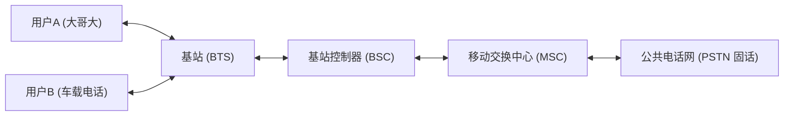

## RF无线技术

### 1. 蜂窝网 - 1G

#### 1.1 发展背景与定义

蜂窝通信的概念最早由 **贝尔实验室（Bell Labs）** 于1947年提出。当时的设想是：将大城市划分为许多小区（Cell），每个小区配备一个基站，频率可以在不相邻的小区中复用，这样在有限的频谱下支持更多用户。然而，直到70年代末，随着半导体技术、射频放大器、微波链路和交换系统的进步，这一理念才得以真正实现。

第一代蜂窝移动通信系统（1G, First Generation）正式在1981年左右投入商用。它采用 **模拟调制方式**，通过 **FDMA（Frequency Division Multiple Access，频分多址）** 给用户分配独立的频率信道，从而实现语音通话。

1G最大的意义在于：它标志着移动通信从“实验阶段”进入了“大规模商用阶段”。

#### 1.2 技术特点

1G的主要特征可以总结为以下几点：

1.  **模拟语音传输**：
    
    -   所有的语音信号都是以模拟调制方式（主要为调频FM）传输。
        
    -   无数字化处理，抗干扰能力有限。
        
2.  **多址方式：FDMA**
    
    -   每个用户独占一个频率信道（上行+下行）。
        
    -   信道间通过保护带隔开，避免串扰。
        
3.  **核心业务：语音**
    
    -   不支持数据传输。
        
    -   短信、彩信、互联网均不存在。
        
4.  **低安全性**
    
    -   无加密机制，通话可以被轻易窃听。
        
    -   冒充（伪造终端号码）非常常见。
        
5.  **设备大功率**
    
    -   手机通常发射功率在1–3 W。
        
    -   早期移动电话体积庞大，被称为“大哥大”。
        
6.  **基站切换初步实现**
    
    -   虽然有“Handoff”机制，但切换延时长、丢话率高。
        
7.  **频谱效率低**
    
    -   每信道30 kHz，利用率远不如后来的数字系统。
        

#### 1.3 常见的1G制式

不同国家采用了不同的1G标准，以下为主要代表：

##### （1）AMPS（Advanced Mobile Phone System，美国）

-   **推出时间**：1983年，由美国AT&T、摩托罗拉主导。
    
-   **工作频段**：824–894 MHz，分为上行（824–849 MHz）和下行（869–894 MHz）。
    
-   **信道带宽**：30 kHz。
    
-   **容量**：832个双工信道（原始配置），后续通过小区划分和频率复用扩展容量。
    
-   **覆盖**：基站半径可达数公里至十几公里。
    
-   **意义**：全球最成功的1G标准，推动摩托罗拉DynaTAC 8000X成为第一款商用移动电话。
    

##### （2）NMT（Nordic Mobile Telephony，北欧）

-   **推出时间**：1981年，瑞典、挪威、芬兰、丹麦联合开发。
    
-   **频段**：NMT-450（450 MHz）和NMT-900（900 MHz）。
    
-   **特点**：
    
    -   覆盖范围广，尤其适合北欧地广人稀的环境。
        
    -   提供较好的漫游支持，是第一个跨国互通的蜂窝系统。
        

##### （3）TACS（Total Access Communication System，英国）

-   **推出时间**：1985年。
    
-   **频段**：890–915 MHz（上行），935–960 MHz（下行）。
    
-   **特点**：AMPS的改进版，适合欧洲市场。
    
-   **影响**：成为欧洲早期最主要的蜂窝标准，直到90年代被GSM取代。
    

##### （4）C-Netz（德国）

-   **推出时间**：1985年。
    
-   **频段**：450 MHz左右。
    
-   **特点**：采用调频模拟方式，兼顾车载电话和便携机。
    
-   **局限**：覆盖与容量有限，寿命较短。
    

#### 1.4 使用频段与信道配置

1G网络主要在 **400–900 MHz** 范围工作，原因是：

-   频率低 → 传播损耗小，覆盖半径大。
    
-   天线尺寸适中，适合车载和手持设备。
    

**以AMPS为例**：

-   下行频段：869–894 MHz
    
-   上行频段：824–849 MHz
    
-   每信道带宽：30 kHz
    
-   Duplex spacing：45 MHz（上下行间隔）
    

公式：

$$N= \frac{B}{BW_{ch}}​$$

其中：

-  B：总带宽（25 MHz）
    
-  $BW_{ch}​$：信道带宽（30 kHz）
    
-   $N \approx 832$ 个信道（含控制信道）。
    

#### 1.5 理论速度

-   1G不支持数据通信 → 理论速率近似 **0 kbps**。
    
-   仅语音传输，相当于13 kbps语音等效带宽。
    
-   后期部分系统通过调制解调器尝试承载低速数据（1.2 kbps），但应用极少。
    

#### 1.6 关键技术解析

1G的核心创新主要包括：

1.  **蜂窝复用（Cellular Reuse）**
    
    -   将大城市划分为多个小区，采用频率复用因子（通常为7或12）。
        
    -   有效提升容量，突破传统“大功率单基站”的限制。
        
2.  **FDMA**
    
    -   每用户独占频率，避免多用户干扰。
        
    -   缺点：频谱利用率低。
        
3.  **基站切换（Handoff）**
    
    -   原理：当信号强度下降到阈值时，系统将用户切换到邻近基站。
        
    -   问题：切换判决滞后、掉话率高。
        
4.  **高功率终端与基站**
    
    -   移动台发射功率可达2 W以上。
        
    -   基站覆盖直径动辄几十公里。
        
5.  **频率规划**
    
    -   1G网络建设重点在于频率规划，以避免同频干扰。
        
    -   常用7小区复用模型（蜂窝状布局）。
        

#### 1.7 应用与社会影响

1.  **主要用途**：
    
    -   提供移动语音服务。
        
    -   满足商务人士、政府、紧急部门通信。
        
2.  **应用场景**：
    
    -   车载电话：早期用户主要在汽车上使用。
        
    -   大哥大：摩托罗拉DynaTAC成为80年代身份象征。
        
3.  **社会影响**：
    
    -   标志“移动通信”概念进入公众视野。
        
    -   推动移动产业链（基站、终端、天线、频率规划）的发展。
        
    -   成为奢侈品，促进后续数字化需求。
        

#### 1.8 局限与问题

1G虽然开创了时代，但很快暴露问题：

1.  **安全性差**：
    
    -   无加密，窃听普遍。
        
    -   伪造IMSI号冒充合法用户，造成诈骗。
        
2.  **容量不足**：
    
    -   用户数增长快，频率资源有限。
        
    -   FDMA效率低，无法满足需求。
        
3.  **语音质量差**：
    
    -   模拟调制受噪声干扰，通话嘈杂。
        
4.  **终端昂贵**：
    
    -   价格动辄几千美元。
        
    -   尺寸大、待机时间短。
        
5.  **缺乏国际标准**：
    
    -   各国标准互不兼容，无法漫游。
        

#### 1.9 示意图

蜂窝网1G结构简化如下：

-   用户与基站之间通过模拟FDMA信道通信。
    
-   MSC（Mobile Switching Center）完成呼叫交换。
    
-   通过PSTN与传统固定电话互通。
    

#### 1.10 小结：从1G到2G

-   1G解决了“能打电话”的问题，是移动通信的起点。
    
-   但它在容量、安全性、服务种类上存在严重不足。
    
-   随着用户数的爆炸式增长，数字化与新业务需求推动了 **2G（GSM/CDMA）** 的诞生。

1G → 2G 的过渡，正是模拟通信向数字通信的历史跨越。
<!--stackedit_data:
eyJoaXN0b3J5IjpbMTI1MTIyNjIzM119
-->