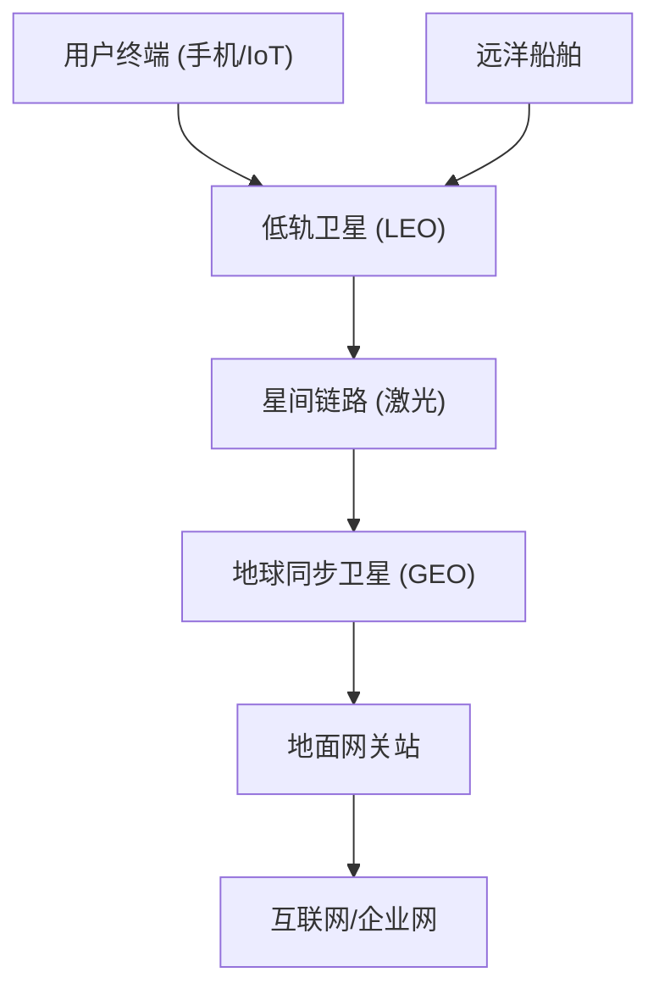

## RF 无线技术

### 卫星通信与 GPSS 系统

#### 6.1 前言与发展背景

在蜂窝通信（2G–5G）迅速发展的同时，卫星通信系统（Global Positioning & Satellite Services, GPSS）逐渐成为无线通信网络的重要补充。

-   **蜂窝局限**：在山区、海洋、沙漠、极地等环境，传统蜂窝基站无法有效覆盖。
    
-   **卫星优势**：星地一体化网络能够实现全球无缝覆盖，并在应急通信、导航定位、航空航海、军事侦察、远程物联网中发挥不可替代作用。
    

GPSS 通常包括：

-   **卫星移动通信**（如 Iridium、Globalstar、铱星、天通系统）；
    
-   **卫星互联网**（如 Starlink、OneWeb）；
    
-   **卫星导航定位**（GPS、北斗、GLONASS、Galileo）。
    

在 6G 演进方向中，**天地一体化网络** 已被视为核心目标之一。

#### 6.2 技术特点

1.  **全球覆盖**：覆盖地球 99% 的区域，包括海洋、沙漠和极地。
    
2.  **多轨道协同**：LEO（低轨道）、MEO（中轨道）、GEO（地球同步轨道）卫星联合组网。
    
3.  **高时延挑战**：GEO 链路单程约 36,000 km，时延可达 250 ms 以上。
    
4.  **高功率/高灵敏度需求**：终端需具备更强的发射功率和天线增益。
    
5.  **星间链路与自组网**：新一代卫星支持星间激光链路，实现动态路由与全网自组织。
    
6.  **融合通信定位**：卫星既可传输数据，又可提供高精度定位服务。
    

#### 6.3 使用频段与信道配置

-   **L 波段（1–2 GHz）**：常用于卫星移动通信、GPS/北斗导航。
    
-   **S 波段（2–4 GHz）**：卫星移动多媒体、部分 IoT。
    
-   **Ku 波段（12–18 GHz）**：卫星互联网下行链路。
    
-   **Ka 波段（26–40 GHz）**：高吞吐卫星（HTS）系统核心，速率可达 Gbps。
    
-   **V 波段与毫米波（>40 GHz）**：未来 6G 卫星通信潜在频谱资源。
    

#### 6.4 理论速率

-   **传统 L/S 波段窄带系统**：几十 kbps – 数 Mbps。
    
-   **高通量 Ka/Ku 波段系统**：100 Mbps – 1 Gbps（单用户）。
    
-   **星间链路+多波束天线系统**：未来可达 10 Gbps 以上，支持视频会议、无人机回传等。
    

#### 6.5 关键技术解析

卫星通信的关键技术包括：

##### (1) 多轨道卫星协同

-   **LEO 卫星**（300–2000 km）：低时延（10–30 ms）、覆盖小、需大量星座（如 Starlink > 4000 颗）。
    
-   **MEO 卫星**（2000–20000 km）：典型代表是导航卫星（北斗、GPS），平衡覆盖与时延。
    
-   **GEO 卫星**（35786 km）：固定位置、覆盖广（1 颗可覆盖 1/3 地球），但时延高。
    
-   **混合组网**：LEO 提供高速低时延，GEO 提供广覆盖，MEO 负责导航。
    

##### (2) 星间链路（ISL, Inter-Satellite Link）

-   传统卫星需通过地面网关转发 → 时延高。
    
-   新一代 LEO 卫星支持 **星间激光链路**，可实现“天基互联网”，绕开地面基站，降低路由跳数。
    

##### (3) 波束赋形与多波束天线

-   卫星采用 **相控阵天线**，可同时生成数百个波束。
    
-   实现频谱复用：不同波束可复用相同频率，大幅提升系统容量。
    
-   波束可动态指向用户或区域，提高链路效率。
    

##### (4) 频谱与功率控制

-   卫星频谱稀缺，需要 **动态频谱分配**。
    
-   链路预算需考虑自由空间损耗（随频率平方增加）。
    
-   终端需 **高功率放大器（HPA）** 与 **高增益天线** 保证接入。
    

##### (5) 卫星网络切片与虚拟化

-   未来 6G 卫星网络将支持 **网络切片**：为应急通信、物联网、军事任务分配专用资源。
    
-   基于 **SDN/NFV** 技术实现星地一体化调度。
    

##### (6) 卫星导航与通信融合

-   北斗/GPS 等导航系统可与卫星互联网融合，支持高精度定位 + 高速通信。
    
-   应用于车联网、无人机、智慧农业。
    

#### 6.6 应用与社会影响

-   **应急通信**：地震、海啸等灾害中，卫星可第一时间提供通信保障。
    
-   **远洋航行/航空**：保证跨洋航班、远洋船舶实时通信与导航。
    
-   **军事与安防**：卫星是战略通信与侦察核心。
    
-   **物联网与智慧城市**：支持偏远地区农业监控、管道巡检、环境监测。
    
-   **未来 6G 融合**：天地一体化，5G/6G 手机将原生支持卫星链路。
    

#### 6.7 示意图（基础 mermaid）

#### 6.8 小结

-   GPSS 系统提供 **全球覆盖能力**，是蜂窝通信的有效补充。
    
-   **关键技术**包括：多轨道协同、星间链路、多波束天线、频谱与功率控制、网络切片。
    
-   在 6G 时代，**天地一体化网络** 将成为主流，推动通信从“地面覆盖”走向“全球无缝”。
<!--stackedit_data:
eyJoaXN0b3J5IjpbLTE5NzE1MzY1MDBdfQ==
-->