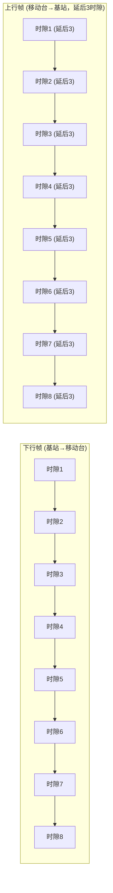
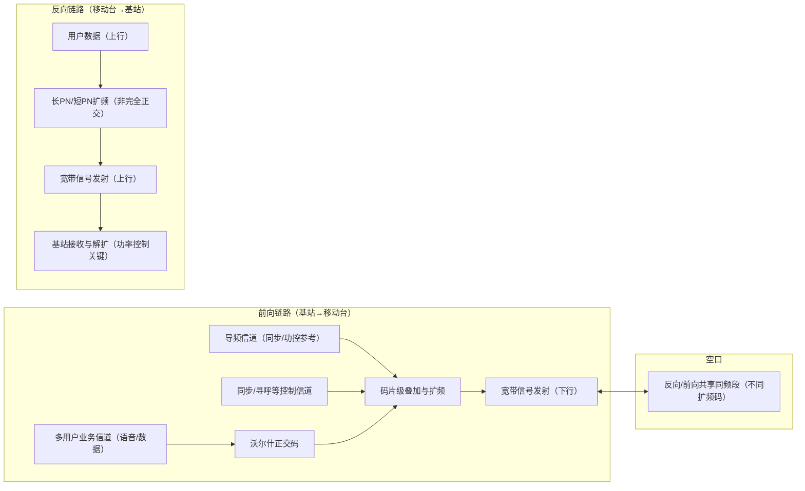
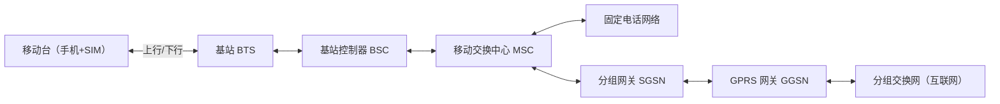

## RF无线技术

#### 1.1 发展背景与定义

20世纪80年代，全球已经广泛部署了**1G模拟蜂窝系统**，如美国的AMPS、日本的NMT、英国的TACS。1G系统的主要特点是模拟调制、低频谱效率、容易被窃听、只能提供语音服务。

随着用户量的急速增长，1G系统暴露出严重问题：

-   频谱利用率低，无法支撑更多用户；
    
-   模拟语音易受噪声和干扰影响，质量难以保证；
    
-   安全性差，通话容易被监听；
    
-   无法支持数据业务。
    

在这样的背景下，第二代移动通信系统（2G）于1991年在欧洲率先商用（GSM标准）。**2G的定义是：采用数字信号处理的蜂窝移动通信系统，以数字语音为核心，同时支持数据和短消息业务**。

简而言之：**1G = 模拟语音**，**2G = 数字语音 + 数据萌芽**。

#### 1.2 技术特点

2G系统相较于1G的显著进步体现在：

1.  **全数字化传输**
    
    -   语音经过编码、压缩后以数字比特流在空口传输，抗噪声能力强。
        
    -   通话质量接近固定电话。
        
2.  **频谱效率提升**
    
    -   引入TDMA或CDMA多址技术，频率复用度更高。
        
    -   系统容量扩大3~5倍。
        
3.  **更高的安全性**
    
    -   引入鉴权、加密算法（A3/A8/A5），有效防止窃听。
        
4.  **支持多业务**
    
    -   除语音外，支持短信（SMS）、电路交换数据（CSD）、分组交换数据（GPRS）、增强型数据（EDGE）。
        
5.  **标准化与国际化**
    
    -   GSM成为全球统一标准，推动国际漫游；
        
    -   cdmaOne则在北美和部分亚洲国家广泛应用。
        

#### 1.3 常见的2G制式

2G并不是单一标准，而是多种技术并存。主要包括：

-   **GSM (Global System for Mobile Communications)**
    
    -   起源于欧洲，采用TDMA+FDMA。
        
    -   全球最成功的2G标准，占据超过80%市场份额。
        
    -   特点：SIM卡机制、支持国际漫游、短消息业务。
        
-   **IS-95（cdmaOne）**
    
    -   美国高通主导，采用CDMA。
        
    -   抗干扰能力强，容量高。
        
    -   特点：支持软切换，语音质量优良。
        
-   **D-AMPS (IS-136)**
    
    -   由美国AT&T提出，基于AMPS演进。
        
    -   使用TDMA方式，但最终被GSM和cdmaOne取代。
        
-   **PDC (Personal Digital Cellular)**
    
    -   日本自主标准，采用TDMA。
        
    -   覆盖日本国内，但未能国际化。
        

#### 1.4 使用频段与信道配置

**GSM常见频段：**

-   GSM 900：上行 890–915 MHz，下行 935–960 MHz
    
-   GSM 1800（DCS）：上行 1710–1785 MHz，下行 1805–1880 MHz
    
-   GSM 1900（PCS）：上行 1850–1910 MHz，下行 1930–1990 MHz
    

**cdmaOne常见频段：**

-   800 MHz：上行 824–849 MHz，下行 869–894 MHz
    
-   1900 MHz：上行 1850–1910 MHz，下行 1930–1990 MHz
    

**信道配置（以GSM为例）：**

-   载波带宽：200 kHz
    
-   每载波划分为8个时隙
    
-   每时隙速率：22.8 kbps（净数据约13 kbps语音）
    

#### 1.5 理论速度

2G的核心业务是语音，但也支持低速数据。

-   **GSM语音**：13 kbps 全速率，质量接近固定电话
    
-   **CSD（电路交换数据）**：9.6–14.4 kbps
    
-   **SMS**：最大140字节/条
    
-   **GPRS**：最高171.2 kbps（8时隙 × 21.4 kbps）
    
-   **EDGE**：最高473.6 kbps（8时隙 × 59.2 kbps）
    
-   **IS-95**：14.4 kbps（IS-95A），最高115 kbps（IS-95B）

#### 1.6 关键技术解析

1.  **多址接入技术**
    
    -   GSM：FDMA + TDMA
    -  cdmaOne：CDMA扩频

        
2.  **语音编码**
    
    -   GSM：FR（13 kbps）、EFR（12.2 kbps）、HR（6.5 kbps）
        
    -   cdmaOne：8 kbps QCELP
        
3.  **信道编码与交织**
    
    -   卷积码、循环冗余校验，提升误码性能。
        
4.  **切换机制**
    
    -   GSM：硬切换
        
    -   cdmaOne：软切换
        
5.  **安全机制**
    
    -   鉴权：A3算法
        
    -   会话密钥：A8算法
        
    -   加密：A5算法
        
6.  **数据增强**
    
    -   GPRS：分组交换
        
    -   EDGE：8PSK调制
        

#### 1.7 应用与社会影响

-   **短信（SMS）**：成为2G最具标志性的应用，推动了移动社交。
    
-   **移动上网雏形**：GPRS/EDGE使得WAP浏览、彩信成为可能。
    
-   **国际漫游**：GSM SIM卡机制推动了全球移动通信市场一体化。
    
-   **经济效益**：降低通信成本，带动手机普及，促进信息社会。
    

2G在全球范围内的普及，让“随时随地沟通”成为现实，也为后续3G/4G/5G的发展奠定基础。

#### 1.8 局限与问题

尽管2G通信系统在全球范围内取得了巨大成功，但随着用户需求的不断增长和互联网时代的来临，其技术瓶颈逐渐显现。主要局限与问题包括：

1.  **数据速率过低**
    
    -   原始GSM仅能提供9.6 kbps 的电路交换数据，无法满足多媒体、网页浏览等需求。
        
    -   即便是EDGE，理论峰值速率不足500 kbps，与真正的宽带上网差距甚远。
        
2.  **频谱资源紧张**
    
    -   随着用户数量激增，即便采用小区分裂和频率复用，2G系统在城市高密度区域仍面临容量瓶颈。
        
3.  **安全性不足**
    
    -   虽然2G引入了加密和鉴权机制，但部分算法（如A5/1）后来被证明存在漏洞。
        
    -   伪基站、短信诈骗等问题依然普遍。
        
4.  **服务种类有限**
    
    -   语音和短信是核心业务，数据业务仅作为补充。
        
    -   无法支持视频通话、大流量应用。
        
5.  **信令负担沉重**
    
    -   短消息（SMS）利用控制信道传输，在海量发送情况下容易造成信令拥塞。
        
6.  **切换与小区边缘问题**
    
    -   GSM采用硬切换，在高速移动环境下（如高速铁路）易出现掉话。
        
    -   小区边缘信号衰减明显，语音质量下降。
        
7.  **难以满足互联网时代需求**
    
    -   随着智能手机和移动互联网的出现，用户对高带宽、低时延的需求激增，而2G架构难以支撑。

#### 1.9 示意图

#### 1.10 小结

2G蜂窝通信系统是移动通信发展史上里程碑式的一代。它在继承1G蜂窝网络“移动性”的同时，引入了**全数字化语音、加密鉴权机制、多址接入技术和短消息业务**，显著提升了系统容量、安全性与用户体验。

-   从 **发展背景** 来看，2G诞生于用户需求爆发与1G瓶颈激化的时代。
    
-   在 **技术特点** 上，2G实现了语音数字化、抗干扰增强、容量提升，并开始支持数据业务。
    
-   从 **标准制式** 上看，GSM和cdmaOne成为主流，分别代表TDMA与CDMA两条技术路线。
    
-   在 **频段与信道** 方面，2G充分利用了800/900 MHz的广覆盖与1800/1900 MHz的高容量优势。
    
-   在 **数据速率** 上，虽然最初仅有9.6 kbps，但随着GPRS和EDGE的引入，2G逐渐具备了移动上网的雏形。
    
-   在 **关键技术** 层面，语音压缩、信道编码、切换机制、SIM卡与安全算法构成了其核心。
    
-   在 **应用与社会影响** 上，2G不仅带来了清晰的语音通话，还催生了短信、国际漫游、移动互联网萌芽，极大地推动了全球信息化进程。
    

可以说，**2G是第一代真正意义上的“数字移动通信系统”**。如果说1G解决了“能打电话”的问题，那么2G则让人们真正实现了“随时随地清晰、安全地沟通”，并开启了数据通信时代的大门。

##### 从2G到3G

然而，随着互联网的快速发展和用户需求的升级，2G的低速数据业务已经无法满足**网页浏览、视频通信、多媒体下载**等新兴应用。  
这直接催生了**第三代（3G）移动通信系统**的出现。

-   **速率需求**：从几十kbps提升到几百kbps甚至Mbps级别；
    
-   **业务扩展**：从语音+短信，扩展到移动上网、多媒体业务、移动视频；
    
-   **技术演进**：从GSM/GPRS/EDGE平滑过渡到WCDMA、CDMA2000、TD-SCDMA等3G制式。
    

因此，2G不仅是“语音数字化”的开端，更是迈向“移动宽带”的前奏。它的成功普及和局限性，成为3G诞生的直接驱动力。

#### 专栏：2G 各主要制式对比

在 2G 时代，全球并未形成完全统一的技术标准，而是呈现“多制式并存”的格局。不同地区因历史、产业和监管差异，选择了不同的 2G 技术。以下是主要制式的特点对比：

##### 1. GSM（Global System for Mobile Communications）

-   **起源**：欧洲 ETSI 主导（1987 定标）
    
-   **接入方式**：TDMA（时分多址），每载波 200 kHz，8 时隙
    
-   **频段**：900/1800 MHz（欧洲），850/1900 MHz（美洲）
    
-   **主要业务**：数字语音、SMS 短信、GPRS/EDGE 数据
    
-   **优势**：国际漫游最强，产业链最完善
    
-   **劣势**：数据速率偏低，语音容量受限
    

##### 2. cdmaOne（IS-95）

-   **起源**：美国 Qualcomm 主导（1993 商用）
    
-   **接入方式**：CDMA（码分多址），1.25 MHz 载波
    
-   **频段**：800/1900 MHz
    
-   **主要业务**：数字语音、分组数据（CDMA2000 1xEV-DO演进）
    
-   **优势**：频谱利用率高，语音质量好，抗干扰能力强
    
-   **劣势**：产业链集中在美洲/亚洲，国际漫游不如 GSM
    

##### 3. IS-136（北美 TDMA）

-   **起源**：美国运营商联盟（1990s）
    
-   **接入方式**：TDMA，每载波 30 kHz，3 时隙
    
-   **频段**：800/1900 MHz
    
-   **主要业务**：数字语音、短信（局限性大）
    
-   **优势**：兼容模拟 AMPS，便于平滑升级
    
-   **劣势**：容量有限，技术演进受阻，最终被 GSM/CDMA 淘汰
    

##### 4. PDC（Personal Digital Cellular，日本专用）

-   **起源**：日本 NTT 主导（1993 商用）
    
-   **接入方式**：TDMA，每载波 25 kHz，3 时隙
    
-   **频段**：800/1500 MHz
    
-   **主要业务**：语音、短信
    
-   **优势**：满足日本本土市场，先发优势
    
-   **劣势**：制式封闭，国际化程度低，已退网

##### 🔑 差异总结

-   **接入方式**：GSM、IS-136、PDC 都是 TDMA，但带宽和时隙配置不同；cdmaOne 则走 CDMA 路线。
    
-   **频谱效率**：CDMA（IS-95）普遍优于 TDMA 系统。
    
-   **国际化程度**：GSM 全球统一最成功；cdmaOne 在部分国家流行；IS-136 与 PDC 地域性很强。
    
-   **演进路径**：GSM → GPRS/EDGE → WCDMA；cdmaOne → CDMA2000；IS-136 与 PDC 没有成功进入 3G。

<!--stackedit_data:
eyJoaXN0b3J5IjpbLTExNjQ4NTM0MDBdfQ==
-->