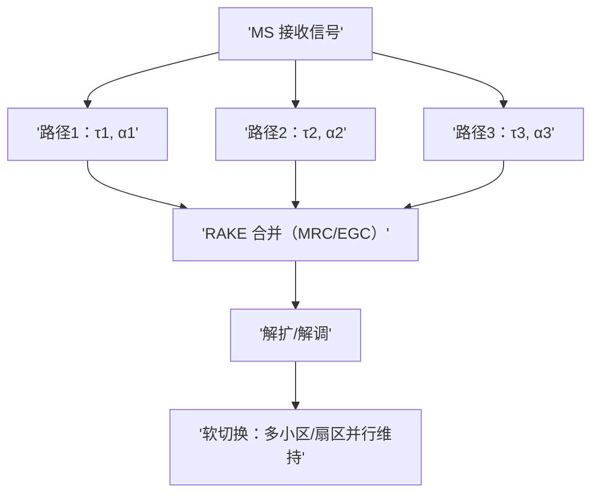
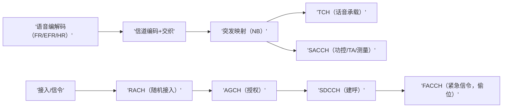
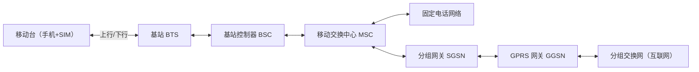

## RF无线技术

### 蜂窝网-2G
#### 1.1 发展背景与定义

20世纪80年代，全球已经广泛部署了**1G模拟蜂窝系统**，如美国的AMPS、日本的NMT、英国的TACS。1G系统的主要特点是模拟调制、低频谱效率、容易被窃听、只能提供语音服务。

随着用户量的急速增长，1G系统暴露出严重问题：

-   频谱利用率低，无法支撑更多用户；
    
-   模拟语音易受噪声和干扰影响，质量难以保证；
    
-   安全性差，通话容易被监听；
    
-   无法支持数据业务。
    

在这样的背景下，第二代移动通信系统（2G）于1991年在欧洲率先商用（GSM标准）。**2G的定义是：采用数字信号处理的蜂窝移动通信系统，以数字语音为核心，同时支持数据和短消息业务**。

简而言之：**1G = 模拟语音**，**2G = 数字语音 + 数据萌芽**。

#### 1.2 技术特点

2G系统相较于1G的显著进步体现在：

1.  **全数字化传输**
    
    -   语音经过编码、压缩后以数字比特流在空口传输，抗噪声能力强。
        
    -   通话质量接近固定电话。
        
2.  **频谱效率提升**
    
    -   引入TDMA或CDMA多址技术，频率复用度更高。
        
    -   系统容量扩大3~5倍。
        
3.  **更高的安全性**
    
    -   引入鉴权、加密算法（A3/A8/A5），有效防止窃听。
        
4.  **支持多业务**
    
    -   除语音外，支持短信（SMS）、电路交换数据（CSD）、分组交换数据（GPRS）、增强型数据（EDGE）。
        
5.  **标准化与国际化**
    
    -   GSM成为全球统一标准，推动国际漫游；
        
    -   cdmaOne则在北美和部分亚洲国家广泛应用。
        

#### 1.3 常见的2G制式

2G并不是单一标准，而是多种技术并存。主要包括：

-   **GSM (Global System for Mobile Communications)**
    
    -   起源于欧洲，采用TDMA+FDMA。
        
    -   全球最成功的2G标准，占据超过80%市场份额。
        
    -   特点：SIM卡机制、支持国际漫游、短消息业务。
        
-   **IS-95（cdmaOne）**
    
    -   美国高通主导，采用CDMA。
        
    -   抗干扰能力强，容量高。
        
    -   特点：支持软切换，语音质量优良。
        
-   **D-AMPS (IS-136)**
    
    -   由美国AT&T提出，基于AMPS演进。
        
    -   使用TDMA方式，但最终被GSM和cdmaOne取代。
        
-   **PDC (Personal Digital Cellular)**
    
    -   日本自主标准，采用TDMA。
        
    -   覆盖日本国内，但未能国际化。
        

#### 1.4 使用频段与信道配置

**GSM常见频段：**

-   GSM 900：上行 890–915 MHz，下行 935–960 MHz
    
-   GSM 1800（DCS）：上行 1710–1785 MHz，下行 1805–1880 MHz
    
-   GSM 1900（PCS）：上行 1850–1910 MHz，下行 1930–1990 MHz
    

**cdmaOne常见频段：**

-   800 MHz：上行 824–849 MHz，下行 869–894 MHz
    
-   1900 MHz：上行 1850–1910 MHz，下行 1930–1990 MHz
    

**信道配置（以GSM为例）：**

-   载波带宽：200 kHz
    
-   每载波划分为8个时隙
    
-   每时隙速率：22.8 kbps（净数据约13 kbps语音）
    

#### 1.5 理论速度

2G的核心业务是语音，但也支持低速数据。

-   **GSM语音**：13 kbps 全速率，质量接近固定电话
    
-   **CSD（电路交换数据）**：9.6–14.4 kbps
    
-   **SMS**：最大140字节/条
    
-   **GPRS**：最高171.2 kbps（8时隙 × 21.4 kbps）
    
-   **EDGE**：最高473.6 kbps（8时隙 × 59.2 kbps）
    
-   **IS-95**：14.4 kbps（IS-95A），最高115 kbps（IS-95B）

#### 1.6 关键技术解析

![TDMA][1]
![多址接入技术解析- 电力电子技术- 电子技术论坛- 广受欢迎的专业电子论坛!][2]

##### 1.6.1 空口与帧结构（GSM为例）

-   **载波与多址**：FDMA 把频谱切成 200 kHz 的载波（ARFCN），每个载波再以 **TDMA** 划分为 **8 个时隙（timeslot, TS0~TS7）**。
    
-   **时间参数**：
    
    -   单时隙时长 **≈ 577 μs**（= 156.25 比特周期）。
        
    -   1 帧含 8 个时隙，帧长 **≈ 4.615 ms**。
        
    -   多帧：**26-多帧**（业务承载/话音）与 **51-多帧**（广播/控制）。
        
    -   超帧/超超帧（Hyperframe）用于全局计数与加密同步（周期约 **3 h 28 min 53 s**）。
        
-   **上下行错位**：FDD 上、下行分属不同频点；同一用户的上/下行**编号相同**但**时间上延后约 3 个时隙**，便于终端在收/发间切换（终端侧呈“时分半双工”）。
    

**GSM Normal Burst 结构（示意）**

要点：每个 Normal Burst 承载**114 个有用比特**（左/右各 57），中间 **26 比特训练序列**用于信道估计；两侧 **stealing flag** 指示是否被 FACCH“抢占”承载信令。

##### 1.6.2 调制与发射成形

-   **GSM（语音/控制）**：**GMSK**（高斯滤波 MSK），常用 **BT≈0.3**。
    
    -   **优点**：恒包络 → 可用高效率、非线性功放（Class-E/AB），能耗低、成本低。
        
    -   **代价**：相位调制+高斯成形使抗 ISI 能力依赖均衡器。
        
-   **EDGE（增强数据）**：**8PSK**（线性调制）。
    
    -   **优点**：同带宽速率更高（每符号 3 比特）。
        
    -   **代价**：对线性度/EVM 更敏感，功放需线性化（记忆多项式、DPD 等），带来**谱再生**风险与更严的**邻道泄漏**约束。
        

**工程测试关注**

-   GMSK：频偏/相位误差（RMS/峰值）、时钟稳定度（ppm 级）、发射功率精度、邻道功率（ACP）。
    
-   8PSK：**EVM**（RMS/峰值）、频谱模板、瞬态掩模、线性/非线性失真（AM/AM、AM/PM）。
    

##### 1.6.3 信道编码、交织与突发映射（GSM语音路径）

-   **语音编码**（典型）：
    
    -   FR：13 kbps（RPE-LTP）
        
    -   EFR：12.2 kbps（改进语音质量）
        
    -   HR：6.5 kbps（容量优先）
        
-   **分类保护**：一帧语音比特常分为 **Class Ia/Ib/II**，重要度不同 → 采用不同保护级别（Ia 有 CRC，Ib 卷积码，II 可能不编码）。
    
-   **信道编码**：卷积码（常见 **1/2** 码率，穿孔得到更高净码率），外加 CRC；编码后形成 **456 比特/语音帧**。
    
-   **交织**：将 456 比特**跨 8 个突发**（每突发 2×57 比特）**对角交织**，以把突发性衰落随机化 → 便于译码。
    
-   **承载与抢占**：
    
    -   **TCH**：话音承载。
        
    -   **SACCH**：伴随 TCH 的慢速信令（功控、TA 报告）。
        
    -   **FACCH**：当有紧急信令（如切换）时，**“偷位”**替代 TCH 负载（由 stealing flag 指示）。
        

##### 1.6.4 同步与定时提前（TA）

-   **频率/帧同步**：
    
    -   **FCCH**：下发“纯频偏校正”信号，帮助终端校正本振。
        
    -   **SCH**：发送 **BSIC** 与帧号（FN），实现时间对齐。
        
    -   **训练序列（TSC）**：每个突发中部 26 比特作信道估计与均衡参考。
        
-   **Timing Advance（TA）**：终端上行提前发射，使其刚好落在基站的时隙窗口内。
    
    -   **步进**：1 TA = **1 比特周期 ≈ 3.69 μs**；范围 **0~63**。
        
    -   **等效距离**：最大补偿约 **≈ 35 km**（往返传播考虑后的单程距离），限定了单小区理论覆盖半径上限（宏站一般远小于此）。
        

##### 1.6.5 均衡与接收机算法

-   **信道等化**：对抗多径与频率选择性衰落。
    
    -   **线性均衡/DFE**：复杂度低，适合中等时延扩展。
        
    -   **MLSE（Viterbi）**：基于训练序列的最大似然序列估计，性能好、复杂度高。
        
-   **EDGE 8PSK**：调制更密集，常配合 **软判决译码** 与更强编码/交织。
    
-   **CDMA（对比）**：采用 **RAKE 合并**，把多径视作“分路径分集”，按路径延迟相关对齐后加权合并提升 SNR。
    

##### 1.6.6 频率规划与跳频

-   **频率复用**：GSM 为避免同/邻频干扰，传统采用 **K 复用因子**（如 4/12 规划），结合小区分裂/扇区化提升容量。
    
-   **跳频（FH）**：降低深衰落与窄带干扰影响：
    
    -   **MA 列表 / HSN / MAIO** 定义跳频序列；**BCCH** 常不跳、TCH 可跳；支持 **同步/异步跳频**。
        
-   **工程点**：跳频有助提升 **C/I 与 FER**，但测试与故障定位更复杂（需记录 MA/HSN/MAIO）。
    

##### 1.6.7 发射功率控制（PC）、DTX/DRX 与节能

-   **功率控制**：
    
    -   **上/下行**皆可分级（终端典型步进 **2 dB**）。
        
    -   通过 **SACCH** 下发 PC 命令，折中覆盖与干扰；室内/微蜂窝更依赖 PC 精细度。
        
-   **终端功率等级（举例）**：
    
    -   **GSM900**：Class 4 **33 dBm（2 W）**、Class 5 **29 dBm（0.8 W）**。
        
    -   **DCS1800**：Class 1 **30 dBm（1 W）**、Class 3 **24 dBm（0.25 W）**。
        
-   **DTX**：语音静音段**不连续发射**，降低干扰和省电；配合 **VAD** 与 **舒适噪声（CNG/SID）**。
    
-   **DRX**：寻呼监听间歇接收，降低待机功耗。
    

##### 1.6.8 接入与信令控制

-   **随机接入（RACH）**：上行突发采用 **时隙 ALOHA**，可能碰撞 → **AGCH** 下发接入授权，随后转入 **SDCCH** 进行完整呼叫建立与鉴权。
    
-   **控制信道族**：**BCCH/CCCH/PCH/AGCH/SDCCH/SACCH/FACCH** 各司其职，确保系统广播、寻呼、接入与通话维持。
    

##### 1.6.9 切换与测量报告（GSM 硬切换）

-   **测量指标**：终端周期性上报 **RxLev（电平）**、**RxQual（质量）**、邻区列表（BA 列表）。
    
-   **判决**：BSC/MSC 基于门限/滞回/优先级做**硬切换**（Hard HO）；切换瞬间“断后连”，对链路设计与 FACCH 可靠性要求高。
    
-   **对比**：IS-95/cdmaOne 支持 **软/更软切换**（Soft/Softer HO），可同时连多个小区/扇区，平滑过渡但占用更多资源。
    

##### 1.6.10 数据增强：GPRS / EDGE（2.5G / 2.75G）

-   **GPRS**（分组交换）：
    
    -   **动态时隙分配**：同一载波的 TS 可配置为 **PDCH**（分组信道），按需分给多用户；
        
    -   **上行调度**：通过 **USF（Uplink State Flag）** 指定下一块可用上行；
        
    -   **可靠传输**：**RLC/MAC** 层分段、重传（ARQ）、TBF（暂态块流）。
        
    -   **编码级别（CS-1…CS-4）**：从强保护到高净率，**每时隙净率约 9–21 kbps**。
        
-   **EDGE / E-GPRS**：
    
    -   **8PSK + MCS-1…9** 自适应链路，峰值**每时隙 ~59.2 kbps**；
        
    -   8 时隙聚合峰值 **~473.6 kbps**（理想），实网常 **100–200 kbps**。
        
-   **测试要点**：时隙聚合吞吐、BLER/BER、EVM、频谱模板、时隙意外空洞、上/下行调度一致性。
    

##### 1.6.11 安全与鉴权（GSM 典型流程）

-   **身份与密钥**：
    
    -   **IMSI/SIM（Ki）** 存根密钥；
        
    -   鉴权用三元组：**RAND（随机数）→ SRES（签名）/Kc（会话密钥）**；
        
    -   **A3/A8** 生成算法，空口加密使用 **A5/x**。
        
-   **隐私**：使用 **TMSI** 代替 IMSI 在空口暴露，降低跟踪风险。
    
-   **工程点**：算法强度与实现安全（早期 A5/1/A5/2 漏洞、伪基站风险）；信令完整性与 SMS 欺诈治理。
    

##### 1.6.12 cdmaOne（IS-95）关键技术要点（与 GSM 对照理解）

-   **扩频与码**：
    
    -   码片速率 **1.2288 Mcps**；前向链路用 **Walsh 正交码（长度 64）** 作业务/控制信道的正交化，叠加 **短 PN（I/Q）** 做小区区分；
        
    -   反向链路用户各自以 **长码** 扩频，**非完全正交** → 更依赖功控。
        
-   **导频/同步/寻呼/业务**：导频（Walsh 0）提供相位基准，**RAKE** 利用多径分集；同步/寻呼/业务分别占用不同 Walsh。
    
-   **功率控制**：**闭环快功控 ~800 Hz**（基站发上/下指令），叠加开环，抑制远近效应。
    
-   **切换**：**软切换**与**更软切换**（同站内扇区间）显著降低掉话。
    
-   **容量机理**：**干扰受限**、可视为复用系数 ≈ 1；容量随载干比门限、语音活跃因子、功控精度、外来干扰而变（出现“**小区呼吸**”现象）。
    
-   **语音**：可变速率 **QCELP**（8/13 kbps），20 ms 帧；低语音活跃期降低速率→降干扰、增容量。
    
-   **测试关注**：导频 Ec/Io、反向接入成功率、快功控抖动、RAKE 合并增益、前向/反向 FER、邻导频搜索与越区问题。
    

**CDMA RAKE / 软切换示意**

##### 1.6.13 与 RF 测试硬件的接口与指标映射

-   **信号源/综合仪**：产生/分析 **GMSK/8PSK** 波形；测 **频偏、相位误差、EVM、瞬态、功控阶跃**。
    
-   **频谱仪**：看 **ACP（邻道功率）、带外辐射、跳频轨迹（瀑布图）**。
    
-   **矢网/VNA**：天线/馈线匹配（S11），与**TA/覆盖**间接相关。
    
-   **场强/扫频**：路测 **RxLev/RxQual、C/I、导频 Ec/Io**（CDMA）；覆盖孔洞与越区。
    
-   **典型限值（概念级）**：
    
    -   频率误差 **≈ ±0.1 ppm** 量级；
        
    -   GSM 相位误差 **RMS 几度**、峰值十几度要求；
        
    -   EDGE **EVM（RMS）** 常见门限 **10%** 左右量级（具体依标准版本/产品级别而定）；
        
    -   邻道功率/谱模板需满足区域监管与 3GPP TS 05 系列（GSM）/TIA（IS-95）要求。
        

##### 1.6.14 “从 2G 到 3G”的技术启示

-   **容量与速率**：GSM 的 TDMA + 频率规划在高密度城市遇到天花板 → 走向 **宽带 CDMA（WCDMA）** 与 **更强的链路自适应/分集**。
    
-   **同步与接入**：CDMA 的 **软切换、快功控、RAKE** 成为 3G 的基础能力；GPRS/EDGE 的 **分组化与MAC/ARQ** 思想延续到更高代。
    
-   **终端与 PA 线性化**：从恒包络（GMSK）到线性调制（8PSK、QAM），促使 **线性功放与数字预失真（DPD）** 成为主流。
    
-   **安全体系**：2G 的 A3/A8/A5 体系为后续 AKA/EPS-AKA 打基础，但也暴露“算法与实现同样重要”的工程教训。
    

##### 附** GSM 业务/控制承载关系（简化）**

#### 1.7 应用与社会影响

-   **短信（SMS）**：成为2G最具标志性的应用，推动了移动社交。
    
-   **移动上网雏形**：GPRS/EDGE使得WAP浏览、彩信成为可能。
    
-   **国际漫游**：GSM SIM卡机制推动了全球移动通信市场一体化。
    
-   **经济效益**：降低通信成本，带动手机普及，促进信息社会。
    

2G在全球范围内的普及，让“随时随地沟通”成为现实，也为后续3G/4G/5G的发展奠定基础。

#### 1.8 局限与问题

尽管2G通信系统在全球范围内取得了巨大成功，但随着用户需求的不断增长和互联网时代的来临，其技术瓶颈逐渐显现。主要局限与问题包括：

1.  **数据速率过低**
    
    -   原始GSM仅能提供9.6 kbps 的电路交换数据，无法满足多媒体、网页浏览等需求。
        
    -   即便是EDGE，理论峰值速率不足500 kbps，与真正的宽带上网差距甚远。
        
2.  **频谱资源紧张**
    
    -   随着用户数量激增，即便采用小区分裂和频率复用，2G系统在城市高密度区域仍面临容量瓶颈。
        
3.  **安全性不足**
    
    -   虽然2G引入了加密和鉴权机制，但部分算法（如A5/1）后来被证明存在漏洞。
        
    -   伪基站、短信诈骗等问题依然普遍。
        
4.  **服务种类有限**
    
    -   语音和短信是核心业务，数据业务仅作为补充。
        
    -   无法支持视频通话、大流量应用。
        
5.  **信令负担沉重**
    
    -   短消息（SMS）利用控制信道传输，在海量发送情况下容易造成信令拥塞。
        
6.  **切换与小区边缘问题**
    
    -   GSM采用硬切换，在高速移动环境下（如高速铁路）易出现掉话。
        
    -   小区边缘信号衰减明显，语音质量下降。
        
7.  **难以满足互联网时代需求**
    
    -   随着智能手机和移动互联网的出现，用户对高带宽、低时延的需求激增，而2G架构难以支撑。

#### 1.9 示意图

#### 1.10 小结

2G蜂窝通信系统是移动通信发展史上里程碑式的一代。它在继承1G蜂窝网络“移动性”的同时，引入了**全数字化语音、加密鉴权机制、多址接入技术和短消息业务**，显著提升了系统容量、安全性与用户体验。

-   从 **发展背景** 来看，2G诞生于用户需求爆发与1G瓶颈激化的时代。
    
-   在 **技术特点** 上，2G实现了语音数字化、抗干扰增强、容量提升，并开始支持数据业务。
    
-   从 **标准制式** 上看，GSM和cdmaOne成为主流，分别代表TDMA与CDMA两条技术路线。
    
-   在 **频段与信道** 方面，2G充分利用了800/900 MHz的广覆盖与1800/1900 MHz的高容量优势。
    
-   在 **数据速率** 上，虽然最初仅有9.6 kbps，但随着GPRS和EDGE的引入，2G逐渐具备了移动上网的雏形。
    
-   在 **关键技术** 层面，语音压缩、信道编码、切换机制、SIM卡与安全算法构成了其核心。
    
-   在 **应用与社会影响** 上，2G不仅带来了清晰的语音通话，还催生了短信、国际漫游、移动互联网萌芽，极大地推动了全球信息化进程。
    

可以说，**2G是第一代真正意义上的“数字移动通信系统”**。如果说1G解决了“能打电话”的问题，那么2G则让人们真正实现了“随时随地清晰、安全地沟通”，并开启了数据通信时代的大门。

##### 从2G到3G

然而，随着互联网的快速发展和用户需求的升级，2G的低速数据业务已经无法满足**网页浏览、视频通信、多媒体下载**等新兴应用。  
这直接催生了**第三代（3G）移动通信系统**的出现。

-   **速率需求**：从几十kbps提升到几百kbps甚至Mbps级别；
    
-   **业务扩展**：从语音+短信，扩展到移动上网、多媒体业务、移动视频；
    
-   **技术演进**：从GSM/GPRS/EDGE平滑过渡到WCDMA、CDMA2000、TD-SCDMA等3G制式。
    

因此，2G不仅是“语音数字化”的开端，更是迈向“移动宽带”的前奏。它的成功普及和局限性，成为3G诞生的直接驱动力。

#### 专栏：2G 各主要制式对比

在 2G 时代，全球并未形成完全统一的技术标准，而是呈现“多制式并存”的格局。不同地区因历史、产业和监管差异，选择了不同的 2G 技术。以下是主要制式的特点对比：

##### 1. GSM（Global System for Mobile Communications）

-   **起源**：欧洲 ETSI 主导（1987 定标）
    
-   **接入方式**：TDMA（时分多址），每载波 200 kHz，8 时隙
    
-   **频段**：900/1800 MHz（欧洲），850/1900 MHz（美洲）
    
-   **主要业务**：数字语音、SMS 短信、GPRS/EDGE 数据
    
-   **优势**：国际漫游最强，产业链最完善
    
-   **劣势**：数据速率偏低，语音容量受限
    

##### 2. cdmaOne（IS-95）

-   **起源**：美国 Qualcomm 主导（1993 商用）
    
-   **接入方式**：CDMA（码分多址），1.25 MHz 载波
    
-   **频段**：800/1900 MHz
    
-   **主要业务**：数字语音、分组数据（CDMA2000 1xEV-DO演进）
    
-   **优势**：频谱利用率高，语音质量好，抗干扰能力强
    
-   **劣势**：产业链集中在美洲/亚洲，国际漫游不如 GSM
    

##### 3. IS-136（北美 TDMA）

-   **起源**：美国运营商联盟（1990s）
    
-   **接入方式**：TDMA，每载波 30 kHz，3 时隙
    
-   **频段**：800/1900 MHz
    
-   **主要业务**：数字语音、短信（局限性大）
    
-   **优势**：兼容模拟 AMPS，便于平滑升级
    
-   **劣势**：容量有限，技术演进受阻，最终被 GSM/CDMA 淘汰
    

##### 4. PDC（Personal Digital Cellular，日本专用）

-   **起源**：日本 NTT 主导（1993 商用）
    
-   **接入方式**：TDMA，每载波 25 kHz，3 时隙
    
-   **频段**：800/1500 MHz
    
-   **主要业务**：语音、短信
    
-   **优势**：满足日本本土市场，先发优势
    
-   **劣势**：制式封闭，国际化程度低，已退网

##### 🔑 差异总结

-   **接入方式**：GSM、IS-136、PDC 都是 TDMA，但带宽和时隙配置不同；cdmaOne 则走 CDMA 路线。
    
-   **频谱效率**：CDMA（IS-95）普遍优于 TDMA 系统。
    
-   **国际化程度**：GSM 全球统一最成功；cdmaOne 在部分国家流行；IS-136 与 PDC 地域性很强。
    
-   **演进路径**：GSM → GPRS/EDGE → WCDMA；cdmaOne → CDMA2000；IS-136 与 PDC 没有成功进入 3G。

[2]:
data:image/png;base64,iVBORw0KGgoAAAANSUhEUgAAAVIAAACVCAMAAAA9kYJlAAACHFBMVEX////+/v4AAADEwsX+rsez5xiTq0S0fFq9eVWqfWZbWmGjfYa45j/ExMRERETQr0e4fmF4V0u5eVrMycz9zRDy5bfEv6K25By85ST/s8vv5Kzu57UrOwUxKy7IkKX80EnZ2dmXl5dxcXGhoaH09PRiYmLj4+OCgoL/zEjCkqS1tbX//P/S0tKa2ev/yQ2srKwiJiqKanViTzJHUzM/TVT8zzV6enpUVFSOjo7Fv6dsbGxPT09kTEA2NjZdXV25ubm8fGQWFhbnqb51VmBRY2ur2emoul6fvG8AAA14ikmecVyW3Oj0t8wrOg3///Xt+fq/sq7e0da0w8bk27qUtL/Itpa32zyYn2TLp6psZ1tpgYz7++k4GxOCa3NLOD7h3dKAai+fgz+chS1seE94jjhFVRXwxVKfgy6wt6ajxEKQn4VlVEx0Tj3T1MJ/cFtdcTrLtr+qxVZ+mZ+beBuYjG2UgXZ8jFd7Uz/00i7r6Nlcdyk+YW5DLh1nP0zCr206IwC01FweLhl6SzQuDBfy016dh1GexjEfLTf0yNexx5NuTip0mRh8ZGyFVmXerkCGnkaY1/WXgYjNq1dqblI+LTNPQzBDMijcxGHBoT1fXEwXJQDRxZPItXu6oqrhwTGdfWawkoquy7y9nnCZnnDHqiK3lG8dAABxkis4R1nv4cWrxmV7bUCKtroOCiQtPyYsQ0OBqaymboFyWy6JlnoonmWlAAAcSElEQVR4nO2di2PT1r3Hj2yCE7AcEzskaZYiWbLU2EoUutkWNrZIwGVNPJMS41HYGmAthUF4ZGGF3raX3m5d2WjXlrZrBw2sY+u6y9267R+8v/OQLNtyHo7zKPjbxsiWdHTOR79zfr+jxzkItdVWW2211dZjLY5DHEIyh4XoZ4PtOLa24UactdlS6dTu8BiKQ5FoOqqp6aQopqNppVE5OdfFxtushOjjizQtGkIgkBGNZCQtNwRmpkVVVyMRQ0plUrx7UrokiqaZNPmYqEtygwNyMojwX6pOVBJF3yVzJjUVqWOBlJhNZwwjHcjIDU1HikqSpqYCKp+ORkPu26TFbJbPpaKimknn6g2eNhtoKBMIxNLRiJiMRqMy+9GxCZag6rqp6VJIMFRDWGtBN0zMAJKqkZMyetQwtYzY2CIkNZUTpVxEksScpLunlzSSyVAgEJAC0VzGpQ2hrW3AMPBWSd1Q1aRMf6tsQhf5lJGKqZFURMtFo+YaC7regjzLTJpAXAktBrEWa6M4V6Qbo5BVXCmaSSXTmWiU1wPjCq60ceax4hw0F3Hs5tJDqSE1lQ4YopoLkL2KXPwkGGIR/i3eULgi3j4VSOf4TCYKJymVpivhDwSrrcPx0VxW1cGSY9GhiAEZitMVOPdbrg3mEB9RiQw1abVoHANKMwtfIruYfqKwAiicoAkCknk4FQo+DUfiPz3I9BJ180jitWSMV4yYoukaOxw3e+o00Zkzl2jrmY2kAnpWzaoS5AR+ApQ/ex7r5ZdffuUkBWYGstl0NBfNaGo0Z+KMHbL0T3nrIY3wTCFVo80p8xSWt4gj7eKBIFXXi2w3toFciZXMpwuFwsDAQKEwLKHK3pzMjkOSKqIXzybCiXA4kdjz6ixJRJEVDRwUnBhZoeme2+7vB/n9/vM/p3VGU3RJ12UlIiuihjc5WspjjeTzj6Qt5654g7eVtH6siiQ5dKGrpxOrpyd4cdaxDVKUypeDA9uoBgb2knrPwGuO5pFDc2cSo1jh0dE9lyqtplUtsIqXyx1M/tepv7JSs/89lB9hyp/YcuFXOlRBaij2z0Il6DkyuyuIcfb0+Dp7Jh84d64gRd7hASwCdfhKvFJMzRE+FdGlxTDV6GjizKxtYJxMgeI6cW57f0cfCD76r55zNEa2ED9PeU7B/49iG2KmzjjOOrEuB4ZfQw4j5c0kO+OcjRR/veDrBJi+4IFgT2fwogKbxFkCFlLY6mAB2ydFWtjrKL7A+mLEF839IoFpjpK/swuIeihsy5UcXy5jmmCj8OG/fLIYr814nDthG+nUVP5EfANCVcihaSp8zJSREpORbEI7Zbo1446WlNZ8wfrdRsqh2deCABTUA8bqmzQcFa2CNDQ8sM2q+dsGhr2VLqvGVZbjC2ephZK6f/3VGxBK0FU2UjS3vb+PEO2ADzBTl2odms/bRjo1Mn8Un5iWwXMXkAqISjatejTdIyLRY8JfzG07QaxCahrW+bYrPoeuTfZ0+qDWQ82H9jS4Hwc6bGUF6d7CNmyijGrhYNwCiZjTIXGP8moiHLZrPjFTZFmpFRX9EhtpRx84J0Da578ct3ix9h0+mJGChWKk+UNHNgJp0oDoxERqWg9kUQCWslLKbbtqI+VDEatxpLBwgcFIe3DFxw7fh1vTa6jOSlHoaWKkA9jpEzO94jBTa7FYBCPF5rl4+vTD67g1/cUNa53GcHFztCUtv/76eVL5r56zkWosalZYS/rtD/4LIx0pmevvoQDpWEAJmEjP6WpASqe8gof3uPSyNctIxSRbiLAUFIW2w1zxWlewB9f71974rAszDV6U69vSj5iRDr/55gRmWvhpvA5psXjj1eukxnfvf+u/u7Glnr1m2TJv9d7ASEH9N98+XMZsO8rPy7RScFyIFS6SJ5U+P78jnwekH+YPxTei4kMXI2vGhyRJ1T18hjcyYlaq3YpDzDd5eehm815QKMl6IzKBBVmd/R8fbUd3XbuAPb+vZ1KyC8BsOf7CzgFipYV3JmjtHxiOIdafYkjjxSJaeIY2ot3P/urXp3DNT5yWi0ULKWxfLM6d9xNXf/Pty+/iit/Rd/6cFdCFcIbAWGlLOpWf/80JYqX50tF4HK23VOie54bGRKQbyhgX5bMaMjO1SJFmuXs9EzFCGClvqrQSyQprt651UaS+XTuyl7ogmCKtaQUpaQxvF0gANTDxyXsF1pp+ZF9LZUjBz0FMiit+ApD++3QC+/2zC0XbSvFxi9jdU6S33iWOv698WXYghThsnhrpyMj8IdyW4tb0xPqHpvblHM75U91GVm0P5TK5LI/NlA+xKxeKQBOYfc3H9OwVcX8XhKbg9O0OC0VK3T1GWnhn5/AERbpTY67HrvhoYZF6pdHuN3576iwx2MSrigMph909cfV95Ve+97t+TLSDxKakQDgqKCJtnjn7kVJphCCdGikd3YAwyhEYNpSgWm4pDY7JS2o+H0vS/YkLLoK795EACkC+cRFaVV8PcfrIiRQbKUM68f77FOlA4XacXkphSIvcDeLuMdLwnuuJMO1DffAAVZDG0c/KfbTf1F8u+4nnh9b0MruSQ5GqlY5TngRRzEzXmSm3IqS5iqeHVpQihdZUqSDlZi9aMWmn70AnNlHs/CdFJ1IU2lkYYBEUdPEHrNj0haqKD01I92glzKeNajj8zCkZ2W0pOvd74u5pmE+bUjDT7TqyrJTjhEqYb+vD/Dy/+T19ztGSMh9FxcdILE+QAgZASNvSijp7uqA1LXIMKYduF+wg36HCbTuKx+kVb5x+xo5ImcBew93XcBeKVXzs7jtq1AexaZFc8sNIISadqkNKnT7aAB+1NFO7Ja1G6uXTxEwJCGF/0AVpZxDMlLOQYiN1IbptYKcX2QaIiJHWCrcCz5w6iXuc+PoSN/c17jjVyb/9HG44CFJhvs5IMeL8fAhHHptMVFPdkXpN4n1CGMRPuw7Qeu9ACoE/RFTFCtLbrkSx06cOKkQvWp25Tqt6uArp6OjDBY4hxS1pnZXi6l9+HrfKsgBHPFRf7acI00OoupFbus1bH6Q1RlpBykdkhvSFi109dVZKAv/JacSQNjJS7PRJa4ooUty7Hw27CGJTciUA3P3v/X0uZgq90u1zpGcLm7m0pNRVlTSu+p6szG30VT9BDVUjDdmCnj4JAsFIcR8U4/QdwGJM8aXo/SQRfG/z9nsD7iq89xHZiFwRUU7vSVxP1Oo6/LTn43M4O/B356a/gW7eQbT3YUB3Ke8iYKrWFJDPut64XR9JhiiKqXSkoQKw3gAN7W+kC58kRSr1pb0N9clHeIukqEajgU+fbaRPh6JEube/31Bv5+g2Yz9oqLFclG2E04qOezyegLBRSPHRNlhjS2lobIxsMrTkJuzfoWgjQ8g5v6hG0jMmbdh9KQFLF5aUIrdSy5aMkxs8OrFycUr1d02X0ca6KG35TZiK9DISdFxQ5QOLs66D2ledqrsYdoHcVpNNqrdutG2x1n27pkUCgipx3MYybfCEiK1KkeMN4pFKcepuZdDVVZQAfdwVvRMrcsWFisUq5w0J1ake6YbSJFoJ0taq+SRXVCAHUs7xuYHilzliC1laYJrfcyVyItX0kA7OwpQEpfEOLRe+F7xUbjcTYV1KK5EDqRzIip6kmPUMjeXWymkVEuSl+2wt49ECrahADqRaJpDKZoRoJpARGm7feglcXdjRSmESiowU+IQASaHPkG4UUjmazQaSkp7NpWv7VOsp3siNp8xYjbSlo1WHlgcRNwLelBSJmkYUGjbV642v2103WRcwUusMKGpKGktK6dxYRF2/c1gnzUhnDS2kORXSJHGlkpaUjjOmRFQlHTXVcUnLJUVDxXcHuRUfYCmpyRqlPIGIt4JU4iQ5BnVEb7JqNIcU2lJ5fSu+nNXNtJROesFKY4IRMNeQ2xrVdc9CRlTUKvjsJy6aAtq0lS7TA2wyMw7FoSMqwyeHL7ThR/LXnqSl2pzKXtlR8Vuc/oolL7Pr2vNV31Ndpve0rJbKVJyT15q840DrohZlzr4fFEfx5Tqky0hexiW2MO7bykjjsm75Pl1es5W2ktrSx9mySPHtCvuKl0AepVpzghuiLYtUAQkaYrapCfj7luqVNdTWRWrqXkVm4Qx4ZK8eU1qQ7AZoiyIljkkOhTQFX+CUoR8ht+ZMbYC2LFIsbJ2hUMgryPG1evwN1EoZrQ/6FSm+2RlYRk0jxQ/jm/xGyeuiDTv46mTWhhIrPhWeQFuu8shNIYXNPPiJkoanKvTkylN7+WHlSJes9W4V9QnRGqy0jdRdntpbDitEyrWRNlKzSElbqmmb3W5tRXlqOyErRap4hobGhtqqV5PuCQHSXW256bNok6E+IO3yBX3Btmq1X6ztPq0CKX7Npi2H8PsxwYtrQVr9akhbPfi5+QNrs9IeX1tOYaRdgLTJPr7i8bUrvosOXFwD0vtdbbloLVb6179u/IsP3wXhV2Kb6T1xKHN7Z1suutAAaYWt9S4B+XNSzQw3eOnr8dF7hdXvU9jbwONzSAuMSfr4eE5RPCqSx+EPLJqrRur+auLjI9d3rpcQGdvmX+5IOQDIc7IYReqY4hmTY+NJFAsMVb2J8QQgHWgGKVhpvB4pfMayKI7ENHghIZvjU8kICghZDT1ZSFerJawUPnlPHGGkvEcZMgMZPSJ7MtACuCJtfSP2XVaDig8/BjKiLg6JnpgyLnskKSLlOM1TedeQQ4Gdw8MPnn6MNdycDhrucSm2U1NWTFNBMo9CsiJoeEl2xAGb8Drud0M5hKqfKqyETva4dVxlyYHU84c9j7eeaU4f59zj0mXFoR+erR4Gwx4VY12Wwpu1tGp9nkNcs0gX6w5b+e66FF7z0miLlxxZr17bPNLRz3fE400hRdRKnXkaXeVSM/uscGntSMPW6FPV1ZBu0Viw7vMdTVopRtps1Xi81TRSqPhffdDdVr1+3WRbCjtlNztY2apKN22lcy/t291Wve6IqOgW6q9A/Be9Tw266Ski11WPuXCxexfEpt2T94unGmiwd7C30brHWoO9oAVjDUhhf5JSb7UG7UP0PnEaHFwLUv7TfUxuLUrDFY+79r3YfMXXPP/40ffc9CMs1zWPv6DkHr1ppMhz019uNFLgk6py+eYf6bjCzSEt1w5h+6QLj5ZaXhPSd/tdh7F9coVxrMFKOaj4/X39bVWrD1tpdaS/GqS/395WnQ57mkaKuOiOtlyUUlbVfFabaVuuaproJgw/idhtMIXXeGUrntMmfPxmi4xtoIXwtJqAdevl/btHFKTgoQ1ormVtucGp2lpGwFHTecfEmopg6sJ3zCS2ljg6rbg1BzMna2So7TbS5sWaKXuIZDr+zmbm6HGRjVR2mX28rdWLQ7zCpLWRtkiyhVRpA22rrc1T2+u2Wu1ApvXSKg+bW5OzsCd8yRKZc4Q+FBwv4lluOTrlepzd9Irjr/E4vSaC6O9sd2uhWKw8vkFWsLHKi2yGbQ4/dUyeKI6z6dyLzmzYuSuSX45YCcS5I2xdnM3UXRkDHadX3DR7sR4252r+ZfnBRTvi+IVMnmNPNl7/6lqcYzMQcUgh48MriPxSLMp4PhhK4+Qc6JuZG3FZmMUqFk8SFfGkePIREB5Glw4vjxQ6gM0R7uQsbK3NFo/Yh5g9dvfY3bt3T3JzVHHuBvn3RpGje8ub0a7ZxoQEmnUIHXUyqr5SFKaJZE55gShePHbvrXtvvXXvZJGnjwAUT94imkHyUSIFCXQ0/pDMx0wsXX5h1yTWNVn58svh4S+PfynfWyR668a5GaJ9Jw9fBZ3fPnekVCo9gj9F5tno47JO86Vz97tIOg+4L+mLCle+6cZzwy0u3pudIc81zMzNXC1jXZ05Wsrnp/L50qb2eK1AMSTEWBluTOJRELq6HsjDE0RXZs4mEonRROLevhuDvVCMmblbN8vlfr//6o0SnbauJLPuEb5GwnSNzrXZNX28QOd7ne6mj3KePTZDH5qZu3We3E3rv/onMjEznU8QkbcMeTb4kh6a9AV7enp8ky9M0HeUho/ReYvD3bvJYzOD3+x+rp/c6izfKo3giXOn8tpm9id41gsXrPGj9OnJYE9nZ6fv/hU2jfDwPTqzdfhjYPEUFGNw99W+DjzZcvlPj9isqoLVNvMW0tg1PDFkZ2fwwXCBTqI7/ZAi3fMVe9Jt5sf4BjhQvXqOTc1eokMcc5zCTjBvTk+SoR18k8cnyATH2ya+SjCkx+hDR713n/OTZPyHS3jyTEC6AdM7N1aIvYZCy+DFSLuCeKSOzsnjdCLMAVwG8vS+VYbBu1fpfevyYbBSMp/yUWu4Z4rUi5H6OvHkzz0PrHSOU6Sjibd68eNywPTHZTpB5vmfk5mZp0ZK7AwjWTdpOgRpEOwUIyWiSCE/3Xd7n+r9Bk7xbowUoAJSbKVwdrYCUmQh9erTeJJMKARGOkBmZ/8qQR+Fr0KK/8NloDX2qMbSYUi9vI6RYhYYKXmn8PgH5K0KghTX+6d6/1zu6PcD1HcBKZn0skSnZaZIvbrJkE52BYP3MVI8WzQ5w4nFcPjh3d7eYwt3BwEpnqbc30+yQ2bP3DJIQyZDGgx2MaQFWgbgkAhjpABjkCL1+/0dUIYP86X5EkOKr4gQpBIgncZILwIMjPTpiYFtBYw08XBxNPHVzOClS7shKbDS86//rr/v3W/zI/MnTuQxUqRk0ogg1YdEWvEn9+/vCpKK//7ewsDEXxLh65//9Vfhh8dmBp89N0OQ9p1/5ev+foz0vw6dGNn8ip/LKgRpNEuQ+nyTF9/oIkiffnNngVT8xKunEqMY6adf7B6EtrS/f/srX/cRpPPzf6NIUymdWqk4rgPSB+Ca7n9GkE7sfKdAkIa7Pd1hjPSz6W96ccUvf/+Xf/cTpKXS3/JTjwCpyqcFgjSkiiGCNPiAIh0oHH9pAiMdXbw0RJD2Hruw0IuRll+5c7i/j1jp/PymI0W8yhu04gdCFGmw67Mu4g8m9u4tkJrW/eL/XqdIr30DSP/e7//+nef8/lulD0fyJx4RpEpOSVGkWhQ+wEp9Xbt2UaQHDxYGMNLFS5E/YKS9+15c6MXuqfzH2CvlDkA6lT/x7RRBGtEiFCmfNBjS/dfwGQakO9+cIGf4F8n/6w5/cAwq/rVLFOn3tH+UacX/Z35LIcVuZbrL1wVl8JEyfPQmsdLEbz96dhGQgju4tvBNL1hp+UfCP/y4pk09ImUApAEhytrSlE7cU3DyM0gHPP7EcWalDy98coZY6cIXwAOs1H9ZfB2Q4rb0N9AGlnB2UincloKjzKW8/NHpSd9rb1wMEqQTFOn10cXuf58lSBcWIBlA2v/1ndcJ0qlvD61fW8qt6NoIlEHOZKDiQxkiWRUjDfpe+8n+IEH6r4P/GiBm8fD0qUVipZc+3d3bC21p/8t3XgakEER9+y1FyhkpgbalUi5NkEID8poPI336/WHSlo6Onj29GMbu6Rik0jsD7ql8vtxPkJbAwjBSjnTsSKSPhwMmVtoVpEgHnp4gbeloGGJ9grQXN+7YPZVvlqnHf5T/sNVWas1+hDuEHJl7u7jUXV4yJThsqOh2ENUDFZ+4J/AHE4VtzMWCi8JIe3FASdxTudzhv/WIzfmNkZIumR2XYo/fg4MHqPjgqBlSHN9eZ3FpL/b4eFJxGkSNMKQsiKqKS309QRaXgrf8S4K+lPcQAhCIxijSPoj2CdKpkZYj1QOeQCybHcrKukdHksdL/pZEinBc6kDa2XPAF+ysCgTJ64LE49Mgyg+9nv6O8o+dSEknN1QJ9fEQX+D1H4CF4iCqcJz0nkbDi1/N4EQGccXvIN0nJ1J63aQWqc9Xl51w9138vgat+H1kvncSl0JYx5C2pleKa7tHRkM8iib1oQxKjXtRIJleDilXCfVj0wd8PQc6GyAlgSl4/DJGikN9HJUCUs0K9Z0dUkyi03ecIB0gSMk7nYvQCSPGPnMLh/pgYLj3RNIpWckImkkGauVjWleQDOM2eWWCju8wcWxP4noYqs3H+8iLC4D0sJ+kQ3pPU5UOqdySyye4GfIoKGsiKacnh7w7Ml5lXPDUXO5yfLNRCGS4cl6Lhcjgkwe67luDAw3f/RWdyf7ebvL2xWDvvqs4sO7vv3mrlCdESwq73KFokk4k8Q/oMGH3p68UqK58RV4t/Pj0vulp8prF9O7nbpbPn7958/Ccda1A4+l1rBgfMYiS/KX798nllxe+pMl8ue/Xp8+cefX06QWmn//nz4evngcdPjdPLr6U5snDArI+ZLZm2nGMFKw0Zeiq6IllQtLYDo+JapDacwYaBv1XNQIpKmM/1sX9Fww6wf3O29eePfVv0LNfvMiU/tnzL2O9/p9DJ6gCS7xKOP4O1boOWPFDkOObtRBtydNCBGk2m5OlpOCRszxUfTFTg1TJRanSUVtppspCZVX1b+Rzx44dabCiCLUmVTTwrIuiQS/tWfKaLjp6FK8BmeY5ewt6V1rQlJVq1lqozHtStOfOpoMQx1Jai5pThcyyRDw+mVI1zslKo6T1lR2yuMx6+wGdNSrgPt8kzmTt/KXkFoPzG8fZdmOK7MfW5IoFMyt8TDpZPQWxfWGa/l/EIsnF7XkFi/i+BkZs3e3Aq6Wky6w7NeN/12enfg+PA2l9gnZC1p0VOy17oUjybYrIOmCLkFqfDTLlzE2yepzupUdBdy8hPg+66r6yKhXnz6j6WIwAGm+ElI1/U5Utx+2amsOaYoWCw3hbAXdZ1SKt51U9NqL7Jg2ROgisoFhLIq3ccqzLXf0hbaSwpCiGkpTUZGueal2KFjv4Ekgr96fosEju8wDSojZCSrpmeDh/PFk2YvdTq/ByVYtOpDVMQ8BEMWWNt+6gVp9we+gmfN+Wt5Gm1Ug6EBWjyda4/pUgVWXkNo0l3tUA2jFVFkW5KjmX40AEqKK4ywpczBz0M8QkH1MzsqLICr7Z1chiDcmjKK4OCg99JyAlw8t6UuJ5zVQUXWZdaSarI87FhWxOspBGszleVdVIKr1xVqqYobrJkXHGkAGdMDOtyUrSNERdVXjqyQQX6Z6xQMATUeuUVFBMTSJ5LB1DSi6WySbH+bEYLq6WZdMsZSqhWnTM4xnzZKN1yqlIjqQFpKcyAkoLY7pHTOZU0jWKQLiINWQdPakmk+NZG2nEiBn4x9zGIVU9nnTtDN4gCYXUjILUZFZRMrJHy8aMFLZa2CHC5JxjPJfOqWnXM8Nl05DEkDykpGRdMkIZIRkhtbZy7iqS5SHT4F2LYkbHRS/QMdMSGlOyQk7L8g0fgeBwxaer0gEv9MBMzQisejbpZpEmFa/gui8PPS8jpqa0cR36DgE+aY5pjR/j0JP4SQ+3HMiaCOF8LmREDT4maaoWkdw3JSLvyLlmHOmKJEu6Yhga/KvEYmLt/EyObU2DIeXwsxYybslXP/lp00hdriywVZqsoZAg8yb03zVZ4EOu/ok6CClSO6Bq1QbOxMmjJ+5AORR1vCNXmw6HbDeJHMGo2yGFUAVpfNUs7Yw3hzTiUh/YvitLjv6uhJYIomoXGmUXkWtHq8h942JZ9WkNaTSNVHGZt7qye1UqSyFdwhRcE2iE1LlqmdSW1SYh3bA5p1uktZrvqo/VBNLvmNpIW6420parjbTlaiNtudpIW6420parjbTl2shi/T9q/eku8pVOfwAAAABJRU5ErkJggg==

[1]:
data:image/jpeg;base64,/9j/4AAQSkZJRgABAQAAAQABAAD/2wCEAAkGBxITEhUSEBIVFRUXGB0YGBcWGB0XFxcYFxYdHR4XGBcYHSggGholHRUXITEhJSorLi4uFx8zODUtNyguLisBCgoKDg0OGxAQGi0mICY2Ky0vLTUwLS4vLS0rLS0tLy0tLSstLS0tLS0vLS0tLS0tLS0tLS0tLS0tLS01NS0tLf/AABEIANIA8AMBIgACEQEDEQH/xAAcAAACAgMBAQAAAAAAAAAAAAAABgQFAQMHAgj/xABDEAACAQMCAwUFBwIDBwMFAAABAgMABBESIQUGMRMiQVFhBzJxgZEUIzNCUpKhYoJyorEVFkNTssHRY6PCJERUc5P/xAAaAQEAAgMBAAAAAAAAAAAAAAAABAUBAgMG/8QALhEAAgIBAwIEBAYDAAAAAAAAAAECAxEEEiEFMTJBcZEGE0KBFCMzUaHBQ2Gx/9oADAMBAAIRAxEAPwDuNFFBoCDxXi8FsnaXMqRJnGpzgZPhn5VUf7/8K/8Az7b/APoKo/bXwee64eIrWJpX7VW0r1wA2T/NWPDeVrgRR54neKQi5XTb4HdGV/Bz6daAt77mqyhSN5rqGNZV1xszgB1wDqU+Iww+tRYee+GMQq39sSeg7RRn60n+1vglzLdcMmtreSZLeQvJ2YBIAkiOMEjchD9KtOZ+Ky3VtLbx8IunaRGVe1WJEVmGAxYybYJzt5UA3cS45bW6LLcTRxxsQFd2AUkgkAHp0BPyo4Xxy3uUMltNHKinBZGDAEDOCR02Ncg5i5Gv04Fb2So0863HaFU7wjUq/dBPUAn6tWvjvLfFLOW5j4XA7wXsKhtO3YyEAPjfY+/8n9KA6vw/nCwnkEUF3DJI2cIjgscDJ2HoDU7inF4LZO0uZUiTIGp2CjJ6DJ8dq5RwPkaay4xZtFA5t4bfS8wAwZCj6ifEksw/ipN3wHiXE777TcQRx20DYgtrrVpfb8R1jzk/H0HhuB1Ow4hFMiywusiNurKcqR6EVJzXKeUuEcR4Vd9l2ImsbglisGphbOTjID97TjGfT4b9VFAZzRmsUUBhicbUIT44+VGapb7mu0hmMMkhDjGrCsyrnoGZQQpxvigLzNY1VXxcZt3RpI5kdVBZtLAkADJJA3FIttx+7f77tmTtO8sZVWRFI7q4IyTjBJz1J6bV1qplZxE7U6edzxE6Szgdaq7bmW1kwVmXfoWygYealwNQ9RtSdxbj1xNbvA8cba8BmQlMrqBYaWz1UEe941ui41CRh9UfpIuB+4ZTHzrM9PZHujM9LbDxROgB6zmkW1hj963bRnxhbSpPqF7p+YqfDxC5Q7SLIPKRcN8njwB+01xOGBrzRmqCPmMj8WBx5tGRIo+Wz/RTU+14xBIdKSrqP5T3W/a2D/FAWGaM1iigM5ozWKKA9UUUUAUGig0B5IooooAooooAoqNd38UQzJIiZ6aiAT6AdSfhUO25ggkRpUYmJQxaUgrGNBIbvNjOCCNvI0Ba0UsWvOkLbtFMinoSobI8DpQlhkb4I8apvaXzqsPDpZLOZDKSsY/Wms7tpOCCBnBI64rZwku6OcLoTeItHQKg8W4rHbprkPUhVUbszHoqjxPj6AE18wcE9p3FLbAW5aRR+WYdoPqe9/NMTe19p5YXvLcARhvwT1ZwBq0v5AEYz+auVjkotxWWbTbUW4rk7jDzNbH3nMZ/9RSg/ce6frUK8vZJ7ho4ZSkUSqS0ekl3cEhckEaVXBxjcsPKkPhvPdhNsJ9BPhICv84x/NXkEMR78WBnfVEdOfXKEZqi1Ov1Hy3BxcZfuV8dfKD/ADYDTHdXK+Mco9QY2+ZXIJ/tFc8ueFXSvK8sLd+WSTKfeLiSRmA7uW2UqNwOlMsd1Ovuyah5SLn/ADLpP1zUmLjTD8SE/wCKNgw+hwR8s1W1dT19XHE17Mm163TWeeBAljjclWCsRsQR3hnqCDuK2JrX3JHGPAnWv0bO3wIp+kubSfuydmx8FlXS3yDgH6VFueUoG3jLxn+ltS/tfOPlirGj4ljB/mwlB/wTK8rmuQqJxGUe8it/hJU/Q5H81vj4tH+bUh/qBx+5cr/NTrnlSdfw3ST0OY2/7g/xVVd2c0e8sMiDzxqX9yZAHxr0Gm+IKbfDNMlx118PFyTUhjY9omnJ/Ohwx/vQ5P1qQlxOvuSk+koDj6jS38ml5Y4ydS4z+pTg/uXet0csq+7ISPJxq/nZvqTVktVTZ44nX8ZRZ+pAZF4w49+HV6xsP+l8fwTW5uJ2zjTIVAP5ZV0jP94wflS6nE3Hvx59UP8A8Wx/BNb4eJxM3Z6gHI9xxpJHoG975ZrP4eizwSwPwult/TlgaYYiv4UkkY8NDZX5I2Ux8qmQcVuU69nKPUGNvmRkE/BRSetuq7pmPxyhKfwpAPzrVwHmCUuiynXHK2I22DrkErrIADasemNuvWuNujnBZXJHu6fZWm1yjoMPMaf8WKSP1x2i/Ix5P1AqxseIRTKWhkVwDpJU5ww6g+RHkaSOY7to7dtBIdysaEdQ8rBAw+GrPyrVy4FtryEJ3UlVoWA/M6jtEY+bYWUZ8ddQyAdIooooArBrNYNAKl7z1bxzzwFHLW+O070aDvLqGntJFLbeQqbFzbalY21Pqlj7RYxFI0uj9TRqpZRnbJGKnW/BoEllmWNRJLpMjdS2gYHXyHlXi+4FbyuJXT7wLoEiMySaCclNaEMVz+UnFAaI+abNlDC4j0mNpQ2+DHGcO2T+k9R1HlXiTmqxKBjcJoeN5M747OM4dm27oBON8b7da2ScrWZjihNvH2cTa41C4Ct5jHnnfPXxzWf927T74/Z4z2/4oIyHG5wQdupJ28TnrQFT/tfhrRTCKVYQseuR0QxyLE22sFl1Y8NQzjNKlhwuO24RNHE7ss0ugA9poIluO60faqCQYWXJGxKk9cmmqaw4esMyxxCQtHoeEuwkdB/w1ErZHTYDA6b0jcJ5ka8ghgCyaYJZGZ3GkEB5FhiA6krGyZ8tI8a6VR3TSOGpsVdUpMtq1zwK4w6qw8mAI/mtlFej2rGDxG5p5QucR5Ispd+y7M+cZ0/5elLPEPZi3W3nB/pkGD+4f+K6TRXCekql5EyrqWor7Sz6nEOI8oXsO7QMw84++PoN/wCKrbW9ngP3byRH0JX+K+gai3vDYZRiWJHH9Sgn69ah2dOT7Msa+t54sgcu4b7Sb6PZ2WUf+ou/7hg018M9qsDbXELxn9SHWv02P+ter/2eWb5Ka4j/AEnI+jf+aWb/ANmlwu8MqSeh7h/nIqq1HRYPvD2JKv0N/fh+x03h3M9lcDEc8bZ/K3dP7WxVpHCBvEzJ/wDrYgft90/Svm6/sZISBKhUnOM9Dg4yp6EZHUVP4Fxm7R1SCeRMnGAx0/NTtVNb0dJPZL7M7LQPP5M2fRicQnX8yP6MpU/uXb/LW1+YUQap0aMbAsPvF3OBjT3up/TSjyjxiSUvFOwZ1AYNjBZScHIG2Qf9RVpKNdyi/ljQufLW50r8wFf61Q2aCve4zS45yuDEtVqtLY67X2GR7C1uFDmONww2cAZ+TDcUuT8uBp3jt3dFRAWLntAXfOlRnvAYUknPiAKteWCBJcx/1q4H+ONQcD1ZGPxNSuBtqe5k8GnKj4RIqf8AUr1Hrvu0c57ZvCSx98f0XVU1bWpY7nPbKYuisRgkbjyI2I+RzXLOL8Wc3rTKT3JO5v4I2wHpt/NdN4xKLcXeduzklx4dXLKPnrWuMZ8697VPdFSXnhnHws75eX2bVpl/NFqX4suw+pFVcoMaRkf8J4m+Ubrn+Aai8uNNdWkEKW8x0BdZEbYPZnugMRp3wCTnpTYnKlyw++EUKN3cyuDnV4aV2Pw1V6Bair5b3S7rB6OOqpdT3y7rBL48+ZreIfqaUj+mNdIz/dKMfD0rRxOfs+zn/wCRKkp89KnDgeuhmq15d5Xh1Sq97JPLHojlwAhXCZVOhYLpOdjvknOaZ7Ll61iOpIU1Hcuw1uTsMl3yx2A8aojzZaq2QCOhrNYArNAFBooNAeaKKKAKKKKA1XFsjjTIqsD1DAMPoRVHLydaY+6Qw7k4iOlck5J0bqMn0phorKk08o1lBSWJIROKcuPCpk+0R6B/zR2ZGfN1yP8AKKquykxnQXX9cJEy/wDtksPmBT1zHwyW4iMMVw0AYgO6Llyn5lRsjQT+rcilvifKjxlRY28KQxR4CRERz3DeEbzEAxxA4YkEsx8vGVDW2x88lfb0vTz8sehSJMpOAwz5fmHxU7itlTrqW8XK39tb3EcUWuWQwso1k92O3xraQjoTpHh51WScQs9IEiXNrOEDzRpmdINQyFdnGnUVwdK97fpUqHUV9SK+3okvol7m2irFeX7ho1lheKZHUMuQ0LFWGR3W1b488fKoFxDLH+NBKnqULr++PUo+ZFS4auqfZldb0/UV94nmoPGXxCwB3fEY+Mh0/wDcn5VLhmVxlGVh/SQf9Kh3XfmiQb6SZG9MAhc/Ek/tNdJyTjwcaYNT5XYVvapw9TaxyKAOybT/AGsMY+GVFInKkGqfP6QT8+g/1rrPNdqLi2lgTvyFdSoo1sWU5A0rk74x86peTfZpxAKS0AiLdTKwXA+C5J8+gqi6nHvs80ex+H7E1F2vCTNvLcmm8iP6g8f7l1AfVKb+GSAtPOSAhbCsdhojULqz5ate9brL2WjY3Ny5wc4gXQQR5OST9AKkcGuLR2eGCzeR4gVEdwW1Bl6BkIZYVIBwzYztgHOaoH0+U48vHkd+sUw1Wodlb4ZCj4kYZ2khRpu0iEYEatIBKjEpqKAhVIkbJPTR8KYeFWdxHEiJFsMl3mYR6ixLM4VdRGWJ2bG1RTxPiNxbo9nAsMiyMs8DDRIoA2EbSroYg4JOMMOhFa4uV725IlvZl1BTEYnXtIJIzuJGhSQKkuSRlWYEAfAbPo9E1ixZ7ffHYxQnVBQT7ELmLlSxnaSe/uCRHpE0VvkKD+UzBdT5Ab3u6MAeWah2d3wmylKWvDlJXTpmIVmdWAPaxNJ76d7fDAncAGmTg/IwiYmaZpgECq51RzBd8xvLG4MkW/dV8kb7mmfh/DIYEEcESRovRUUKoz1wBVnXXGuKjHsjbIqW83Fn1kLGpUgqhXTBNEw20S7yRSjqdSkA+B60cP5KlXCz3CSpn7zXDrlmXOezmkkdkYebBFJGOlOoFZrcC7wPlRLa6muInYLKip2W+hQmcHvEnO5AxgAeFMVFFAeqKKKAKDRWDQGKKrOM8dhtQpnLDXkDTG8nTrnQpx18apo/aNw1mKLOzMvvKIZSy/EBMj50A2UUu8Q52sYFheaYoJ89kCj6n0kA93TqByw2I8a0t7QOHD35zGD4yRSRr+50AoBooqm4vzRaW0KXE86iFyAsi5dWJBIwUzkYB39KzwPma1u43ltpldEOGO40kDO4YA9N6AuMUUscH5/4ddTLBb3AeRs4UKwzgEncjHQGrPj/ADBbWUYlu5ljQtpBPUsfAAbnpQFpUOfhcDtreGNnGO8UBbbp3sZrHB+LQ3USzW8iyRt0ZfTYg+RHlU2gMAUYrNBoCuvuBW0pzJChb9WMP+8Yb+aphyNbo7PEWBbcrKTOhIGBkOc7ejU0g1WzcXHatDHG8rIoaTRpwmr3QSxGWIBOkb43PUVlSa8zRwi+Wj1w62eM6THCqY6xApv5FMbfHUan4qAvGogcSExHylUxg/4Wbut8iaq+AJJcI1128i9q7GNVIKLErFEARgR3gusnrlzvgCsG/YZGIHWqG34naM32nRp2KidoyqsgPhLjGgkbZIz16VQ848YuNX+zYgs8tyhUlcxPFG2VMhPeB2Dfpx9Msx4qkKffRvCijdiuqNVA6l4yQqgDq2BQFlBOjgFGDDzUgj6itornXs+gjvXur+U5Z5nijVHKBIYzhcCMjvHcluu9WPFeKXEV5BY2cmuSRTLJ2+HSKBTgtqGHZidgCT0NAOlFVNzxKWFGe4jXQoJZ43GyjqxWTTj4AmtfCeaLWeNJUk0K4yhlVotQP6e0ADfImgLqivKuCMggj0r1QBRRRQHqiiigCg0UGgPBrnfJHLl1BxbiVzNHphnYmNtQOr7zPQHI2866LRQHNfapy5d3N1w6a1h7VbaQvIAyqfxImAGojchDVtx+8vrm3lt04YwaVGQNNLFoXUCNRCsxOM56U6UUBxrj/s6vV4JBYQ4nmWftWwwCqCr5CliNhkfMmtXMPJHFIZbgcLQdjewosy61URvsHxk+Pe3Hgx9K6/c8ShQ4eRAf0573yUbmo9vxpJCxRX0JnXIwCqpXqCGIbPyoDnHCuQZ7Ti1pLDFm2gt9DOGXJk0PqOknJJZv5r3PypxS/vje3XZW6QnFtbzDt0Ax77KjgFvHc9fhT9ZcWmkQSi2bs23QB17Ur4MyNpAyN8as4I8dqq+cOao4raRUk7G4ZcRLIuh8lwpZVYYbTqzkZG1EZSyLXLPLXEuF3h7ER3FncEtKkQ7MQOTjVGjudsY8dxt4Cui8T4gsEZkYE9AFXdnZjhUUeJJIFc1soRGAYXkX+tZGy3qxz3z6nNVvD+b7ueRJC6yQwyl0DrhnbQVGpkwCAJNXTrjyrvbQ60m2SL9LKlJt9zq/+0ZFGZbeQeseJQPkveJ+Cmqefisd1dC2SfSkaCSVVcxSM7NiOM4IdR3WYgYJ7vgd6t/aTGo0SwSCRgdKxfe5bwBAAbc7dK1ezlrM2wE7RNeTfeXKykdqZGJ2ZX3AA2AxgeFR9y7EYar9Wt4nm+0sqRqXbtVEgCqMncaWOw86p+S+IXLxPdS2pAuJDKoVl1aCqqhKPjGVQNjJPeqk4xw9768n4bbytb20US/aCrFy7TAlI0STKooCnOnFW3FeMXXDIFaf7PPEmmNdBaGZjsqqkeHV29Ay9KyCv9ovHllFvw9HaNrmZEnVgUdbfVhz3h7p6aht13ph4lZWdnaPOiGOOCMt9y5QlUGw7pAY/wCLNUHKEjRzXdzxG2lhluJcozxmQLbhQEjLx6lXG5IONyaicZt4OIXy8PtnVbcRGe6MDYEo16Vhwp0jfcnGRigJ3J/BLt3HFLiVDcSxaFjZe4kJbUq61x3yAuW0n4VF9oXE57nTw2CJzMXR5+wbtFjg3yzkgHVkhghG+nx6Uy8XvG4fbGVpg8UShQjp3z4KiOmMk7AZU5qp5Et7m3FxPeW7h7uYz/d4kMaFVCxuBh9Q8gpHrQFwPsCxaVWNREndQjs5QEXphsODt1pZ9nfC5bknirTMjyqY4lP3irCrbBjIdTbg43zjfO+B75svor/iFpw3WGgIaa4X3WYoMpE2dxk4YjYkY86Y+K21vYWsk0WuGOJc6Im7voqxvlBkkDp40Ar+0G/nuCnCURJZHeN5THkARI4Yh1bITIUH3iOnTIp1/wBq26IVlUwqq+7KuhNKjoG9w4A8CaU+ROGXpaTic3ZtJdKmEOYykQGV3APeYYyMeA6ZwMe0Ti0kixWAjkjaaaJJyCCogeTSfvEJ06z3QDpJ3oDPs14eLmF+ISPIrXEjsixuY0ijR2VVCIdJyBk6getT+L8euYbuGytiJ5JBqYSgKEjye9rjA/Sx909B5ir6PgVtGgEcfZBFABiJjOlRtkoRnp45pT4bZFJ4OLSOXa40QBXx93BOR2QBAGZNWjUT11EDwyA4/b5V/Et2+MREg+ndb6LXvhnGILgEwSq+NiBswwSDlTuN1I38Qahc3zstsyISHmZIEK9QZ3Cah5aQxbPhpqPfWyW9zZPGulTqtcDYaWTtE29DBj+8+dAMoooFFAFBooNAKHFOcTHeSWccIZo4llLMzAEOSMARxOc7eOK32vOCEQLJbzpPOHKW5UdpiP3mJJChehGSDv0q/W0jDmUIokICl8DUVHQE9SK83nD4pQBNGkgG4DqGx8M9KAoV57stIZpGRcyqWdCAskAy8TN014yQBnODjOKIueLRl1BpBhJJJA0bBoUhGWMynePqMA+9nbNXh4ZAUEZhj0KQVTQNIIOQQuMAg+NexZRhncRqGfAdtIy4HQMfzbHxoBX4bzVZvGwt0khDRPMr9hgFQMlxjYt44bBNLfB+GpBw+9ntJJ9F0rGMzKMSPcDTHIASW1ZfByAGyNuhpzmFrCJCtvHG2lhlotEb7dDIqkBT45+lJXInEzfO9vFC0cEF2ZnLEFV0NmK3jCkg4ddW22F260B1GGPSqqPAAfTakbkVlur7iF6wDaZRbwsdykUajUF8AGYhvXNNXMnFFtrWWZjjSh0+rkYVR6liBVF7KrAxcPjJG8rNJv1IPdU/NUU/OgK7nyzj7a1tLVFhnu5CDMg0tHGil3YBcBmIUgZ9ah3ns/WygZ4bsLDGC5FwoIUdT348H6g1bIO342W8LaMqD5NoGcfH7SRn+j0rz7ZbgDhkkQPemZI1Hie9rI/ahrLbZltvuLHIXB7l5RxKW3PZPGFhVWBcb/ilX07EFsYycMfOt3tO4rAYktu528kirokTEioxOWGsd1cgZYeGa6hw237KGOPoERU+GlQP+1Ifs7sftF3f8QnGstII4Swzoi06tK581dM1XXdPhZer23lexnc9rSI3DeHR2iF7dnjOkF3Rt30D3mByreOMjbpXO+P+0eSS6tJJ0EqWsvaqPcZiQMByO7qUqNwo3yOm9dJ5/hQ3Fvw+1RIpLknXKg0lEz5LschX6+C48cip477DbZlL291JGQN+1AdcgdSRggfWu2monXnfPJEopnXndLJLT202c0MgijnjuShESFNYaQqdIDIT+bHUCpnsw4BZmyjEwjku3LSzEnE6u7E7kHWpA09Medc45H5Xa3nE8mGjcSLBIB3ZdDAF0B3AIyQT1G4pm5q70SRj8SWRY1bGSmrdnUnoQAenpVpXpt9e/JHv13yr1Vt7+ZaRWUvFLmSGK4eOztJVOliZmkmjc6SWfvBe6SV1dNPidnbiXFbm2UNJHHMSdKLExWSRz0VY3yCdiT3xgAnwpb9nEcdtPLbJnEqCVSSSS0eEfc+jIfmaZb1y3ELaPGyQzSk+AJMca/M6n+hqPODg9rJtVsbYKcezKH2acEU280t5GHuJJWWYSAMwKEd1gemTl/7x4Yrxxvg/225l4crSRWyQq02lye0aQns41DZCKvZhzjBOANgd2ThTBb27j2ywhm+OpDHn/wBjHyrHKyhmu5/+ZcsAf6YVWIfLVG5/urU6G/lW8MtpDI4CsYwGVfdVl7rAegINVHDLD7TZTvnvXTSSK43IGfuG/tVIyK0vedhFe2y7S9o3YKNy32sFkwPISGb0AQnoKvYLu2tEhtmljj0xhUUsAxWMBdl6nHd+tAQLvjDvwv7SBiSS3BA8pZEAC4P9bAYo5ksuz4fpUE/Z1ikUDc5tmRxjz/DqosUuH0W32eRoIZTIHwEEoWXXAo1kEKuxY4zmMAA5pomkuNJaQwQqASSdUmFxuSToA/kUBEvp1murVIzqCZuGI3ABQpHk/wBRdiPPQfKtPN99EYgUkRpYZUlEakF2MLgtGqjfUV1DHriofA+HWELJAs7zNcapEzIxR0jwCq6MJoUFQFOcCmu1so4xiKNUB66VC5+OOtASFOQDWaBRQBQaKDQHmiiigCiiigDFV13wO2kOp4U1/rXuP8nTDD61Y0UAm8y8mdvGAbq4KIdYibEykgYxuBI2QSPf/McVHtOdyyMkKwTSAMqJG5iYumxUxTBcAHrpZsU2cZ4aLiJoXd1VtiY20MR4rqG4B6bVS8a5XZ4khtmWKGJe7brmNJGHuiSRO92fmoGT4mgK/kmWGLU9zKVuZjuJvu2KgkjGcK2osznSSO8B0WoHM0o4hxK3tIRrjtnE0z/lDAju58TgafjIfI4lPa8StwFL9tCiF5B2KOJGOwgt7ePSVRT4u1U68Xt4TpubBre6VA0jWZMSgnJSMFWBkbBO2GUEkZoB/wCZ74w2srr7+kqg85H7qAeuphUH2e2XZWMX9eZB/hY9z5BAg+VVvFOW5ryKGRblyMBxFdRDo+Mq/ZaCGKakPXAdvOp17xa/hhb/AOg7RwvdNvIrpnGBlZNDhfQBqAVbZ/tPMrEbrbxtn0KJpH+aaX6GnXnfP2C5VThniaJf8Uo0L/LilL2XQQwGaa6lVLy4cl45DodV1scaXxlmZmc4yMsB4UzcwzLLNBbZGEdLmYk7IkTao9R8C0qrgeIRvKgInOPC1jsI9Ax9mMRX0VcIw+aMwpDvBrvoU8Io3kP+JiEX+NVdN43cw3EEluhaTtEZPulLgFhjJcDSuD5kdKS+XeS7/LzXRhSWQjUcl9KKMBQqgDrk+91NTNPcoLbLsVut00py3wXOGvc2cPm0XdrIenaGMn0ljYD/ADBB86Z7PiUQkuL6VgkOhY42b86RFyzqvUqWcgYG+nbwqLc8kq0bK7mViNlfuRFhuNWga9OQOjVX8nS3BleJ7aOCWNdLgIqIuR3XhIDNKuw3Lr45ArnqbI2T3ROugpnTVsmWPGZpTMJ+HI0sjp2DnSVjChiyS63wG0Mz90HftPnUuCGW3hSMSQ20aY70jdq7b5YtnSoZtyTk9TVc/CuKTwvHNciKZJgwkjwIZo8e5pQrIg33BbOR1IrbZ8mMdDXVw7SRMWgdW1PEGGGUvICJFPky7fzUcmmpzYS3KTPMbm47EtCEOlZIxnIh06VlO7DBZiAx86hrziow3DrLXGy7yBSNMwJzBKI1Zo3HiW89s1c2XItrGzE6pUc63ilCPG0pOe2ClMI/+DSPSmSC3RBpRVUDYBRgYHwoBOhj4pcNr7VreNk1xaUTMb53juY5FLOp2wyFTjwBrZbcnzanmkuAs0h1MwRZTC2MH7M8oyin9LAgZpyAooBbk5OgNzBdL3HhJbuBV7VmTSWkIG+3oN6ZKKKA9UUUUAUGig0B5oqn5i5mtbJVN1LoLnCKFZ3c+SogJNVlxz1DGvaTW17HGOsjW7aQPMhckD5UA10UvcW5zs7e1W9eQtA5Cq6KWyWzju9R7prR/vxDoEht7zQQG1fZnI0kZztk4xQDRRVBBzjZSWkl7FL2kMQLOVB1LjqCjYIPoRULlj2hWN9L2Ns769BcB0KalDYJUnrv/ofKgGyikniHtS4bDO0DvIXR+zJWMsmv9OroT4fI0z8Z4vDawvPcOEjQZJP+gA6k+AFAT68PEpwSoOOmRnFUPKvOdnf6xauxaPGpHUo4BGzaT+X1phoAoorBNAa7m1SQaZEV1PUMAw+hqkj5Os0cvBEIWOM9mFxt07jgqMZ8AKl8W5gt7faWQavBF7zn+1dx8TtVDcc/IPw7aVj5sURfiTqJ/is4OFmpqr4nJIZLeKdWw7o6eeko4+OCVb5Bam1zq/52u3GIY4YvNiWlYD0GFAPqc1TT307giSeVgeoLkA/FVIHyxWVFkC/rOmr7PPodN4nx22g/GlVT+n3mPwRct/FRbPmyzk2E2k+UgMZ+WoAH5VzKKJVGFAUegxXqs7Stl8QvdxDg7KjgjKkEHxG4+te64zau0ZzE7Rn+hiv1A2PzFXNpzbeR9XWVfKRcN+9Mf9Jo4k2nrunn4so6bRSdac+J0mhdP6kxIv0GG/ymr6w4/bTbRzIT+knS37Wwf4rXBaVamqzwSTLOisA1msHcKKKKA9UUUUAUGig0Aj87clyXV1bX1rKiT23urKCY3GScHG6nJO9brufjbrojt7KFjsZTM8oUeJEfZrn5mnCigEL2hcq3l9w1LUPFJcdojO5HZIdIbOBuR1FS7KXjEcMcK2VplEVAxumx3VAyVEPp0zTlRQHM+GezqaCw4hEZUkub0MTjKRKxyQBnfGXO/wAKp09m1/Da2D2jRR31sZVc6u40cksjjvadyNeMf1HyrsE9wiDLsqgeLEAfU1T3/NVtHE02pnjQZLxqWQ+Wl9lYk7YBO9Ac1u/ZXcixtIYzG063BuLlmbAYnwVsd7AH+tX/ADjyfe8Tuws8iQ2MXeRUOt5JBjvSIwxjqMb4A9aL32g3JA7GzVc+LyFseXcRQTt61S3HHrifaa6ceaR5gX6DDn5sazgr7upUVrOc+nJM4/yRdQ3CcQtL6M3SYVhKqQRvENirdmB4YG/gB5Uy3XPMa6Qkfatpy+hx2aH9IkIw/j0HhSElpGuSEXJ3Jxkk+ZPU1trZQKe/4gljFcceo2XPPchGIoArfqd9QH9qgE/UUs3t1JM2uaRnbfGdlXPgqjYD+fU1pzRWyiirv6pqLlhyx6cHlUAzgAZ648fj516oorYgOTfdhRmiihqFFFFAFFFFDIZrEiBhhgCPIjI+hrzLOikBmAJ8Cd/p1rH2gflBb4Db6nArGUdY12LlZJtpfzxfhTSIPINlf2tkY+VXdnzrcr+Kkcg8xmNv+4z8hSsJHP5Ao82bP8L/AOa8vbs3vSNjyXug/E9f5rXCZPp12oq72f2dEtufLXA7ctATt3xlf3JkfXFMHD+IxTLrhkV1zjKnO48D5GuPrbqDkAZ8zufqd6YOQbjReunhNDq/uhcDPx0y4+C1q44LvQdW+fYqpL7nTaKwKzWpehQaKwaASB7R4T2xEMjdjK0LANH2jMjYJSLVqYb+AzV5cc02yM0ZLs6RiV1SN3aNCMguFU6T12O+xqdYcMih1CGNUDuZG0jGp26sfU1pvuA20zl5YEZiuktjDMo/KxHvLv0ORQEFudLEKz9vlVRJMhHOpZSQhTC/eEsMYXJB60Tc6WKqXM4KhY2yFZhibPZgEDBZsHujfzAqc3AbYtC3YRZg2hOgDsgRjCY90bDp5VrTluzEbxC2i7OR+0dNAwz598jHvbDfwoCg5l43YXNpMHnaNVZYnYRt2imXYKvdJAbIGpc7ZpZ4pwrsLCxte0kdO0LFJAVIMcZOMMA3Z9p3gD0yKZuYUtIbWZVtQcHW0bqyGRkyQ6SOMO42I38MbUhWnMTcQSGZww7GLsgWOWkche0lOPMoAPn51lELqFvy9PJkvNeWUHqM/Hes0V2PAZeTV9nH5SV+B2+h2ow4/S3x7p+tbaKxg6fOk+/Jr7fHvKw+WR9VzXtXB6EH51mvDwqeoHx8fr1pyM1vywe6K19iR7rn594fzv8AzWJJWUEsAQOpBx/Df+aZMqrd4Xk20Vo7diMrGd+mohfr4/xXlYZW3dwo/Sg3+bN1+QFMmVQ14mkSa1falOynUf6d/rjpXkWSdO8QeoLsQfiCd63RxhRhQAPIDA+lOR+VH93/AAaJpnx92m58WIAHqfE/AV5W0J3kkcn+klF+QU/6k1LrFMBXuKxFY/6a4rZF3VQCep8T8SdzWysivIcE4G7fpXvN9FyaGuLLH5s9VirKz4Bdy+7AyjzlIjH0Pe/y1Zpyjowbq7jiBIAVcZLHw1yHGfTTWHJE6npOqs+nHqLdbuD3/Y3MUwDSBSVdYwXfS64yEXc4Ok49KcuD8B4dI0iqDM0L6JBKSQGwDjQQFIwQc4wQaabe2RBiNFUeSgAfQVq5ZLnRdGnTYrJS5RuifIBGdwDuCDv5g7g+leqBRWh6EKDRQaA80UUUAVruEYqQjaSejYzj1wetbKKArW4MrDEzySjxDthT6FEwpHoQahXvJ1jJ/wDbRocY1RDsm9O9Hg1f0UMNJ8M57xvkpYUMkV26KOqyxmcY+KYf5nOKXoLOWQarfsbtfO1mV2A/qjbBHyJrpvH+CC6VY5JZEj1ZdI209qP0Ow72nzAIzVBx/l25LL9mWDskURxwqOyGPFpnA1NGuAREmMkbms5ZBu6Zpre8fYSJrgIdMoaJvKVTGSfTWBn5Vtpmu+L38KyLcW6XMaARpqiKSXU5PSONNYWLw1NjxNVrXXB5AuYpbdiwjLQ6ljErNpKpjuy4fullUgelbKZVXfD8X+nL3Kqimi75DmX8C5Vx+mVMH96bf5apLrg15F+JauR+qL71flpGv6rW25FVd0jVV/Tlf6IVRb8ZMS+BkGfXSC3+oFb0mUkrqGodVOzD4qdx9KgpdK82Sy6Uyq75LufeKjqcYxt5mjaOGnosU22nwWRrFTLXhV1L+FbS/Fx2S/H7zBx8AaubXka4bBlmjj8wimQ/ubSP4NNyOtXStVZztx6i3XgyrnTnLfpG7ftG9O1zylBBE0vZTXjqMiPtNJb0CDSnyOa1cn8cE0cn2S0iRlBGlQ0aJIBns5nZFYNuOiHHnWu8s6vh9/5Jewv2nBbuXHZ274P5pPulHx1d76Kat4uS5ANVxcxxL46Rq/zuQB+2t73XFriJGiUQSK7LPEy6D0GkxSuGWRVznIwG81wRXuLk2ac9tfSq0xQxMrIk0Tx57rGNlCpL5lNunWsbmWlXR9LX9OfU1vw7hcCyNIzzmEgTLlpDHnG7xR7BcEHOMY3rVHzkiMYrOyAjBwjoCVZCNpY1jTTKCfyqxbY501bcI5HhhyJHadQoSPtRmRExvGZRgyRk76WyBnbama3t0RQsaqijoqgKB8ANq1yWEKoQWIxSE2C14s+vtJlRgxGwAgmib9Gn763lUb5JbB8638L5J7LSrzK8Y2dTCmuZcHuXErZ7Ub9dKk43JpwxRQ6FBwHlWK1nnmhJHbaAYxtGgjGBpXzwcZ8gBV/RRQHqiiigCiiigMYoxWaKAxijFZooDGKMVmigMYo01migPOmoicJgD9osMYc9WCAMfXOKm0UB501GuoZDjs3VPMlNR+XeAHzzUuigKG/5ZjmA+0Ht2BBHaAaRv4IgUH55rxw3laO3B+ykQ7k4RFKnPmrgkePukUw0UMYRqhjIA1EE+JAxk/DJxWzTWaKGTGmtEVlGrM6ooZ8amAAZsdNR6n51IooDGmjFZooDGKMVmigMYoxWaKAxijFZooAooooAooooAooooAooooAooooAooooAooooAooooAooooAooooAooooAooooAooooAooooAooooAooooD/2Q==
<!--stackedit_data:
eyJoaXN0b3J5IjpbLTIxMTUwODc1NzddfQ==
-->