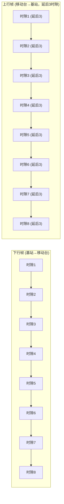
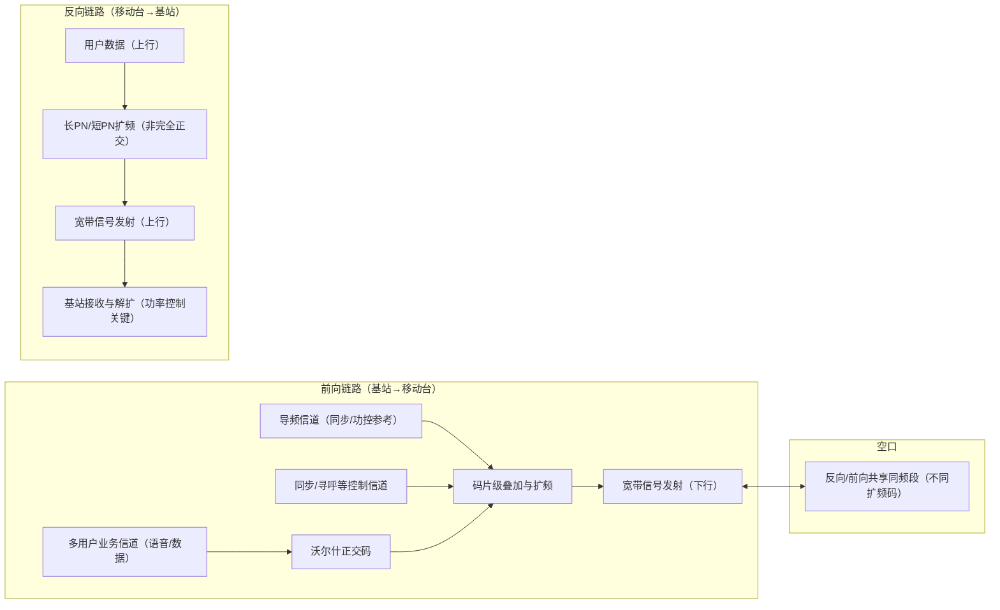
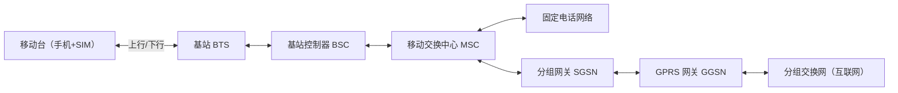

## RF无线技术

#### 1.1 发展背景与定义

20世纪80年代，全球已经广泛部署了**1G模拟蜂窝系统**，如美国的AMPS、日本的NMT、英国的TACS。1G系统的主要特点是模拟调制、低频谱效率、容易被窃听、只能提供语音服务。

随着用户量的急速增长，1G系统暴露出严重问题：

-   频谱利用率低，无法支撑更多用户；
    
-   模拟语音易受噪声和干扰影响，质量难以保证；
    
-   安全性差，通话容易被监听；
    
-   无法支持数据业务。
    

在这样的背景下，第二代移动通信系统（2G）于1991年在欧洲率先商用（GSM标准）。**2G的定义是：采用数字信号处理的蜂窝移动通信系统，以数字语音为核心，同时支持数据和短消息业务**。

简而言之：**1G = 模拟语音**，**2G = 数字语音 + 数据萌芽**。

#### 1.2 技术特点

2G系统相较于1G的显著进步体现在：

1.  **全数字化传输**
    
    -   语音经过编码、压缩后以数字比特流在空口传输，抗噪声能力强。
        
    -   通话质量接近固定电话。
        
2.  **频谱效率提升**
    
    -   引入TDMA或CDMA多址技术，频率复用度更高。
        
    -   系统容量扩大3~5倍。
        
3.  **更高的安全性**
    
    -   引入鉴权、加密算法（A3/A8/A5），有效防止窃听。
        
4.  **支持多业务**
    
    -   除语音外，支持短信（SMS）、电路交换数据（CSD）、分组交换数据（GPRS）、增强型数据（EDGE）。
        
5.  **标准化与国际化**
    
    -   GSM成为全球统一标准，推动国际漫游；
        
    -   cdmaOne则在北美和部分亚洲国家广泛应用。
        

#### 1.3 常见的2G制式

2G并不是单一标准，而是多种技术并存。主要包括：

-   **GSM (Global System for Mobile Communications)**
    
    -   起源于欧洲，采用TDMA+FDMA。
        
    -   全球最成功的2G标准，占据超过80%市场份额。
        
    -   特点：SIM卡机制、支持国际漫游、短消息业务。
        
-   **IS-95（cdmaOne）**
    
    -   美国高通主导，采用CDMA。
        
    -   抗干扰能力强，容量高。
        
    -   特点：支持软切换，语音质量优良。
        
-   **D-AMPS (IS-136)**
    
    -   由美国AT&T提出，基于AMPS演进。
        
    -   使用TDMA方式，但最终被GSM和cdmaOne取代。
        
-   **PDC (Personal Digital Cellular)**
    
    -   日本自主标准，采用TDMA。
        
    -   覆盖日本国内，但未能国际化。
        

#### 1.4 使用频段与信道配置

**GSM常见频段：**

-   GSM 900：上行 890–915 MHz，下行 935–960 MHz
    
-   GSM 1800（DCS）：上行 1710–1785 MHz，下行 1805–1880 MHz
    
-   GSM 1900（PCS）：上行 1850–1910 MHz，下行 1930–1990 MHz
    

**cdmaOne常见频段：**

-   800 MHz：上行 824–849 MHz，下行 869–894 MHz
    
-   1900 MHz：上行 1850–1910 MHz，下行 1930–1990 MHz
    

**信道配置（以GSM为例）：**

-   载波带宽：200 kHz
    
-   每载波划分为8个时隙
    
-   每时隙速率：22.8 kbps（净数据约13 kbps语音）
    

#### 1.5 理论速度

2G的核心业务是语音，但也支持低速数据。

-   **GSM语音**：13 kbps 全速率，质量接近固定电话
    
-   **CSD（电路交换数据）**：9.6–14.4 kbps
    
-   **SMS**：最大140字节/条
    
-   **GPRS**：最高171.2 kbps（8时隙 × 21.4 kbps）
    
-   **EDGE**：最高473.6 kbps（8时隙 × 59.2 kbps）
    
-   **IS-95**：14.4 kbps（IS-95A），最高115 kbps（IS-95B）

#### 1.6 关键技术解析

![TDMA][1]

1.  **多址接入技术**
    
    -   GSM：FDMA + TDMA
    -  cdmaOne：CDMA扩频

        
2.  **语音编码**
    
    -   GSM：FR（13 kbps）、EFR（12.2 kbps）、HR（6.5 kbps）
        
    -   cdmaOne：8 kbps QCELP
        
3.  **信道编码与交织**
    
    -   卷积码、循环冗余校验，提升误码性能。
        
4.  **切换机制**
    
    -   GSM：硬切换
        
    -   cdmaOne：软切换
        
5.  **安全机制**
    
    -   鉴权：A3算法
        
    -   会话密钥：A8算法
        
    -   加密：A5算法
        
6.  **数据增强**
    
    -   GPRS：分组交换
        
    -   EDGE：8PSK调制
        

#### 1.7 应用与社会影响

-   **短信（SMS）**：成为2G最具标志性的应用，推动了移动社交。
    
-   **移动上网雏形**：GPRS/EDGE使得WAP浏览、彩信成为可能。
    
-   **国际漫游**：GSM SIM卡机制推动了全球移动通信市场一体化。
    
-   **经济效益**：降低通信成本，带动手机普及，促进信息社会。
    

2G在全球范围内的普及，让“随时随地沟通”成为现实，也为后续3G/4G/5G的发展奠定基础。

#### 1.8 局限与问题

尽管2G通信系统在全球范围内取得了巨大成功，但随着用户需求的不断增长和互联网时代的来临，其技术瓶颈逐渐显现。主要局限与问题包括：

1.  **数据速率过低**
    
    -   原始GSM仅能提供9.6 kbps 的电路交换数据，无法满足多媒体、网页浏览等需求。
        
    -   即便是EDGE，理论峰值速率不足500 kbps，与真正的宽带上网差距甚远。
        
2.  **频谱资源紧张**
    
    -   随着用户数量激增，即便采用小区分裂和频率复用，2G系统在城市高密度区域仍面临容量瓶颈。
        
3.  **安全性不足**
    
    -   虽然2G引入了加密和鉴权机制，但部分算法（如A5/1）后来被证明存在漏洞。
        
    -   伪基站、短信诈骗等问题依然普遍。
        
4.  **服务种类有限**
    
    -   语音和短信是核心业务，数据业务仅作为补充。
        
    -   无法支持视频通话、大流量应用。
        
5.  **信令负担沉重**
    
    -   短消息（SMS）利用控制信道传输，在海量发送情况下容易造成信令拥塞。
        
6.  **切换与小区边缘问题**
    
    -   GSM采用硬切换，在高速移动环境下（如高速铁路）易出现掉话。
        
    -   小区边缘信号衰减明显，语音质量下降。
        
7.  **难以满足互联网时代需求**
    
    -   随着智能手机和移动互联网的出现，用户对高带宽、低时延的需求激增，而2G架构难以支撑。

#### 1.9 示意图

#### 1.10 小结

2G蜂窝通信系统是移动通信发展史上里程碑式的一代。它在继承1G蜂窝网络“移动性”的同时，引入了**全数字化语音、加密鉴权机制、多址接入技术和短消息业务**，显著提升了系统容量、安全性与用户体验。

-   从 **发展背景** 来看，2G诞生于用户需求爆发与1G瓶颈激化的时代。
    
-   在 **技术特点** 上，2G实现了语音数字化、抗干扰增强、容量提升，并开始支持数据业务。
    
-   从 **标准制式** 上看，GSM和cdmaOne成为主流，分别代表TDMA与CDMA两条技术路线。
    
-   在 **频段与信道** 方面，2G充分利用了800/900 MHz的广覆盖与1800/1900 MHz的高容量优势。
    
-   在 **数据速率** 上，虽然最初仅有9.6 kbps，但随着GPRS和EDGE的引入，2G逐渐具备了移动上网的雏形。
    
-   在 **关键技术** 层面，语音压缩、信道编码、切换机制、SIM卡与安全算法构成了其核心。
    
-   在 **应用与社会影响** 上，2G不仅带来了清晰的语音通话，还催生了短信、国际漫游、移动互联网萌芽，极大地推动了全球信息化进程。
    

可以说，**2G是第一代真正意义上的“数字移动通信系统”**。如果说1G解决了“能打电话”的问题，那么2G则让人们真正实现了“随时随地清晰、安全地沟通”，并开启了数据通信时代的大门。

##### 从2G到3G

然而，随着互联网的快速发展和用户需求的升级，2G的低速数据业务已经无法满足**网页浏览、视频通信、多媒体下载**等新兴应用。  
这直接催生了**第三代（3G）移动通信系统**的出现。

-   **速率需求**：从几十kbps提升到几百kbps甚至Mbps级别；
    
-   **业务扩展**：从语音+短信，扩展到移动上网、多媒体业务、移动视频；
    
-   **技术演进**：从GSM/GPRS/EDGE平滑过渡到WCDMA、CDMA2000、TD-SCDMA等3G制式。
    

因此，2G不仅是“语音数字化”的开端，更是迈向“移动宽带”的前奏。它的成功普及和局限性，成为3G诞生的直接驱动力。

#### 专栏：2G 各主要制式对比

在 2G 时代，全球并未形成完全统一的技术标准，而是呈现“多制式并存”的格局。不同地区因历史、产业和监管差异，选择了不同的 2G 技术。以下是主要制式的特点对比：

##### 1. GSM（Global System for Mobile Communications）

-   **起源**：欧洲 ETSI 主导（1987 定标）
    
-   **接入方式**：TDMA（时分多址），每载波 200 kHz，8 时隙
    
-   **频段**：900/1800 MHz（欧洲），850/1900 MHz（美洲）
    
-   **主要业务**：数字语音、SMS 短信、GPRS/EDGE 数据
    
-   **优势**：国际漫游最强，产业链最完善
    
-   **劣势**：数据速率偏低，语音容量受限
    

##### 2. cdmaOne（IS-95）

-   **起源**：美国 Qualcomm 主导（1993 商用）
    
-   **接入方式**：CDMA（码分多址），1.25 MHz 载波
    
-   **频段**：800/1900 MHz
    
-   **主要业务**：数字语音、分组数据（CDMA2000 1xEV-DO演进）
    
-   **优势**：频谱利用率高，语音质量好，抗干扰能力强
    
-   **劣势**：产业链集中在美洲/亚洲，国际漫游不如 GSM
    

##### 3. IS-136（北美 TDMA）

-   **起源**：美国运营商联盟（1990s）
    
-   **接入方式**：TDMA，每载波 30 kHz，3 时隙
    
-   **频段**：800/1900 MHz
    
-   **主要业务**：数字语音、短信（局限性大）
    
-   **优势**：兼容模拟 AMPS，便于平滑升级
    
-   **劣势**：容量有限，技术演进受阻，最终被 GSM/CDMA 淘汰
    

##### 4. PDC（Personal Digital Cellular，日本专用）

-   **起源**：日本 NTT 主导（1993 商用）
    
-   **接入方式**：TDMA，每载波 25 kHz，3 时隙
    
-   **频段**：800/1500 MHz
    
-   **主要业务**：语音、短信
    
-   **优势**：满足日本本土市场，先发优势
    
-   **劣势**：制式封闭，国际化程度低，已退网

##### 🔑 差异总结

-   **接入方式**：GSM、IS-136、PDC 都是 TDMA，但带宽和时隙配置不同；cdmaOne 则走 CDMA 路线。
    
-   **频谱效率**：CDMA（IS-95）普遍优于 TDMA 系统。
    
-   **国际化程度**：GSM 全球统一最成功；cdmaOne 在部分国家流行；IS-136 与 PDC 地域性很强。
    
-   **演进路径**：GSM → GPRS/EDGE → WCDMA；cdmaOne → CDMA2000；IS-136 与 PDC 没有成功进入 3G。

[1]:
data:image/jpeg;base64,/9j/4AAQSkZJRgABAQAAAQABAAD/2wCEAAkGBxITEhUSEBIVFRUXGB0YGBcWGB0XFxcYFxYdHR4XGBcYHSggGholHRUXITEhJSorLi4uFx8zODUtNyguLisBCgoKDg0OGxAQGi0mICY2Ky0vLTUwLS4vLS0rLS0tLy0tLSstLS0tLS0vLS0tLS0tLS0tLS0tLS0tLS01NS0tLf/AABEIANIA8AMBIgACEQEDEQH/xAAcAAACAgMBAQAAAAAAAAAAAAAABgQFAQMHAgj/xABDEAACAQMCAwUFBwIDBwMFAAABAgMABBESIQUGMRMiQVFhBzJxgZEUIzNCUpKhYoJyorEVFkNTssHRY6PCJERUc5P/xAAaAQEAAgMBAAAAAAAAAAAAAAAABAUBAgMG/8QALhEAAgIBAwIEBAYDAAAAAAAAAAECAxEEEiEFMTJBcZEGE0KBFCMzUaHBQ2Gx/9oADAMBAAIRAxEAPwDuNFFBoCDxXi8FsnaXMqRJnGpzgZPhn5VUf7/8K/8Az7b/APoKo/bXwee64eIrWJpX7VW0r1wA2T/NWPDeVrgRR54neKQi5XTb4HdGV/Bz6daAt77mqyhSN5rqGNZV1xszgB1wDqU+Iww+tRYee+GMQq39sSeg7RRn60n+1vglzLdcMmtreSZLeQvJ2YBIAkiOMEjchD9KtOZ+Ky3VtLbx8IunaRGVe1WJEVmGAxYybYJzt5UA3cS45bW6LLcTRxxsQFd2AUkgkAHp0BPyo4Xxy3uUMltNHKinBZGDAEDOCR02Ncg5i5Gv04Fb2So0863HaFU7wjUq/dBPUAn6tWvjvLfFLOW5j4XA7wXsKhtO3YyEAPjfY+/8n9KA6vw/nCwnkEUF3DJI2cIjgscDJ2HoDU7inF4LZO0uZUiTIGp2CjJ6DJ8dq5RwPkaay4xZtFA5t4bfS8wAwZCj6ifEksw/ipN3wHiXE777TcQRx20DYgtrrVpfb8R1jzk/H0HhuB1Ow4hFMiywusiNurKcqR6EVJzXKeUuEcR4Vd9l2ImsbglisGphbOTjID97TjGfT4b9VFAZzRmsUUBhicbUIT44+VGapb7mu0hmMMkhDjGrCsyrnoGZQQpxvigLzNY1VXxcZt3RpI5kdVBZtLAkADJJA3FIttx+7f77tmTtO8sZVWRFI7q4IyTjBJz1J6bV1qplZxE7U6edzxE6Szgdaq7bmW1kwVmXfoWygYealwNQ9RtSdxbj1xNbvA8cba8BmQlMrqBYaWz1UEe941ui41CRh9UfpIuB+4ZTHzrM9PZHujM9LbDxROgB6zmkW1hj963bRnxhbSpPqF7p+YqfDxC5Q7SLIPKRcN8njwB+01xOGBrzRmqCPmMj8WBx5tGRIo+Wz/RTU+14xBIdKSrqP5T3W/a2D/FAWGaM1iigM5ozWKKA9UUUUAUGig0B5IooooAooooAoqNd38UQzJIiZ6aiAT6AdSfhUO25ggkRpUYmJQxaUgrGNBIbvNjOCCNvI0Ba0UsWvOkLbtFMinoSobI8DpQlhkb4I8apvaXzqsPDpZLOZDKSsY/Wms7tpOCCBnBI64rZwku6OcLoTeItHQKg8W4rHbprkPUhVUbszHoqjxPj6AE18wcE9p3FLbAW5aRR+WYdoPqe9/NMTe19p5YXvLcARhvwT1ZwBq0v5AEYz+auVjkotxWWbTbUW4rk7jDzNbH3nMZ/9RSg/ce6frUK8vZJ7ho4ZSkUSqS0ekl3cEhckEaVXBxjcsPKkPhvPdhNsJ9BPhICv84x/NXkEMR78WBnfVEdOfXKEZqi1Ov1Hy3BxcZfuV8dfKD/ADYDTHdXK+Mco9QY2+ZXIJ/tFc8ueFXSvK8sLd+WSTKfeLiSRmA7uW2UqNwOlMsd1Ovuyah5SLn/ADLpP1zUmLjTD8SE/wCKNgw+hwR8s1W1dT19XHE17Mm163TWeeBAljjclWCsRsQR3hnqCDuK2JrX3JHGPAnWv0bO3wIp+kubSfuydmx8FlXS3yDgH6VFueUoG3jLxn+ltS/tfOPlirGj4ljB/mwlB/wTK8rmuQqJxGUe8it/hJU/Q5H81vj4tH+bUh/qBx+5cr/NTrnlSdfw3ST0OY2/7g/xVVd2c0e8sMiDzxqX9yZAHxr0Gm+IKbfDNMlx118PFyTUhjY9omnJ/Ohwx/vQ5P1qQlxOvuSk+koDj6jS38ml5Y4ydS4z+pTg/uXet0csq+7ISPJxq/nZvqTVktVTZ44nX8ZRZ+pAZF4w49+HV6xsP+l8fwTW5uJ2zjTIVAP5ZV0jP94wflS6nE3Hvx59UP8A8Wx/BNb4eJxM3Z6gHI9xxpJHoG975ZrP4eizwSwPwult/TlgaYYiv4UkkY8NDZX5I2Ux8qmQcVuU69nKPUGNvmRkE/BRSetuq7pmPxyhKfwpAPzrVwHmCUuiynXHK2I22DrkErrIADasemNuvWuNujnBZXJHu6fZWm1yjoMPMaf8WKSP1x2i/Ix5P1AqxseIRTKWhkVwDpJU5ww6g+RHkaSOY7to7dtBIdysaEdQ8rBAw+GrPyrVy4FtryEJ3UlVoWA/M6jtEY+bYWUZ8ddQyAdIooooArBrNYNAKl7z1bxzzwFHLW+O070aDvLqGntJFLbeQqbFzbalY21Pqlj7RYxFI0uj9TRqpZRnbJGKnW/BoEllmWNRJLpMjdS2gYHXyHlXi+4FbyuJXT7wLoEiMySaCclNaEMVz+UnFAaI+abNlDC4j0mNpQ2+DHGcO2T+k9R1HlXiTmqxKBjcJoeN5M747OM4dm27oBON8b7da2ScrWZjihNvH2cTa41C4Ct5jHnnfPXxzWf927T74/Z4z2/4oIyHG5wQdupJ28TnrQFT/tfhrRTCKVYQseuR0QxyLE22sFl1Y8NQzjNKlhwuO24RNHE7ss0ugA9poIluO60faqCQYWXJGxKk9cmmqaw4esMyxxCQtHoeEuwkdB/w1ErZHTYDA6b0jcJ5ka8ghgCyaYJZGZ3GkEB5FhiA6krGyZ8tI8a6VR3TSOGpsVdUpMtq1zwK4w6qw8mAI/mtlFej2rGDxG5p5QucR5Ispd+y7M+cZ0/5elLPEPZi3W3nB/pkGD+4f+K6TRXCekql5EyrqWor7Sz6nEOI8oXsO7QMw84++PoN/wCKrbW9ngP3byRH0JX+K+gai3vDYZRiWJHH9Sgn69ah2dOT7Msa+t54sgcu4b7Sb6PZ2WUf+ou/7hg018M9qsDbXELxn9SHWv02P+ter/2eWb5Ka4j/AEnI+jf+aWb/ANmlwu8MqSeh7h/nIqq1HRYPvD2JKv0N/fh+x03h3M9lcDEc8bZ/K3dP7WxVpHCBvEzJ/wDrYgft90/Svm6/sZISBKhUnOM9Dg4yp6EZHUVP4Fxm7R1SCeRMnGAx0/NTtVNb0dJPZL7M7LQPP5M2fRicQnX8yP6MpU/uXb/LW1+YUQap0aMbAsPvF3OBjT3up/TSjyjxiSUvFOwZ1AYNjBZScHIG2Qf9RVpKNdyi/ljQufLW50r8wFf61Q2aCve4zS45yuDEtVqtLY67X2GR7C1uFDmONww2cAZ+TDcUuT8uBp3jt3dFRAWLntAXfOlRnvAYUknPiAKteWCBJcx/1q4H+ONQcD1ZGPxNSuBtqe5k8GnKj4RIqf8AUr1Hrvu0c57ZvCSx98f0XVU1bWpY7nPbKYuisRgkbjyI2I+RzXLOL8Wc3rTKT3JO5v4I2wHpt/NdN4xKLcXeduzklx4dXLKPnrWuMZ8697VPdFSXnhnHws75eX2bVpl/NFqX4suw+pFVcoMaRkf8J4m+Ubrn+Aai8uNNdWkEKW8x0BdZEbYPZnugMRp3wCTnpTYnKlyw++EUKN3cyuDnV4aV2Pw1V6Bair5b3S7rB6OOqpdT3y7rBL48+ZreIfqaUj+mNdIz/dKMfD0rRxOfs+zn/wCRKkp89KnDgeuhmq15d5Xh1Sq97JPLHojlwAhXCZVOhYLpOdjvknOaZ7Ll61iOpIU1Hcuw1uTsMl3yx2A8aojzZaq2QCOhrNYArNAFBooNAeaKKKAKKKKA1XFsjjTIqsD1DAMPoRVHLydaY+6Qw7k4iOlck5J0bqMn0phorKk08o1lBSWJIROKcuPCpk+0R6B/zR2ZGfN1yP8AKKquykxnQXX9cJEy/wDtksPmBT1zHwyW4iMMVw0AYgO6Llyn5lRsjQT+rcilvifKjxlRY28KQxR4CRERz3DeEbzEAxxA4YkEsx8vGVDW2x88lfb0vTz8sehSJMpOAwz5fmHxU7itlTrqW8XK39tb3EcUWuWQwso1k92O3xraQjoTpHh51WScQs9IEiXNrOEDzRpmdINQyFdnGnUVwdK97fpUqHUV9SK+3okvol7m2irFeX7ho1lheKZHUMuQ0LFWGR3W1b488fKoFxDLH+NBKnqULr++PUo+ZFS4auqfZldb0/UV94nmoPGXxCwB3fEY+Mh0/wDcn5VLhmVxlGVh/SQf9Kh3XfmiQb6SZG9MAhc/Ek/tNdJyTjwcaYNT5XYVvapw9TaxyKAOybT/AGsMY+GVFInKkGqfP6QT8+g/1rrPNdqLi2lgTvyFdSoo1sWU5A0rk74x86peTfZpxAKS0AiLdTKwXA+C5J8+gqi6nHvs80ex+H7E1F2vCTNvLcmm8iP6g8f7l1AfVKb+GSAtPOSAhbCsdhojULqz5ate9brL2WjY3Ny5wc4gXQQR5OST9AKkcGuLR2eGCzeR4gVEdwW1Bl6BkIZYVIBwzYztgHOaoH0+U48vHkd+sUw1Wodlb4ZCj4kYZ2khRpu0iEYEatIBKjEpqKAhVIkbJPTR8KYeFWdxHEiJFsMl3mYR6ixLM4VdRGWJ2bG1RTxPiNxbo9nAsMiyMs8DDRIoA2EbSroYg4JOMMOhFa4uV725IlvZl1BTEYnXtIJIzuJGhSQKkuSRlWYEAfAbPo9E1ixZ7ffHYxQnVBQT7ELmLlSxnaSe/uCRHpE0VvkKD+UzBdT5Ab3u6MAeWah2d3wmylKWvDlJXTpmIVmdWAPaxNJ76d7fDAncAGmTg/IwiYmaZpgECq51RzBd8xvLG4MkW/dV8kb7mmfh/DIYEEcESRovRUUKoz1wBVnXXGuKjHsjbIqW83Fn1kLGpUgqhXTBNEw20S7yRSjqdSkA+B60cP5KlXCz3CSpn7zXDrlmXOezmkkdkYebBFJGOlOoFZrcC7wPlRLa6muInYLKip2W+hQmcHvEnO5AxgAeFMVFFAeqKKKAKDRWDQGKKrOM8dhtQpnLDXkDTG8nTrnQpx18apo/aNw1mKLOzMvvKIZSy/EBMj50A2UUu8Q52sYFheaYoJ89kCj6n0kA93TqByw2I8a0t7QOHD35zGD4yRSRr+50AoBooqm4vzRaW0KXE86iFyAsi5dWJBIwUzkYB39KzwPma1u43ltpldEOGO40kDO4YA9N6AuMUUscH5/4ddTLBb3AeRs4UKwzgEncjHQGrPj/ADBbWUYlu5ljQtpBPUsfAAbnpQFpUOfhcDtreGNnGO8UBbbp3sZrHB+LQ3USzW8iyRt0ZfTYg+RHlU2gMAUYrNBoCuvuBW0pzJChb9WMP+8Yb+aphyNbo7PEWBbcrKTOhIGBkOc7ejU0g1WzcXHatDHG8rIoaTRpwmr3QSxGWIBOkb43PUVlSa8zRwi+Wj1w62eM6THCqY6xApv5FMbfHUan4qAvGogcSExHylUxg/4Wbut8iaq+AJJcI1128i9q7GNVIKLErFEARgR3gusnrlzvgCsG/YZGIHWqG34naM32nRp2KidoyqsgPhLjGgkbZIz16VQ848YuNX+zYgs8tyhUlcxPFG2VMhPeB2Dfpx9Msx4qkKffRvCijdiuqNVA6l4yQqgDq2BQFlBOjgFGDDzUgj6itornXs+gjvXur+U5Z5nijVHKBIYzhcCMjvHcluu9WPFeKXEV5BY2cmuSRTLJ2+HSKBTgtqGHZidgCT0NAOlFVNzxKWFGe4jXQoJZ43GyjqxWTTj4AmtfCeaLWeNJUk0K4yhlVotQP6e0ADfImgLqivKuCMggj0r1QBRRRQHqiiigCg0UGgPBrnfJHLl1BxbiVzNHphnYmNtQOr7zPQHI2866LRQHNfapy5d3N1w6a1h7VbaQvIAyqfxImAGojchDVtx+8vrm3lt04YwaVGQNNLFoXUCNRCsxOM56U6UUBxrj/s6vV4JBYQ4nmWftWwwCqCr5CliNhkfMmtXMPJHFIZbgcLQdjewosy61URvsHxk+Pe3Hgx9K6/c8ShQ4eRAf0573yUbmo9vxpJCxRX0JnXIwCqpXqCGIbPyoDnHCuQZ7Ti1pLDFm2gt9DOGXJk0PqOknJJZv5r3PypxS/vje3XZW6QnFtbzDt0Ax77KjgFvHc9fhT9ZcWmkQSi2bs23QB17Ur4MyNpAyN8as4I8dqq+cOao4raRUk7G4ZcRLIuh8lwpZVYYbTqzkZG1EZSyLXLPLXEuF3h7ER3FncEtKkQ7MQOTjVGjudsY8dxt4Cui8T4gsEZkYE9AFXdnZjhUUeJJIFc1soRGAYXkX+tZGy3qxz3z6nNVvD+b7ueRJC6yQwyl0DrhnbQVGpkwCAJNXTrjyrvbQ60m2SL9LKlJt9zq/+0ZFGZbeQeseJQPkveJ+Cmqefisd1dC2SfSkaCSVVcxSM7NiOM4IdR3WYgYJ7vgd6t/aTGo0SwSCRgdKxfe5bwBAAbc7dK1ezlrM2wE7RNeTfeXKykdqZGJ2ZX3AA2AxgeFR9y7EYar9Wt4nm+0sqRqXbtVEgCqMncaWOw86p+S+IXLxPdS2pAuJDKoVl1aCqqhKPjGVQNjJPeqk4xw9768n4bbytb20US/aCrFy7TAlI0STKooCnOnFW3FeMXXDIFaf7PPEmmNdBaGZjsqqkeHV29Ay9KyCv9ovHllFvw9HaNrmZEnVgUdbfVhz3h7p6aht13ph4lZWdnaPOiGOOCMt9y5QlUGw7pAY/wCLNUHKEjRzXdzxG2lhluJcozxmQLbhQEjLx6lXG5IONyaicZt4OIXy8PtnVbcRGe6MDYEo16Vhwp0jfcnGRigJ3J/BLt3HFLiVDcSxaFjZe4kJbUq61x3yAuW0n4VF9oXE57nTw2CJzMXR5+wbtFjg3yzkgHVkhghG+nx6Uy8XvG4fbGVpg8UShQjp3z4KiOmMk7AZU5qp5Et7m3FxPeW7h7uYz/d4kMaFVCxuBh9Q8gpHrQFwPsCxaVWNREndQjs5QEXphsODt1pZ9nfC5bknirTMjyqY4lP3irCrbBjIdTbg43zjfO+B75svor/iFpw3WGgIaa4X3WYoMpE2dxk4YjYkY86Y+K21vYWsk0WuGOJc6Im7voqxvlBkkDp40Ar+0G/nuCnCURJZHeN5THkARI4Yh1bITIUH3iOnTIp1/wBq26IVlUwqq+7KuhNKjoG9w4A8CaU+ROGXpaTic3ZtJdKmEOYykQGV3APeYYyMeA6ZwMe0Ti0kixWAjkjaaaJJyCCogeTSfvEJ06z3QDpJ3oDPs14eLmF+ISPIrXEjsixuY0ijR2VVCIdJyBk6getT+L8euYbuGytiJ5JBqYSgKEjye9rjA/Sx909B5ir6PgVtGgEcfZBFABiJjOlRtkoRnp45pT4bZFJ4OLSOXa40QBXx93BOR2QBAGZNWjUT11EDwyA4/b5V/Et2+MREg+ndb6LXvhnGILgEwSq+NiBswwSDlTuN1I38Qahc3zstsyISHmZIEK9QZ3Cah5aQxbPhpqPfWyW9zZPGulTqtcDYaWTtE29DBj+8+dAMoooFFAFBooNAKHFOcTHeSWccIZo4llLMzAEOSMARxOc7eOK32vOCEQLJbzpPOHKW5UdpiP3mJJChehGSDv0q/W0jDmUIokICl8DUVHQE9SK83nD4pQBNGkgG4DqGx8M9KAoV57stIZpGRcyqWdCAskAy8TN014yQBnODjOKIueLRl1BpBhJJJA0bBoUhGWMynePqMA+9nbNXh4ZAUEZhj0KQVTQNIIOQQuMAg+NexZRhncRqGfAdtIy4HQMfzbHxoBX4bzVZvGwt0khDRPMr9hgFQMlxjYt44bBNLfB+GpBw+9ntJJ9F0rGMzKMSPcDTHIASW1ZfByAGyNuhpzmFrCJCtvHG2lhlotEb7dDIqkBT45+lJXInEzfO9vFC0cEF2ZnLEFV0NmK3jCkg4ddW22F260B1GGPSqqPAAfTakbkVlur7iF6wDaZRbwsdykUajUF8AGYhvXNNXMnFFtrWWZjjSh0+rkYVR6liBVF7KrAxcPjJG8rNJv1IPdU/NUU/OgK7nyzj7a1tLVFhnu5CDMg0tHGil3YBcBmIUgZ9ah3ns/WygZ4bsLDGC5FwoIUdT348H6g1bIO342W8LaMqD5NoGcfH7SRn+j0rz7ZbgDhkkQPemZI1Hie9rI/ahrLbZltvuLHIXB7l5RxKW3PZPGFhVWBcb/ilX07EFsYycMfOt3tO4rAYktu528kirokTEioxOWGsd1cgZYeGa6hw237KGOPoERU+GlQP+1Ifs7sftF3f8QnGstII4Swzoi06tK581dM1XXdPhZer23lexnc9rSI3DeHR2iF7dnjOkF3Rt30D3mByreOMjbpXO+P+0eSS6tJJ0EqWsvaqPcZiQMByO7qUqNwo3yOm9dJ5/hQ3Fvw+1RIpLknXKg0lEz5LschX6+C48cip477DbZlL291JGQN+1AdcgdSRggfWu2monXnfPJEopnXndLJLT202c0MgijnjuShESFNYaQqdIDIT+bHUCpnsw4BZmyjEwjku3LSzEnE6u7E7kHWpA09Medc45H5Xa3nE8mGjcSLBIB3ZdDAF0B3AIyQT1G4pm5q70SRj8SWRY1bGSmrdnUnoQAenpVpXpt9e/JHv13yr1Vt7+ZaRWUvFLmSGK4eOztJVOliZmkmjc6SWfvBe6SV1dNPidnbiXFbm2UNJHHMSdKLExWSRz0VY3yCdiT3xgAnwpb9nEcdtPLbJnEqCVSSSS0eEfc+jIfmaZb1y3ELaPGyQzSk+AJMca/M6n+hqPODg9rJtVsbYKcezKH2acEU280t5GHuJJWWYSAMwKEd1gemTl/7x4Yrxxvg/225l4crSRWyQq02lye0aQns41DZCKvZhzjBOANgd2ThTBb27j2ywhm+OpDHn/wBjHyrHKyhmu5/+ZcsAf6YVWIfLVG5/urU6G/lW8MtpDI4CsYwGVfdVl7rAegINVHDLD7TZTvnvXTSSK43IGfuG/tVIyK0vedhFe2y7S9o3YKNy32sFkwPISGb0AQnoKvYLu2tEhtmljj0xhUUsAxWMBdl6nHd+tAQLvjDvwv7SBiSS3BA8pZEAC4P9bAYo5ksuz4fpUE/Z1ikUDc5tmRxjz/DqosUuH0W32eRoIZTIHwEEoWXXAo1kEKuxY4zmMAA5pomkuNJaQwQqASSdUmFxuSToA/kUBEvp1murVIzqCZuGI3ABQpHk/wBRdiPPQfKtPN99EYgUkRpYZUlEakF2MLgtGqjfUV1DHriofA+HWELJAs7zNcapEzIxR0jwCq6MJoUFQFOcCmu1so4xiKNUB66VC5+OOtASFOQDWaBRQBQaKDQHmiiigCiiigDFV13wO2kOp4U1/rXuP8nTDD61Y0UAm8y8mdvGAbq4KIdYibEykgYxuBI2QSPf/McVHtOdyyMkKwTSAMqJG5iYumxUxTBcAHrpZsU2cZ4aLiJoXd1VtiY20MR4rqG4B6bVS8a5XZ4khtmWKGJe7brmNJGHuiSRO92fmoGT4mgK/kmWGLU9zKVuZjuJvu2KgkjGcK2osznSSO8B0WoHM0o4hxK3tIRrjtnE0z/lDAju58TgafjIfI4lPa8StwFL9tCiF5B2KOJGOwgt7ePSVRT4u1U68Xt4TpubBre6VA0jWZMSgnJSMFWBkbBO2GUEkZoB/wCZ74w2srr7+kqg85H7qAeuphUH2e2XZWMX9eZB/hY9z5BAg+VVvFOW5ryKGRblyMBxFdRDo+Mq/ZaCGKakPXAdvOp17xa/hhb/AOg7RwvdNvIrpnGBlZNDhfQBqAVbZ/tPMrEbrbxtn0KJpH+aaX6GnXnfP2C5VThniaJf8Uo0L/LilL2XQQwGaa6lVLy4cl45DodV1scaXxlmZmc4yMsB4UzcwzLLNBbZGEdLmYk7IkTao9R8C0qrgeIRvKgInOPC1jsI9Ax9mMRX0VcIw+aMwpDvBrvoU8Io3kP+JiEX+NVdN43cw3EEluhaTtEZPulLgFhjJcDSuD5kdKS+XeS7/LzXRhSWQjUcl9KKMBQqgDrk+91NTNPcoLbLsVut00py3wXOGvc2cPm0XdrIenaGMn0ljYD/ADBB86Z7PiUQkuL6VgkOhY42b86RFyzqvUqWcgYG+nbwqLc8kq0bK7mViNlfuRFhuNWga9OQOjVX8nS3BleJ7aOCWNdLgIqIuR3XhIDNKuw3Lr45ArnqbI2T3ROugpnTVsmWPGZpTMJ+HI0sjp2DnSVjChiyS63wG0Mz90HftPnUuCGW3hSMSQ20aY70jdq7b5YtnSoZtyTk9TVc/CuKTwvHNciKZJgwkjwIZo8e5pQrIg33BbOR1IrbZ8mMdDXVw7SRMWgdW1PEGGGUvICJFPky7fzUcmmpzYS3KTPMbm47EtCEOlZIxnIh06VlO7DBZiAx86hrziow3DrLXGy7yBSNMwJzBKI1Zo3HiW89s1c2XItrGzE6pUc63ilCPG0pOe2ClMI/+DSPSmSC3RBpRVUDYBRgYHwoBOhj4pcNr7VreNk1xaUTMb53juY5FLOp2wyFTjwBrZbcnzanmkuAs0h1MwRZTC2MH7M8oyin9LAgZpyAooBbk5OgNzBdL3HhJbuBV7VmTSWkIG+3oN6ZKKKA9UUUUAUGig0B5oqn5i5mtbJVN1LoLnCKFZ3c+SogJNVlxz1DGvaTW17HGOsjW7aQPMhckD5UA10UvcW5zs7e1W9eQtA5Cq6KWyWzju9R7prR/vxDoEht7zQQG1fZnI0kZztk4xQDRRVBBzjZSWkl7FL2kMQLOVB1LjqCjYIPoRULlj2hWN9L2Ns769BcB0KalDYJUnrv/ofKgGyikniHtS4bDO0DvIXR+zJWMsmv9OroT4fI0z8Z4vDawvPcOEjQZJP+gA6k+AFAT68PEpwSoOOmRnFUPKvOdnf6xauxaPGpHUo4BGzaT+X1phoAoorBNAa7m1SQaZEV1PUMAw+hqkj5Os0cvBEIWOM9mFxt07jgqMZ8AKl8W5gt7faWQavBF7zn+1dx8TtVDcc/IPw7aVj5sURfiTqJ/is4OFmpqr4nJIZLeKdWw7o6eeko4+OCVb5Bam1zq/52u3GIY4YvNiWlYD0GFAPqc1TT307giSeVgeoLkA/FVIHyxWVFkC/rOmr7PPodN4nx22g/GlVT+n3mPwRct/FRbPmyzk2E2k+UgMZ+WoAH5VzKKJVGFAUegxXqs7Stl8QvdxDg7KjgjKkEHxG4+te64zau0ZzE7Rn+hiv1A2PzFXNpzbeR9XWVfKRcN+9Mf9Jo4k2nrunn4so6bRSdac+J0mhdP6kxIv0GG/ymr6w4/bTbRzIT+knS37Wwf4rXBaVamqzwSTLOisA1msHcKKKKA9UUUUAUGig0Aj87clyXV1bX1rKiT23urKCY3GScHG6nJO9brufjbrojt7KFjsZTM8oUeJEfZrn5mnCigEL2hcq3l9w1LUPFJcdojO5HZIdIbOBuR1FS7KXjEcMcK2VplEVAxumx3VAyVEPp0zTlRQHM+GezqaCw4hEZUkub0MTjKRKxyQBnfGXO/wAKp09m1/Da2D2jRR31sZVc6u40cksjjvadyNeMf1HyrsE9wiDLsqgeLEAfU1T3/NVtHE02pnjQZLxqWQ+Wl9lYk7YBO9Ac1u/ZXcixtIYzG063BuLlmbAYnwVsd7AH+tX/ADjyfe8Tuws8iQ2MXeRUOt5JBjvSIwxjqMb4A9aL32g3JA7GzVc+LyFseXcRQTt61S3HHrifaa6ceaR5gX6DDn5sazgr7upUVrOc+nJM4/yRdQ3CcQtL6M3SYVhKqQRvENirdmB4YG/gB5Uy3XPMa6Qkfatpy+hx2aH9IkIw/j0HhSElpGuSEXJ3Jxkk+ZPU1trZQKe/4gljFcceo2XPPchGIoArfqd9QH9qgE/UUs3t1JM2uaRnbfGdlXPgqjYD+fU1pzRWyiirv6pqLlhyx6cHlUAzgAZ648fj516oorYgOTfdhRmiihqFFFFAFFFFDIZrEiBhhgCPIjI+hrzLOikBmAJ8Cd/p1rH2gflBb4Db6nArGUdY12LlZJtpfzxfhTSIPINlf2tkY+VXdnzrcr+Kkcg8xmNv+4z8hSsJHP5Ao82bP8L/AOa8vbs3vSNjyXug/E9f5rXCZPp12oq72f2dEtufLXA7ctATt3xlf3JkfXFMHD+IxTLrhkV1zjKnO48D5GuPrbqDkAZ8zufqd6YOQbjReunhNDq/uhcDPx0y4+C1q44LvQdW+fYqpL7nTaKwKzWpehQaKwaASB7R4T2xEMjdjK0LANH2jMjYJSLVqYb+AzV5cc02yM0ZLs6RiV1SN3aNCMguFU6T12O+xqdYcMih1CGNUDuZG0jGp26sfU1pvuA20zl5YEZiuktjDMo/KxHvLv0ORQEFudLEKz9vlVRJMhHOpZSQhTC/eEsMYXJB60Tc6WKqXM4KhY2yFZhibPZgEDBZsHujfzAqc3AbYtC3YRZg2hOgDsgRjCY90bDp5VrTluzEbxC2i7OR+0dNAwz598jHvbDfwoCg5l43YXNpMHnaNVZYnYRt2imXYKvdJAbIGpc7ZpZ4pwrsLCxte0kdO0LFJAVIMcZOMMA3Z9p3gD0yKZuYUtIbWZVtQcHW0bqyGRkyQ6SOMO42I38MbUhWnMTcQSGZww7GLsgWOWkche0lOPMoAPn51lELqFvy9PJkvNeWUHqM/Hes0V2PAZeTV9nH5SV+B2+h2ow4/S3x7p+tbaKxg6fOk+/Jr7fHvKw+WR9VzXtXB6EH51mvDwqeoHx8fr1pyM1vywe6K19iR7rn594fzv8AzWJJWUEsAQOpBx/Df+aZMqrd4Xk20Vo7diMrGd+mohfr4/xXlYZW3dwo/Sg3+bN1+QFMmVQ14mkSa1falOynUf6d/rjpXkWSdO8QeoLsQfiCd63RxhRhQAPIDA+lOR+VH93/AAaJpnx92m58WIAHqfE/AV5W0J3kkcn+klF+QU/6k1LrFMBXuKxFY/6a4rZF3VQCep8T8SdzWysivIcE4G7fpXvN9FyaGuLLH5s9VirKz4Bdy+7AyjzlIjH0Pe/y1Zpyjowbq7jiBIAVcZLHw1yHGfTTWHJE6npOqs+nHqLdbuD3/Y3MUwDSBSVdYwXfS64yEXc4Ok49KcuD8B4dI0iqDM0L6JBKSQGwDjQQFIwQc4wQaabe2RBiNFUeSgAfQVq5ZLnRdGnTYrJS5RuifIBGdwDuCDv5g7g+leqBRWh6EKDRQaA80UUUAVruEYqQjaSejYzj1wetbKKArW4MrDEzySjxDthT6FEwpHoQahXvJ1jJ/wDbRocY1RDsm9O9Hg1f0UMNJ8M57xvkpYUMkV26KOqyxmcY+KYf5nOKXoLOWQarfsbtfO1mV2A/qjbBHyJrpvH+CC6VY5JZEj1ZdI209qP0Ow72nzAIzVBx/l25LL9mWDskURxwqOyGPFpnA1NGuAREmMkbms5ZBu6Zpre8fYSJrgIdMoaJvKVTGSfTWBn5Vtpmu+L38KyLcW6XMaARpqiKSXU5PSONNYWLw1NjxNVrXXB5AuYpbdiwjLQ6ljErNpKpjuy4fullUgelbKZVXfD8X+nL3Kqimi75DmX8C5Vx+mVMH96bf5apLrg15F+JauR+qL71flpGv6rW25FVd0jVV/Tlf6IVRb8ZMS+BkGfXSC3+oFb0mUkrqGodVOzD4qdx9KgpdK82Sy6Uyq75LufeKjqcYxt5mjaOGnosU22nwWRrFTLXhV1L+FbS/Fx2S/H7zBx8AaubXka4bBlmjj8wimQ/ubSP4NNyOtXStVZztx6i3XgyrnTnLfpG7ftG9O1zylBBE0vZTXjqMiPtNJb0CDSnyOa1cn8cE0cn2S0iRlBGlQ0aJIBns5nZFYNuOiHHnWu8s6vh9/5Jewv2nBbuXHZ274P5pPulHx1d76Kat4uS5ANVxcxxL46Rq/zuQB+2t73XFriJGiUQSK7LPEy6D0GkxSuGWRVznIwG81wRXuLk2ac9tfSq0xQxMrIk0Tx57rGNlCpL5lNunWsbmWlXR9LX9OfU1vw7hcCyNIzzmEgTLlpDHnG7xR7BcEHOMY3rVHzkiMYrOyAjBwjoCVZCNpY1jTTKCfyqxbY501bcI5HhhyJHadQoSPtRmRExvGZRgyRk76WyBnbama3t0RQsaqijoqgKB8ANq1yWEKoQWIxSE2C14s+vtJlRgxGwAgmib9Gn763lUb5JbB8638L5J7LSrzK8Y2dTCmuZcHuXErZ7Ub9dKk43JpwxRQ6FBwHlWK1nnmhJHbaAYxtGgjGBpXzwcZ8gBV/RRQHqiiigCiiigMYoxWaKAxijFZooDGKMVmigMYo01migPOmoicJgD9osMYc9WCAMfXOKm0UB501GuoZDjs3VPMlNR+XeAHzzUuigKG/5ZjmA+0Ht2BBHaAaRv4IgUH55rxw3laO3B+ykQ7k4RFKnPmrgkePukUw0UMYRqhjIA1EE+JAxk/DJxWzTWaKGTGmtEVlGrM6ooZ8amAAZsdNR6n51IooDGmjFZooDGKMVmigMYoxWaKAxijFZooAooooAooooAooooAooooAooooAooooAooooAooooAooooAooooAooooAooooAooooAooooAooooAooooD/2Q==
<!--stackedit_data:
eyJoaXN0b3J5IjpbMjE2NDg1NDYsLTExNjQ4NTM0MDBdfQ==
-->