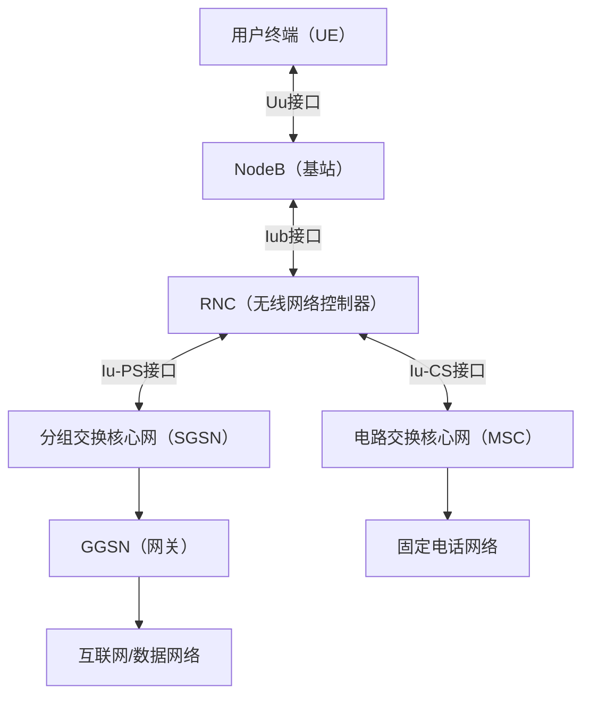
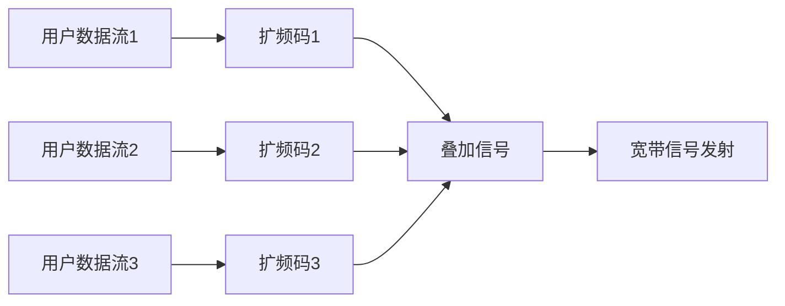
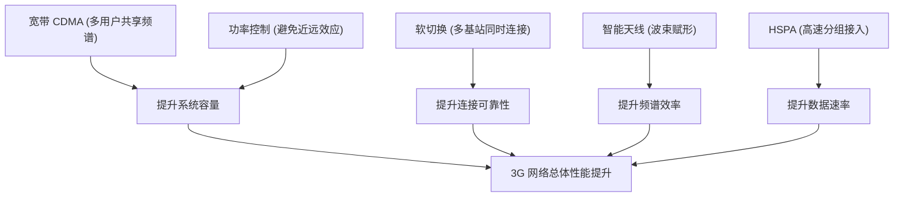

## RF无线技术

### 蜂窝网-3G 移动通信系统

#### 3.1 发展背景与定义

进入21世纪，2G 网络已经在全球范围内普及。虽然 GSM 和 cdmaOne 在语音通信方面表现稳定，但随着移动互联网的萌芽，用户需求逐渐从“能打电话”转向“能上网”。WAP、彩信、手机游戏等新业务对数据速率提出了更高的要求，2G 的 9.6 kbps（GSM 原始数据速率）或 144 kbps（cdmaOne 峰值速率）显然无法满足。

为此，ITU 在1992年提出 **IMT-2000（International Mobile Telecommunications-2000）** 标准框架，目标是提供 **“随时随地的高速数据与多媒体服务”**。这就是第三代移动通信（3G）的诞生背景。

3G 的定义：

-   下行数据速率 ≥ 2 Mbps（室内/低速场景）
    
-   室外移动环境 ≥ 384 kbps
    
-   高速移动环境（火车/高速公路） ≥ 144 kbps
    
-   支持语音、视频电话、多媒体消息、移动互联网接入等业务

#### 3.2 技术特点

与 2G 相比，3G 有如下显著技术特征：

1.  **宽带化**：从 2G 的 200 kHz/1.25 MHz 信道带宽，跃升至 5 MHz（WCDMA）、1.25 MHz 多载波（CDMA2000）、1.28 MHz（TD-SCDMA）。
    
2.  **以数据业务为核心**：强调分组交换，语音逐渐向 IP 化过渡。
    
3.  **多媒体能力**：支持视频电话、流媒体、移动电视、彩铃等业务。
    
4.  **空口技术演进**：从 TDMA/CDMA 向宽带 CDMA 演进，提升频谱利用率和容量。
    
5.  **国际标准分裂**：IMT-2000 框架下并未形成统一制式，而是出现了多条演进路径。

#### 3.3 常见的3G制式

3G 并非单一标准，而是一个“族群”。主要制式包括：

1.  **WCDMA（Wideband CDMA）**
    
    -   由 GSM 演进而来，由 3GPP 主导
        
    -   载波带宽 5 MHz，支持 FDD 模式
        
    -   数据速率：下行最高 2 Mbps
        
    -   覆盖范围广，产业链最成熟
        
    -   后续可演进至 HSPA/HSPA+
        
2.  **CDMA2000**
    
    -   由 cdmaOne 演进而来，由 3GPP2 主导
        
    -   基本载波带宽 1.25 MHz，可多载波并行
        
    -   数据速率：1xRTT ~ 144 kbps，EV-DO 可达 2.4 Mbps
        
    -   在北美、韩国广泛应用
        
3.  **TD-SCDMA（Time Division-Synchronous CDMA）**
    
    -   中国主导的自主3G标准
        
    -   载波带宽 1.28 MHz，采用 TDD 模式
        
    -   支持智能天线、动态信道分配
        
    -   下行速率可达 2 Mbps
        
    -   后续演进至 TD-LTE
        
4.  **其他制式**
    
    -   UWC-136（从北美 TDMA 演进，最终失败）
        
    -   DECT+（面向无绳电话，非主流）
        

#### 3.4 使用频段与信道配置

ITU 为 3G 规划了 **IMT-2000 频段**，主要包括：

-   **FDD 模式**：1920–1980 MHz（上行），2110–2170 MHz（下行）
    
-   **TDD 模式**：1900–1920 MHz，2010–2025 MHz
    
-   各国可根据国情分配，如欧洲以 WCDMA 为主，中国采用“TD-SCDMA（1880–1920 MHz / 2010–2025 MHz / 2300–2400 MHz）+ WCDMA + CDMA2000 三网并存”。
    

#### 3.5 理论速度

不同 3G 制式的理论速率：

-   WCDMA R99：下行 384 kbps ~ 2 Mbps
    
-   HSDPA（3.5G）：下行可达 14.4 Mbps
    
-   HSUPA：上行可达 5.76 Mbps
    
-   CDMA2000 1xRTT：144 kbps
    
-   CDMA2000 EV-DO Rev.0：下行 2.4 Mbps
    
-   TD-SCDMA：下行 2 Mbps，上行 384 kbps
    

对比 2G 的几十 kbps 到 100 kbps，3G 已经实现了数量级的提升，为智能手机和移动互联网奠定了基础。

#### 3.6 关键技术解析

3G 的核心突破在于它将“宽带化的 CDMA 技术”引入蜂窝通信，从而实现了高速数据传输、多媒体业务承载，并在网络架构、资源分配和天线技术方面进行了系统创新。以下逐一解析：

##### 1. 宽带 CDMA（WCDMA/CDMA2000 基础）

**（1）原理**  
CDMA 的基本思想是利用扩频码把用户信号扩展到更宽的频带，使得多个用户可以在同一时间、同一频率上同时通信，通过不同的伪随机码进行区分。

-   2G cdmaOne 带宽为 **1.25 MHz**；
    
-   3G WCDMA 扩展到 **5 MHz**，被称为“宽带 CDMA”。
    

**（2）意义**

-   提高单位带宽可支持的用户数（容量提升）。
    
-   提升数据速率：带宽越宽，理论速率越高。
    
-   抗干扰能力更强，能抵御频率选择性衰落。
    

**（3）举例**  
WCDMA 标准在一个 5 MHz 载波上，可同时承载语音和高速数据，用户数可达数百个，大幅优于 GSM。

##### 2. 功率控制（解决近远效应）

**（1）背景**  
在 CDMA 网络中，所有用户在同一频率上通信。如果离基站近的用户发射功率太大，会淹没远处用户的信号，这就是 **近远效应**。
![CDMA的远近效应与功率控制_cdma功率控制技术-CSDN博客][1]

**（2）方法**  
3G 网络引入 **快速功率控制**，即基站每 1.5 ms（WCDMA）或更短时间，向终端发出功率调整命令，让每个终端的接收功率保持在合适的范围内。

**（3）意义**

-   确保公平接入，避免部分用户“霸占”资源。
    
-   提升频谱利用率。
    
-   降低干扰，提高系统容量。
    

##### 3. 软切换与宏分集

**（1）背景**  
2G（GSM）的切换是“硬切换”，即用户在小区边界时，需要从一个基站断开，再接入另一个基站，中间存在掉话风险。

**（2）原理**  
3G（特别是 WCDMA）支持 **软切换**：当用户在小区边缘时，可以同时与多个基站保持连接，接收多个信号并进行合并。

-   “下行”信号合并，提高接收质量。
    
-   “上行”信号分集，提高基站检测能力。
    

**（3）意义**

-   显著降低掉话率。
    
-   提升小区边界通信质量。
    

##### 4. 智能天线与波束赋形（TD-SCDMA 特有）

**（1）原理**  
通过天线阵列形成定向波束，将能量集中到用户方向，而非全向发射。基站可以动态调整波束指向。

**（2）优势**

-   降低小区间干扰（波束只指向所需方向）。
    
-   提高频谱效率。
    
-   支持更多用户接入。
    
![关于波束赋形概念分析-CSDN博客][2]

**（3）应用**  
TD-SCDMA 率先引入智能天线，在中国大规模部署，成为后续 4G/5G 大规模 MIMO 的先驱。

##### 5. 上下行分集与 TDD/FDD 模式

**（1）FDD（频分双工）**

-   上行和下行使用不同频段（如 WCDMA、CDMA2000）。
    
-   优点：上下行同时通信，时延低。
    
-   缺点：频谱利用率受限。
    

**（2）TDD（时分双工）**

-   上下行共用同一频段，但在时间上分时隙区分（如 TD-SCDMA）。
    
-   优点：上下行比例可动态调整，适合数据业务不对称的场景。
    
-   缺点：系统设计复杂，对时钟同步要求高。
    
![FDD与TDD的区别-腾讯云开发者社区-腾讯云][3]

##### 6. 高速分组接入（HSPA，3.5G 技术）

**（1）背景**  
3G 标准 R99 版本速率仅为 384 kbps，难以满足快速增长的数据需求。

**（2）技术要点**

-   **HSDPA（下行增强）**：
    
    -   使用 16QAM/64QAM 高阶调制，提升单用户速率。
        
    -   **HARQ**（混合自动重传）：结合 FEC 与 ARQ，提升链路可靠性。
        
    -   **快速调度器**：在基站进行毫秒级调度，按用户信道质量分配资源。
        
    -   下行峰值速率提升至 14.4 Mbps。

        
-   **HSUPA（上行增强）**：
    
    -   改进上行调度机制，减少时延。
        
    -   上行峰值速率可达 5.76 Mbps。
        

**（3）意义**  
HSPA 让 3G 网络实现了近乎 4G 的体验，因此被称为“3.5G”，在全球大量部署。

##### 7. 多模终端与国际漫游

**（1）问题**  
由于 3G 制式不统一（WCDMA、CDMA2000、TD-SCDMA），用户在不同国家可能无法直接使用本地网络。

**（2）解决方案**

-   研发 **双模/多模终端**，如 GSM/WCDMA，或 GSM/CDMA2000。
    
-   在芯片层面集成多种制式（高通 MSM 芯片就是代表）。
    

**（3）意义**

-   保证用户在不同国家和地区都能使用 3G 服务。
    
-   促进智能手机普及和国际漫游。
    

##### 8. 网络架构创新（RNC、分组核心网）

**（1）RNC（Radio Network Controller）**

-   类似 2G 的 BSC，但功能更强。
    
-   负责资源管理、切换控制、功率控制、数据分配。
    

**（2）分组核心网**

-   引入 **SGSN/GGSN**，分别对应移动性管理与数据接入网关。
    
-   支持移动互联网的分组交换业务。
    

**（3）意义**

-   将电路交换与分组交换并行支持。
    
-   为向全 IP 核心网（4G）演进奠定基础。
    

📘 **总结**  
3G 的关键技术不仅仅是“速率更高”，而是一整套体系创新：

-   **空口技术（宽带 CDMA、功率控制、软切换）**
    
-   **天线与信道技术（智能天线、TDD/FDD）**
    
-   **速率增强（HSPA 系列）**
    
-   **网络架构（RNC、分组核心网）**
    
-   **终端能力（多模、多频段）**
    

这些创新，使 3G 成为真正意义上的 **“移动互联网起点”**。

#### 3.7 应用与社会影响

3G 的应用场景远超 2G：

-   **移动互联网**：手机浏览网页、邮箱、即时通讯
    
-   **多媒体通信**：视频电话、移动电视、流媒体音乐
    
-   **移动办公**：邮件推送、VPN、远程会议
    
-   **社会影响**：
    
    -   推动智能手机兴起（iPhone 3G 2008 年发布）
        
    -   应用商店、APP 生态崛起
        
    -   移动支付、O2O 模式出现
        
    -   运营商商业模式转型，从语音/SMS 收入向数据流量转移
        

#### 3.8 局限与问题

虽然 3G 是移动通信的重大进步，但也存在一些问题：

1.  **建设成本高**：3G 网络需要新建大量 NodeB/RNC，投资巨大。
    
2.  **标准割裂**：WCDMA、CDMA2000、TD-SCDMA 三分天下，造成国际漫游复杂。
    
3.  **速率仍有限**：相比 4G，3G 的速率不足以支撑高清视频、高清视频会议。
    
4.  **终端功耗高**：早期 3G 手机待机时间短。
    
5.  **频谱利用效率有限**：虽然优于 2G，但仍无法满足日益增长的数据需求。
    

#### 3.9 示意图

**（1）3G 网络架构（以 WCDMA 为例）**

**（2）WCDMA 码分复用示意**

#### 📦 专栏：3G 各主要制式对比

在 3G 时代，IMT-2000 虽然提出了统一标准框架，但由于历史、产业和国家利益的差异，全球依然分化为三大主流制式：**WCDMA、CDMA2000 和 TD-SCDMA**。它们都属于 3G，却在接入方式、频谱利用、产业生态和应用推广上差别显著。

##### 1. WCDMA（Wideband CDMA）

-   **主导方**：欧洲 3GPP（GSM 演进）
    
-   **接入方式**：FDD + 宽带 CDMA，每载波 5 MHz
    
-   **频段**：常用 1920–1980 MHz（上行），2110–2170 MHz（下行）
    
-   **数据速率**：R99 下行 384 kbps，后续 HSDPA 提升至 14.4 Mbps
    
-   **优势**：
    
    -   全球最广泛采用，覆盖范围最大
        
    -   GSM 生态延续，国际漫游能力强
        
-   **劣势**：
    
    -   建设成本高
        
    -   早期终端功耗大
        

##### 2. CDMA2000

-   **主导方**：美国 Qualcomm，3GPP2 标准组织
    
-   **接入方式**：FDD + 窄带 CDMA，每载波 1.25 MHz，可多载波扩展
    
-   **频段**：800 MHz、1900 MHz 等
    
-   **数据速率**：1xRTT ~ 144 kbps，EV-DO Rev.0 下行 2.4 Mbps，Rev.A 可达 3.1 Mbps
    
-   **优势**：
    
    -   频谱利用率高，覆盖性能好
        
    -   向下兼容 cdmaOne，演进平滑
        
-   **劣势**：
    
    -   全球份额有限（北美、韩国、日本局部）
        
    -   漫游能力差于 WCDMA
        

##### 3. TD-SCDMA（Time Division-Synchronous CDMA）

-   **主导方**：中国主导（大唐电信 + 中国移动）
    
-   **接入方式**：TDD + 同步 CDMA，每载波 1.28 MHz
    
-   **频段**：1880–1920 MHz / 2010–2025 MHz / 2300–2400 MHz
    
-   **数据速率**：下行 2 Mbps，上行 384 kbps
    
-   **优势**：
    
    -   首个由中国提出并商用的 3G 标准
        
    -   支持智能天线与动态信道分配，提升容量
        
-   **劣势**：
    
    -   终端和产业链相对弱
        
    -   国际化程度低，仅中国大规模商用
        

##### 🔑 差异总结

-   **接入方式**：
    
    -   WCDMA 与 CDMA2000 都采用 **FDD 宽带/窄带 CDMA**；
        
    -   TD-SCDMA 则采用 **TDD 同步 CDMA**，上下行共享频段，灵活但复杂。
        
-   **带宽配置**：
    
    -   WCDMA：5 MHz 宽带
        
    -   CDMA2000：1.25 MHz 窄带，多载波可扩展
        
    -   TD-SCDMA：1.28 MHz 特殊带宽
        
-   **产业规模**：
    
    -   WCDMA 占全球主导
        
    -   CDMA2000 区域性强
        
    -   TD-SCDMA 仅在中国大规模应用
        
-   **演进方向**：
    
    -   WCDMA → HSPA → LTE (FDD)
        
    -   CDMA2000 → EV-DO → LTE (CDMA 逐步淘汰)
        
    -   TD-SCDMA → TD-LTE（成为全球 TDD LTE 的基础）

#### 3.10 小结

3G 标志着移动通信从“语音时代”进入“数据与多媒体时代”。它不仅提升了速率，也改变了人们的生活方式，推动了智能手机和应用生态的爆发。  
然而，受限于高成本和多标准割裂，3G 的生命周期相对较短，在2010年后逐渐被 4G LTE 取代。但从历史地位上看，3G 是移动互联网真正的起点。

[3]:
data:image/jpeg;base64,/9j/4AAQSkZJRgABAQAAAQABAAD/2wCEAAkGBxIQEhMSEhMSFhMSGBMSFRgVFhYVExYYFxgXFxUYFxUYHCgiGRolGxUXIj0hJSkrOi4uFx8zODMtNygtLisBCgoKDg0OGhAQGi0lHSUrLS0tLS8uKy0rLS0tLSstLS0tLS0tLS0rLS0tLTUtLS0uLS0tLS0tLS0tLTctLS0uMP/AABEIAIgBcQMBIgACEQEDEQH/xAAbAAEAAgMBAQAAAAAAAAAAAAAABAUBAwYCB//EAD0QAAIBAgQEAwUGBQEJAAAAAAECAAMRBBIhMQUiQVETMmEGFHGBkSNSc6Gz0jNCYoKTcgcVQ5KiscHT8P/EABgBAQEBAQEAAAAAAAAAAAAAAAACAQME/8QAJREBAQACAQUAAAcBAAAAAAAAAAECESEDEjFBUSIyYWKhsfAT/9oADAMBAAIRAxEAPwD7jEhpxKmQCPEIOoIpVSCO4IXUes9e/p2q/wCGr+2BKiRff07Vf8NX9se/p2q/4av7IEqJF9/TtV/w1f2R7+nar/hq/tgSokX39O1X/DV/bHv6dqv+Gr+2BKiRff07Vf8ADV/bHv6dqv8Ahq/tgSokZMchYLzgte2ZHS9hcgFlAvYE29DJMBERAREQEREBERAREQESHw+qzNWBN8tQqvoMiG31J+smQERAgIiICIiAiIgIiICIiAiIgIiICIiAiIgIiICIiBQNjnWnhkQMS9PMcoQsAiLe2chbksN79flHr+0nMhpkGnlc2YEPUIpGoLdhoB6kntrnFU2SkiVcO1TKAvLkcXC5SRdgbEX6dZrPEycp91xHL5eSnppbTn000m6Eh+IVgHUPmcJRdSqDVqmZQttgmZQbnYE69Z7qe0QVsjIcwzg2ItnB+zXvzi5HwnMcQ9scHhGNKph6yFQlXLkp9DyEDPqQV6bWluMeG5vc65LFHvkp3LKORvPuBKuOuUyy8LvBcV8V6iZbGkcr63AY+ULpzArrfS17b3tEfilVa7rlDLmpUkGewuyM5ZuS427n4SuOLtbLhcShFxdEpA2JzEasdCTf4z2uPtqcLiS1wcxSnmJAsCSH3sSJmopLb2gcpmWkoLBGUO+hBqCm18o0Nzpvoem0sDxMCoKZU30Fwy21F+pB/KUZxi2y+517Wy2yU7Wve3n2vrNy8XYae7YnT+lP3xwJDe0RCBzSNmWoyAOCT4bBSDpy3zXGp9bTcONMWNMUx4impmGfltTFMkhsupIqrpYdddLmkwjrTXL7pXN7gk06dzds2vP3/wC0zja5qDTC1gSWJJpU2N2AUkfaDWwHfbUGYLXHcUJpYasotnekwB1sKlNtPkGl8JxdV3daFJKFdVpvT1cLYKgsNmNzO0EXW+CMxETAiIgIiICIiAiIgQOF+bEfjH9OnJ8gcL82I/GP6dOT4FZxTFMtTD01NvFqEMf6UUuV+JsPleeKPEmKs5A1rmgo2sBU8O7fEgn5iWFfDK+XML5GDr6MOo+p+sytEC9gOY5jpudBc+tgPpN3E6u1Dg/ahauLxWECkNhkVsxtlJtdvgNV/OTqXEGapQW1lr0nqf1KV8P/ANlvlOE4D7Ru/FHY0AExbnDBsw/4AYXt18p+s+liiL3trbLfrbtederh2Wcev9/Ln0s7nLz7ROBYpqtEM+rBqiE7Zsjsma3rlv8AOWE1YagtNVRRZVFgJtnGus8ERENIiICIiAiIgIiICIiAiIgIiICIiAmLzMj43FLSpvUc2VFLsfQawOC9pqQr18Z5CEVKIvUyHRC5Frc2rbDsfSdl7N4zxsNRe9yVAJ9V5T+YnF8Dx6haj1WpAvVqMM/NdmIJp0yG5WBvr1sPW1n7A4/RqTMDmLPT2zAIfCZWFzr9nm+DT09SXt18ebCyZb+u0iJ5e9tN/p+fSeZ6UfHiyls5QICxIsRYC5uCNRIeE4k4UGumW4BzJcqL/eXdT9R6zRjsZ4j06Lq1O5zsHtZspBVVYaNdrHTouo1kVfeqLOW+3pk8oWy1UHoLAN9ekxunSUqysAVIIOxGonq856gmao7oxp25RlsMzDzllOjWPL8mk8cRamPtgMo18RL5QO7Luv5j1mTL6241ZxNdGsrgMrBgdQQbg/OReMY40KfiBS1mprYbnO6obevNKSnRKHF8dZagpqhv4ZqkMrs45woulMMwG+ttdPW1nwzF+NTSp0cZhYOoIOxAcA2t6QJcREBERAREQERECBwvzYj8Y/p05PkDhfmxH4x/TpyfATzUawJOwBP0nqUnthj/AAcLVIPM4NNP9TafkLn5TcZu6ZldTbhMJhPCajjPDIJrmqWtTCEVGa4DDmLEMBY6dus+qKb69584xaU1wYYpTDKqan+LmTK1mp2sFPQ623O5nZ+zOKNSggb+JTHhOP6l0+hFjO/W3Ztw6PF0tp4q1AoJOgGpnuYJE870NIxIZM6c43GUjX4Em35yqpe0tJgGyVBcFrHLcAZb3s2nmH/1pqoUA5eurMhqG6lLC6DRSVOjZtW1HUdpl6gpKor01ZFCoHpg6C65Q1O99wvlLbbCT3TeldtX4N5macNiUqLmRgw7g317fGbbyksxMXmYCIiAiIgIiICIiAiIgIiICch7cYk1AuESxaplZ+wDNkQH4sbj/TOvkerRQEuVF9CTlueW9vUkXP1lY3V2nKbmnNtwTMq06TfZ0lWm/IlqgUWyA23H3um3e1di8OaFdaqtfxFtTYgKwemBysABZrLb1AI7S/wntRg3FqdQWCNVsFYBVW176WHmGkl08bh6rimGpszKtUDQllYMoZe+ikaSp1LPKL056SuHYxa1Nai7ML/DuD6g3HyjFPUWzIFIF8wJKkj0bYfMfMT0AtJTZbKLkhV+ZOVRr8pX8QxS1lWnTYEVLliDoEXzA9iSQvzPac66xtwuOo4kZSNWFzTqCzEd7HQj1F5rxHDnQH3d7aGy1LsgNtLHzLr8R6SrxXEkXJTxdPIXYKp81InurbrbTe1ryZh69VHZUPiU0sCHPPc65VfrYW83feTf3RU/RCxHD6LmktVXpVKX8MkgEnurjRjfW2/cTZX8RR4bsaoH2hyqA5RdlIvYsT2tcAy4p4unXvTYWYjmp1AA1vgdGHqLiRzwo0yXotbNa6PcobbANuu57jXaLvWvRLyg8MxlLEDxKLNTfdhoH+LpqDfvPWIYVrrXFTJTYDPSZ1QspDAsim4IYDUX2PaecfVTlNSnlrAhaWYaFjoMlQaEem9htPLLiKLqEValBV5gLCqW6kEmx116bmJ54/kvjlaUcBTcZlqOboyBxULNlYqTZjfqo/OTsLh1poiL5UVUXW+iiw1+AlAXFRkNHPTdrs5tlYKuhzowsSTYajuQdJYpjnTSotx99AT/AMybj5X+UTL6dqziaqNZXAZSCD1BuJtlJIiICIiAiIgQOF+bEfjH9OnJ8gcL82I/GP6dOT4GDOI9oR79i6VAWNOi9yT5SUAaoCAdd1X017ztyJScTp4bCUzUalyXytltcCq4LE5iNCxBMrDLtu0Z493CnPBcziploCkNKbeET1vZubWkTt9e1tXs8/udV0YAc4p1LbANrSPw7HszX1WXeF9oqNVQQHyGoaIJUFSbanlJ5dQNe82YXDYbFBm8K9r0mzKykhCygXPmG+ov07S/+m5qpvT1dxbs1gT217/kJV47GpWUU6bAmoSrW0ZUGtS43U2suv3paotgB20kbFcPp1CGYWYaBl5XHwYdPScb4dp5U2OwVZczYapZj/I+tP4jqunQaQ2K1VqxRBRALnNyeKwsBmPYa/3LJlWlXpAkDxgBoBZKv52Vv+mR8GlOpTNJrMzXNVWBDXbVrqdQL6D0AnO28TJc15jccOlS1RTZiARUQ2JHTX+YfG814fG1GQ+JTFWm1wCoGcr0ZkOhvvoe2kjVuHrTKrSZ08S6lAfs7W52ynym3a2pEzX4uMOAK9M01uFVls1M9BruuncdJUlt/Ay2a/E1YLhAZF8OqGyqEbWxVsyliRkvew/mAO06pZz9aitaqLaeGLl1Nmuw5VDDoAS1vVZLSvWp7/ar8lq/+Fb/AKYmcrLh8W0Sor8aDUmqUMrsozFGJRrbbEaa9Tp6zXQ4vUNQU2p2uwT1uafiHQ2Og7Ay0ruIiAiIgIiICIiAiIgJpxdNmRlU5WIIB10JGh0m6IHD8K9i69BiwrrbI1NbFzYELvtc5lzdJa8E4JXoVAz1AygMrHO93UfwgaZ0Frtses6OICQsRw1HbP5XOmdNGNtr9GHobybEClxQq0lJNPxbA2KDW/TMh/7rf4SLTw7FFajW1F76BqbsTdsw3BvfrpOjtImJ4ejnMLq/3l0Y/How+IMnt14V3b8ueqV3qUwmJRabFixOYWVFNy4a91OoW+mplrTNWnbK3iJvZzzW/pqdfn9ZqOHqU2dqi+IrALdR5VHRqfxJNxf4SD7klMivQqFaa3HhJrTZibWAvykm21rTON31/TfX1d0MfSrZqRtm2em4GbYHy7MLEai41mtuGsn8FrD7j3Kf2ndfzHpKupWp0x4eIUgXz+Iw+zLnViGGqG5sL26SSmMqU/D8NvGWpqoY82UC5IqdRt5u41m+uYzXyouJwy1Q9PEg03qsApvpZfIEqDQnc235jpNqrUw62zCpTACoGFqmYkKi3GjC53lrQxlKtemRzEc1NxZiOvKdGHqLiRq3CbMrUntkuQj3ancgjTquhI7a7Rd61Dc3ygYA0S7U6dQiumtQqCrE31LAiza/GWKcRZGCVFLXBbNTBNgLXLJuNxteQcVRosbV6Yp1LizHTXYZKy9fQ2PpJ/BKPL4hJJcAKW83hr5b+puW/uia3wX9VhQrq4BRgwPUG49ZtmAJmUkiIgIiIEDhfmxH4x/TpyfIHC/NiPxj+nTk+AlV7Q8HGLpimWygMrbX22/O30lrEDksP7FBKZTxmBLB8yqAcyggHW/e9vQbS54Hwo4YOMykMQQFXIosoBsLnUkE/OWkQERECHxZ3FJvDVi50XKAbHubkaSorYWtWqrnXkutuXKyjKcxDBrrqBpc7idERFoFM3D6tNy6t4oyhbMQrqLknKwFjfTe2w1nl8dTs2YEMoLFHFn07Kd+1xcay7lFxviNG7UnVKmRPFsWW4YE2Fr5gdOgvIuHxUy+tFfh9VqQCVTSqFs7EAEEnzAjsBoPgJitiawBp1FCs2gdDdbWu7ZTzAhQe+pE28PFY58uoRsuSowJ2B5ai37/AM1/jM4etes3iAo9siI9gSu7EEaNc9j/ACiZbZNVU1buPdJaFdFyZGVdEKnVbC1gRqpsJiniKqVCotVVVzHNZagvsA1rMbA726azTxHhlEuMQ2ZGpXcslgTb72nN2+c1Ni6lArmouwq3eo6c2Q9ioFzYWHymyb/IX9y9w3EabnLcq++RhZ/iB/MPUXEmCc7iatPEUwtMq/iNkUjXKdSW7gqAT8Zb4TDtT0zsyWFg/MR/dufnf4ypfqLJPCXETF5rGYiICIiAiIgIiICIiAiIgJgzMQKFePnxmotSyugDEeIpJBBJyC3MQBtIdHHUcU9I5VR6gDqyv9poLg5ctnADDU3GtxL7/dyF6jMA3iZbhgCoyqV0HqCZqwnCVptSIdyKFLwUXly2soJNlveyDrb0gR8TScKVqoKlM6EqOn9VPf6XkDBYfMpegy0wDkpgKCgVSbgqdsza9DYL2nUSHiOHq5zC6v8AeXRvn0b5gydfFb+qL3pmNRMTQ5aYDB1uUYj7pOqtqLevWTcI2IpKt2FXS5VjZhfor9QNub6zziqNUMmcB6aksSgNyRbLmTsN9L6gbSHU4cxAfB1RTBa7L5qRsbkBf5T3taZ7+f0319XdHG0610IsxGtNxZrdeU6EeouJtwuCWkeQsF6Je6D/AEg6r8AbekgYPCLXLVKihl8lPsADzMp3BLdeyiW1GllAAJNtNSSfmTqZUTXuRMTj0ptlYm9r6KTpt0+B+klzjfbqiGqUQdQTYi5F7LUte3xl4Y910jPLtxtdHw3HPVNXMmVUbKh6utr3IO2t5PnLexNEU/HRVyjMjga9VtfX/ROpjPHtysZ08u7GUiIkrQOF+bEfjH9OnJ8gcL82I/GP6dOT4CIiAiIgIiICIiAnkoO09RA8qgG08V6CuCrqGU7hgCPoZtgwKHG4HKOSqMqMjGnUN1vui5/MutjrfYT1R4ipsG5CdBmtlY/0uND8N5trcDDuzu185pk8qg2RgwXMNcptYjreS8JgFSn4ZsQS5PLoczEnTtrb4CTcZVTKxF4ZSD1Hq2FhemvqRbxG/wCZQv8AZLYSHhMAtI/ZkqlrZP5B6qDqvwBt6SZNk0y3aLxDGCiuYi+oG9gL9STsJT4Xjy18RSSlWo5bVM6Bld20BUix0tY/WTPainmw7DvYfXT/AMzkeAVFNfC5SpOYkhSCQDRqXvbbW287YYS4278OOedxyk15fQxMzAmZydSIiAiIgIiICIiAiIgIiICIiAiIgJBxnDVqXIujkWzobN87gg/MGTogRcDRdFCNksoCqVuNBpqp2PzMlREBKjjXCjXZDYEAEeZlINwQeWx2uPnLYzmuIe0rUsQKOWnlObmuxIy2vcfM9ekS6ZZta8J4WuHDZQoLatlFrn1O5+csZzGG9p2qVSi01yrV8IktuPEp0wy2uDrUJ36Tp4aREQIHC/NiPxj+nTk+QOF+bEfjH9OnJ8BERAREQEREBERAREQEREBERAREQI+Ow3ioVvbVSDvqCDt8pownDFpm9yfTQKPgAJW+1vHXwigoadyCSHt3AFr1F7nv8pDb2oqFqVNBSYuBmbUqrNWSmAVRmA0Ym2fX02jbNOtiReGYk1aVOobXdVYgbAkXIElQ0iIgIiICIiAiIgIiICIiBhmA3IHxnnxV+8PqJx3+1tM2BVbBs2Iwi2byteqos3ob2PpOf41wrDUavDKOMoYOjRLY1npq18Pqq2OZwup06bzdMfUmcAXJFvymVYHbWfFMQKRw9ZVbNw3/AHjhVoFzenk/44UtvTzbfOdV7GpRXiWJXAEHAijTzhCWoLiM7aUztfJa4EaNvoURExpERAwRIVThVJqoqkXZQVA0y67m1vNpvJ0QKuvwGi/iZg32mW9mItlOYZbeXUDbsJZgWmYgIiIEDhfmxH4x/TpyfIHC/NiPxj+nTk+AiIgIiICIiAiIMDBYdxGYdxPn/t1wLDPjuHFqSk4nEMlbf7RVouQDrtdR9JVY/A8PGL4mMUyU1o08MKJNQo9MCkf4et76D8pumPqpYd5mfH+HJTr18AOKFdeHF28ZsnMKvKxNxz5Z2H+zGqzYV+Z3oitWXDO5JZqIPIbnUjexjQ7CIiY0iIgR8bg1rKFfNlBDWDFb26Gx1HoZivgEqMjsLtTuV1Nte467DftJMQI+BwSUFCUxlUEm1ydzc6mSIiAiIgIiICIiAiIgIiICIiB4rUVcWZVYXBswBFxsdes14nB06lvEpo9tsyhrfC4mYgKmEpsoRkQoLWUqCottodJ6o0FQZUVVA6KAB9BEQNkREBERAREQEREBERAhcOpkNXuCM1UsL9Rkpi4+YP0k2IgIiICIiAiIgIiIGqrh0cqzKpKHMpIBKna4PQ2mirwrDs/iNRpGppzFFLabcxF+kxED1i+F0KxDVaNJ2GgLorEDewJEkogAAAAA0AGgERA9REQEREBERAREQEREBERA/9k=

[2]:
data:image/jpeg;base64,/9j/4AAQSkZJRgABAQAAAQABAAD/2wCEAAkGBxETEhUQEhAVFRUWFhgWFRUSFxUYGRgWFRgXGBUVFRUdHSggGB0lGxcVIjEhJSkrLy4uFx8zODMtNygtLisBCgoKDg0OGxAQGy0lHyUtLi0tLS0tLS0tLS81MjIrLS8tLS81LS0vLS0tNS0tLS0rLS0tLS0tLS0tLS0tLS0tLf/AABEIAJQBVAMBIgACEQEDEQH/xAAbAAEAAgMBAQAAAAAAAAAAAAAABAUCAwYBB//EAD8QAAIBAgQDBQQIBAUFAQAAAAECAAMRBBIhMQVBURMiMmFxBoGRoRQjQlJicsHRM6KxsoKSwuHwJFNz0vEV/8QAGgEBAQEBAQEBAAAAAAAAAAAAAAECAwUEBv/EAC0RAQACAQMDAQgABwAAAAAAAAABAhEDITEEEkFRBWFxkbHR4fAGExUiMkLB/9oADAMBAAIRAxEAPwD7jNTVrOtO3iVmv+UoLfz/ACm2QMXXRK9MuwUdnVFybfaozVYzKWnEJWLrZEepa+VWa3XKCbfKbZVcV4hRNGqBVQk03AFxvlMkVOK0FFzUAHv/AGl7Jxwz3xnlIatZ1p28Ss1/ylBb+f5THG1ilN6gFyqM1jzygm0gVOJUe2psKgI7OoLgE6lqVuXkZlxLHI1Gqqkkmm4ACvqSpsNpYpOY2TvjE4laRETm6EREBERAREg8X4pTw6dpUOlwABa5J5D+vugTokPCcUoVGy06qO1r2UgkDqbbTyhxSkzvTvldDYrUGU25Mt/EptuIE2JB4fxWnVpCqDlBBNmIuAL3uAfKRcT7S4VctqyNmYL3WXS/2jrsIFxEiYTiVGqStOqjkC5CkGw87SG/tBSUIzgqr1Hp3YqADTzXJN9u6bQLeJFwfEKdRDUUkKD4nVkB/EMwFx5zXhOK0qhcBgAjFLkrZiN8uuoB090CdExp1AwupBHUG8ygIiICIiAiIgIiICIiAiIgIiICIiAiIgIiICIiAlN7QUzUtTB8NmN9gWYIlx01c/4ZcyqxOtOvU9belIfuG+M6ac4tljUjNcKrFcBzor0dLi5QnZhyPobi8pM9RDa7IRuLkTu8N3Xen/jX0a9/5gfiJp4pwpKw10YbMP6HqJ9el1eJ7b7w8nrPZ1r179CcW9PE/Zy+H45iF+3m/NrLLDe1J+3THqp/Qylx2Bek2Vx6HkfQzSqg6X+P7z7J0dK8Zx8n5n+o9ZoX7O6YmPE7/V2uG43Qf7eU9G0lgrA6g3HlPnhoEb6ee4+IkjDNVTWm/wAD+k+W/RV/1l6eh/EOtE41tPPw5+U/h3kTmcNx+qulSnmHVRY/tLjCcVpVNA1j0bQz5L9PenMfJ7fTe1Om19q2xPpO0/vwTpxPtU7do+RafaBbBg1V3RBY9pYWFDzOt7c520rq/CQ7MzVq2Vt0DhV9AVAb585welCu9ncQc5p5M7lVatXFQOCSO6LjbmQo2HrK7jFyVpUb1np1mKiuA4OSkSyKdC1s435nedbhMLTpKEpoEUbBRYStqezlA2/iCwI7rtqGOZwTfmdzubSykKr2JwiEtWXKyqop06gp9mzX71TMLnYkC/kZC45iHFY0ytWqRWDgUqpsqHwIV+yx1tz0nVYfgtGm+empS65SqEhCNgSg0uOsLwaiFREBUI4qd06sw5uTctfrvHmD1QOE1S+GqOQ1ZWYlUD52y6WQsSLEG+hM5ulSypSJKUS1aqUfPYp2ZYZWZgwJ7zDQchO5HD6YZ3VQj1BZnTQnex9dd5DXgFMCmM9X6suQQ9ixqeIswAPwtvCqBGzYPHOanaNYqXz5gwVARayqB4iNp7Ur0xVKWwwtXp0xTNFc5Rsl2DX/ABHlynQDgdPs61LPUIrElizAsLqF7rEdBzvJ9ajmQoGZbi2ZbZh5gkEX90e/4J+Vd7MqBRIAAAq1bAaD+I3KW0jcPwa0UFNSxAJN2NySxJJJ9SZJgIiICIiAiIgIiICIiAiIgIiICIiAiIgIiICIiBqxVbIjPa+UE2622E1LhbUeyOpyFSepI1PvJMY3Uon3mBPonePzA+MlTXEM8yrhUulGt5KD+WoB+uU+6WMg4KkGoCmdspQ+666fCb8FVLIC3iGjfmXQ/OWyVZYjDq65XUEHrOU4rwJ6feS7J8x69Z2ETejr20p249Hxdf7N0esri8YnxMcx93zylWZdjJCVEbcZT12+c6LinAUqd5O438p9RynL4nDPTOV1IPyPoec9TT1aavG0vxfV9J1PQTi8d1PE8x+JT0Qj7WnnrJH0ViLhcw6rr8RvKvC1DtmA/Nt8eUsUquh1BQ+ex9DsZi9bROz6Ol1tLUr/AHRMR9Pn9NspWHx1SnpqR0a8t8Njg4uPeJEwvEA/dYC/nsZNGXpb0/afBq48xiX6noa2iM11O6vpjht7bynorCaSnQ3mBnLEPRzKWHHWZSATAY9ZO07k+JCFZusyGKPQR2yd0JcSOMUOYmQxK9ZMSuYbomKuDsRMpFIiICImFSqq2zMBc2FyBcnYDqYGcREBERAREQEREBERAREQEREBERAREQIDu3bFlTMEXLoQDdrM1r6HQJzE308YhNr5W+64Kn3A7+omPDdUz/fJf3N4f5bSRUphhZgCOhF5uccMRnlBw9UqpRdWLuFB2HeJLHyF/wCnWZ4ROzc07khhnBO5YaVL/FT7z0nnDaCq1UKLd/5FQQPTUzPiLBQtQm2RgT+U6N8jf3SzziPKRxlLiInN0JqxOHRxldQR5/p0m2JYmY3hm1YtHbaMw5XiHs8y96mcw6Hf485q4bxBqZ7KqDl/EPD/ALTr5HrYcHWwM+qOqm1e3UjLw7ew66er/O6W3ZPmOaz7sbbfsIgwNE/Zt6E2khqZHp1muZLUInGZmfL16adKf4xEfCHl572h9fWZd0+R+UwdCJG3tx6fOYlDy19P2mN55eVAzwmZZ+uvrMTb0+coxJnk9Kn19JjKhM1c8iZiBMwIGxa7dZtXEnmBNAEyAmJiGomUlcQOkruL1cxULl7hV2LtlFiSAAevdMyOIJ8C3/EdB7uZkDFlgzM1ULZaZ7q6eKrbkx66zdKbs2vss04nfkhFwDkqKxGYhQbDzIljOUNVXIPbEkWUWNT7T0zuQANBe3oZddgw2rVB71b+4GS+nELS8ysYkBXrL9pXHmMp+IuPkJvw+KDHKQVb7rf1B2Yek5zWW4skRETLRERAREQEREBERAREQEicUcimwF7t3Rbfvaaedrn3SXItbvVUXkoLn+1fjdj/AIZqvKW4ZYfE0z3VNiNMpBUj/CbGSJrq0VYWZQfUXmj6Ky/w6hA+6/fHxPeHxt5RtKbwUDarVHkjfEEf6YRO0OZh3NkU876FiPMbeXrIvZu1cq4ABpi+U3zZGOnkO/rLWW2yV3RuHscmUm5Q5CTzy7E+osffJMi+Gr5VB/On7qf5JKktzlqpERMqREQNVWjf1kVgRoZPmNSmDvNRZmYQLzJKpH7GKtIr+81Xm+WOG+yttoeh2mqopG4mN5mlYjTcdDA13nk3ZFbwmx6H9DNTIRoRLCMbzIN11ngEzCyj0WmQExAnj1FXcgf1+EyraBIHE6pD0kzAKxbMDbW2Ww+ZkgYvojN6gL/cQflK3iNRmqeHJ3U1uhy/xtdQRqbfCbpXdm9tlojqdAwPoRIPEsOXNRQhc5KWgKj7VXm2khLjMroGuRe7ECkQDcWsyKtrgto3lLm9GrqQrHbUa/OWYmk5TMXjCjw/DnQ52osneXUtSO7L90X35bc9508jrgaQNxTW412G4kiZvfuapTtJqxKXU62I1DfdI2MVMQi7sL9Nz8BrC0mqaFSqcwfEw6W+yPXX0mI23anfZKwtUsiuRYsoNulxe02xE5y6EREBERAREQEREBERASLhNWqP1bKPRNP7i0lSKcKQSabFbm5U6qSdzbl7rTUJKVEi/SiulRcv4h3lPv3X3j3mSVYEXBuOokmJgicotb+NTP4ai/HIf9MlyLi/HSP4yPijCZYmobimpsx3P3V+969P9jLjOEzjLFu+4t4UN79W2sPIX1+HWSpjSphQFAsBtMpJlYgiIkUiIgIiIHhF5Dr4a2o2k2JYnCTGVTeeSdXwoOo3kQpOsTEucxhhNyVjsdR5/vMAsyAiUhsFMHwn3GeZZiBNoq/e1Hn+8y0jVnNwq7kXJ6Dr6yAjqtY3bSxuSSdfq7e/V/8Agk7EugbtA4tbK2ouADcH01PxkKlVGdx2pVb3BXKQxJa+pB2svxnWvDnblNp10Y2DAmVvGGcE5GynLT1zBedbmSP19JKotd17xYByATb/ALRJ2A53m7FYQs5PZ06ilVFqhtYqX18Jvo/yiJiskxNoVPD3qGoA73GYWGYHmOWdiOfx3NwBeVMDSbemp87WPxEjJgzmUijSTvAlkbUgcvAL8ufKWMl7ZnMLSuIxKB9DRGF2qZCQLdrVGUnQWs2xMmjhlLmGb871G/uYzU4zkIuoDAueQym4F+pIGksZztafVutY9GulQRfCir6ACbIic3QiIgIiICIiAiIgIiICIiAiIgJGbBi+ZCUPPLsfVdj67+ckxLE4SYyrsUavdBp5iGBBQixt94HVfnJeGo5QSTdjqx8+g8hym6JZtthIrvkiImWiIiAiIgIiICIiAmurSB/ebIgQXpkTXVqBfMnYDnLEi8rXp/WsPwrl/Lre3v3906VnLnaMNRVzu1vJP/bf+kDCp90HzbU/E6yRlMBZrLOGrsV+6PgJz+LwwzvlGXxeFlHP7h0P69dJ04SQ34eczG1Jrk+NLmx3F77TdL4lm9MqfgyVQEysp750Zs2vZnXMt+UvaVasxK9nTBHI1G1HUfV6iY4fAlSulNQpJtTTLclSuuvQ/Kb63jp23zH/AC2Ob3bfKL2i0lKzWHop1zypr72b9FmQwJPjqEjovcHvI1+cmxOHdLt2wo+KcX7CotNKZKKuerlU2WmbgMpHQg6W1vvNnBeMGs7qyFD46YKkfVXsrE7Ek3Om0qPafBPU7WscO/dpMoJ+jstlzEOMzZl35azd7NYFqbLU+jsM9JVJH0dVt4sxCHMx9ReZjflqfcsE40VbvoGRmtRegc4fRjlK7hgFN+U1cC492yIrIxqlGewUqpAJGjHTewlFxXE0qrFVdKKmo9Vaid0nInZh2I1OZyQLakKZP9jaqA1Aw7KoQtqDNUOWmovmXPqQSSdPKIWW/iPtKyFVFLKe0VWDVKBNuYsKmh8zpLTA8SaqGK0rADQmpTKlvu3Qtb4TlsclWo4fDvak9dWV6qCzVW2NMblBbUne+kueD1WWnWTJVFe5dlKr4m0vTbRGW4019ZI4/fcTygn23G4pKRYNcPU1DHLzpAy74XxY1abVcgyqSAKZdiSviFii+XWcFjw2SgVbK2Zy+bZXZrK2YKS7Gzai9ugE6fgVfLgWepiAScxFQMw38GXOAR8NZfEyY3a6ntkLMoXv5vqzY5TTuO+wvcEA6jnyl9/+lektVKTMCdiVQ2Ozd9gLHTnznC0caXdGOLUNZFDEjuispdh7iig+vKdDh8XTq4Baj4m2xe+WpdjtSZCO9uO6LHaDy9XjuJuoOHOtdkIvT8ADWUd/Q6DvHT4iWOO4s9NKbdjZnfJldxoMrNmLIG5LyvOexwpFqiulGkzUKIpDFkdwHtQxVte8BlOnO1zJ+PxKGjhGVmCCqEDFdTlp1FzBdbg2vB+/9ZJ7Tuc4FOkcm/1lXXS/d+q6dbToMBiO0ppUtbOitbpmANpwho5KlY0ygS27YcqSOzt9VZLDW4O07Xgg/wCno/8AiT+0RCSmxEQERKP2qx1ejTFSnlCh0zEsQ2rAFbZSLEc9xAvInK8J45Xr4nKop5BTuy52I8YGYHJctbltJ2M4u9PEAZHNL+G1gulQkFCpvrcE6HpAvIlLQx1bt66Cm1RVdAO8ihQVBO+p3vzl1AREQEREBERAREQEREBERATViKAbyI2Ybj/nSbZT8Z4waNWnTHZDOrtmrOUAyFRa4U3vm+URODGUhjUXxJmH3qf6odR7rzH6bT5tl/MCv9ZV8O9p2qNSGWj9a5WyVSzrYMblco07vXmJY8X4iyHsqSk1Sude4WXKCAQ1iCNxr5zfdHmGe2Wz6bS/7tP/ADr+88+m0+Tg/lu39JjgeJh2Wm9F6dRkLWYad2wazc9WEswIzCYlADu3gpkfiqd0e5dz8vWScPhsupOZjux6dAOQm+JJssVIiJlpjUQMCrAEEWIIuCDuCOc9RQAABYDQAbADYAT2IGt6CG11U2NxcA2PUdJkUFwbC42NtRfexmUQMKlFWtmUGxuLgGxGxHQzOIgR6eAoqcy0qYa1rhFBtva9vWZ08MiklUUFtWIAFyNies2xAx7MdB8J4aSndRvfYbjY+sziB4VB3EWnsQEREBERATl/afBF6ikqAl1a4Nclyp8JCKQltNbEnynURA+f4PB1HdXyhWu6ZX+l2dS3ducoy2HO/qJbY7AV2xJqJTsgZWc1SFUsiModMpJOj8wNVE6qJMbYXO7h+GLTCYN1pVVd3p5qjFsr90794g7dJ3ERNIRESBERAREQEREBERAREQEosWhq41QlQqaNFs7KFNjVZcqm4OtkYy9mIQAkgC53PW214HGcOosgwSvUbN2zHsmCqQMtXvWsG/8AstuzGIxbstRgtKn2Zam1r1GbMy352AF/WXppi+awuBYG2tul4VANgBrfTqdzAgUOFBaq1u1qMVVls7ZhZipPp4RLGIgIiICIiAiIgIiICIiAiIgIiICIiAiIgIiICIiAiIgIiICIiAiIgIiICIiAiIgIiICIiAiIgIiICIiAiIgIiICIiAiIgIiICIiAiIgIiICIiB//2Q==

[1]:
data:image/png;base64,iVBORw0KGgoAAAANSUhEUgAAAVgAAACTCAMAAAD86vGxAAAAilBMVEX///98fHx/f38AAACysrKCgoK2traTk5Oampru7u7b29vGxsbq6uq5ubmFhYXg4OD09PTS0tLMzMzBwcHV1dWNjY1JSUmtra2enp5VVVVmZmaoqKhAQED5+fm/v7/y8vJzc3NeXl4yMjJfX19ubm5CQkIiIiJOTk45OTkZGRkoKCgREREjIyMWFhalsNQUAAASaElEQVR4nO2dCXurLLeGUVQcUBQ1TnXI0CZt3/3//95BM4hJHKNp+508196tpgmlt4vFYoEIDqLw0uwSD0AELy0gEQg/XYX/TQkvsMvoBXYhvcAupBfYhfQCu5BeYBfSC+xCeoFdSC+wC+kFdiG9wC6kF9iF9AK7kF5gF9ILLACLIHiBBYBAPH+hs4Ml8xb3DMnQmr/QucE68azFPUUQwtnKQueDucHuYDpTSVSZqaA+JQysNFNZ6cf5aGawNoTJTEWZqP89s8gNI5TZ85SVbs5HM4MNIfycqShTnamgLtFiw+z1o/wShfnj5S0G9n3z8eHMU9QTwCIIrYxFBOw3pU7yDveP97xf54PZo4JgroKypcFqn9A7Hp2cTio+5MfCMAiS+Hxt5gZrz+FisR8mAZJnaJpdvwRelqpcvLn+QOBFXE0j2D53ub8SrKTpOtGxMfZzbhXoE33Ie21YtwjEvRqO/aVnEcN3qCPR0+mvBKsYLiGGN8pZUwc5hV1+1yM96MfzuauPufiDQHr73kEitIzZ3F8OlnkqPA4skIEX6RtAFC8I+jt4nw9e+MBOmjpYIDQJEfLOzawL7DFqNsZF/HN0XooeMpFxYK2U/SkFi/fltWb2vRk30gONiDmaaGnEwDbWtB6wGtV34MC+O04Y6sWgMCQlRhgKezVUvAfDbSnPbVvLR4IFIAY7gLJtVvh9bhYVjTP+hEw0WeJ4gYbyXlewS5114IMkDROtt6tMs+KNxdhfseDHQvFeHm6TiSkjkjOwyHBDbZyP3Qeaz8Amuh4ZXtTzbuQ3zviTfBJYYhOX9bi0z2IZWGYDOAGaJYRZjzNwV/DDN8nxXUdXgI0wgnD0oFRPfCTZQMGEYIxHgfVt4FMkn6reJ9SwlSuwY9ubE/q+wtqra+n7fostAAlJkvqSkASrrmL1T5jUVeE7LwY8CQYPZqjqq+6xIMm2TAnZI4dwhg3C6vMDYtEOi7WhBNWhIbSmIBQe60mMPNU0rQes7R5oQAyDZCQJaNLVGYhF47QRFVAYw33WW708Q37o1eeShjV7pMUOl24YNN5S4yK6404ME/pl5qA/iPZKQ639HaGmoEe5ezpt67zYq5YRe6mdSi770lY4Qmi7U1Etf4f4s8OBVRJ6bR8v6xP46NqsFWxJir8UWKwzZ0h0To0THSNWZaR1FaGZPgqvAl4WFeTMf/X62NQEWtVEzC4svYrgV3sAxpwTyu60OknTctaqpoDtC7Q6eZ0UvncNEnRmqPccHKE4Zy1tqQHCtVALndRlBt1Wf4kNutm/KWA7WwfTQ1aiMZeltsX1eZBjVu2zK3wA7KAh+T1hhTWkrk+7noZxTkfnChg32D015E0o8ygWsNw11Fo0kJIkOTfAbrB+x8+mgdUTCym97dGVmNy+d91RDLunhrwpczA5a12qMTII6wSbwi548ci0XkpZLze2fuOUs26nPY3L/hhNAykYM0bXWd+aTDGhTrAJLDo+SkdUMC+70Yf82yA5foTawWLWADVPpQOHhLaBHjCETrDfrfPCeoZZP6APSkCVAdXU8e1odU47YB2HwxY+sDr7kwz1oi6wBmtYbYnNzEmJR3uzSI7qI3fR1n+lnlF01j/cTQ3E6vzw7EUXWJ0WtMMk37pLtl0fccHWkAByBvWAFbozLJgZah2vTOrpLr+pFawX+PJBRkGbZ9Q6ejZy4/LzvnzTTOoBG63afBLrWn1kNgy16DGdTt0Hm4YfEH6+rTart08IP8J73ZT0ef+CsiH0nYBKhctODZ7VA3b3wfulU0IOYAn54U3bTCF8YDr8Hti8gN9bQbZka8X+y8L6Gxa3WNQVl28xquPKPd0fmXSFQXOqB6wvcO0oYcO0tMz5mXf9VAKhPL0id8A6cFNYssgkr47frGIDby5oqNZgLRjbZtdwyphz4VmXusHiJLlkLuw9hDG6NdSLyvTR9IVot2BduLbEo05gmaw1vB4MqskZLPkql5V1BlTsj4BTRlKj5GDgbIFDQGtVnF10Jm+W3LrGvzYNfXd6lHgD1obxmSYHVpTj68T6Wt4eD/C6zA12VQFLEorCJFs2MnACQPVQp0B3Abkf4iXAvMSPtiNZ7y1F2Un8AY+KeufP7usG7Nfb2V4bYEXrsGm+MRE5r4mNVj+vRKz728eH7Z6NN3aTkyDd8ryKqwP8I1cT4HtofVR0zoYcRSL4sfMDM/RNRRVWEE6Zeb4G68IjS5nJsvaWVR4cX2k6Az1LlAENxYTfu9A0FTNm/xV12531nirDPHH1ojNX6V5KAOWh2TtcCeE6MBVFUlSffWG1tmA03tdeg91EctVbrfebzec/+O9zs9mvq75Mjhomm6mr1nxqrRhaZR0lSYmrr4q5Gz/F2KsLV8cJyZmrdmfpyF6Telu2AFWzTK4dwVYH0mF8L3YFNoWCKIvRN/wv2gky2iNZ2EX/we+IvSo0SkdsWN67kCeCwbFuJ7BMZgg7k5ETpF+4UoCMmuuN27ETFOk97dqvq3wGyyq9+h5bqRuwsrWF/4llW1Cq9lt+C8QPuLXkBljBL6w+QgVUzlW7gJWUZLZF3yfhmivZc1xvnA6lQOoJyFyYXCpag5XMr7Ejxxuw1gGK2bWZKZkID1YDbAiKcx2TwPXwnYFVVleSAyspaO7bfy5cdRpijut1jJqEauGfu1yD6rfu1oZWXU8OrCSNvU3hBuzq0hSaNAL2Ex7sAYf4NJbGVVhyU3QOuYpxRUlmPLphdarm6gKU1VzpdR+AAFYvicWq1tcViVdmXWUeLLOGcW72BixnZQ0arAXzRROqrJTzDKt+N44tuEo2ipLMWZ0B5rjifQdXYCFNUg7ns7LWV244hQlX5YbFmh2zzfd0A3bNXbLSx9Ylr3mwWcYuvXKuVwaLEF1f0X+Iq1cDrFIMWAXUVNa1U+CFK3FDjePKXt7xQUAC0B47l1dMeFCbVziFfC2bYFcPgkVlb2UqQZIkCEUIse9B+YLSbAyJYRWycqmWj0HqXwUJH3OCNeB7awBKdeA5zL8yrqUryMsRGHC88hVmlYfaOb7ZrPPy65U57BBbPNousO+KNWYMdgPWTAoWX1X63vzbfB8P/4uKxOTBquXqrqtZXM1qoO0CK8jWuPEtZZW4DZs9v1pvo57+WdzX4z+hrPx5LZdHQ3Xnp1fXH8vcnXpQ4cTA1jLfzS/4NrwHuwG7Z6NjRcdHhkdHn2Jd8SP2E46FUGghuYm3NP76fzfAbvmTnWCx7q4zKxNWg7+zrLgkND4A1uFbPX0U6ACjcun3lYhYoS0v0lrkJBTciRxb/2BPToTXDdhGXqIR871DCSZnow1BwC5fhXHPz3xhsXJFzI2gMFQ5NU+Scg3tqmvktod3dBibLcd8LKsGKJcU/wSWz8wSYcj9pd8wHr44hweLdd2BlF8sVvDLxShUy0xbVba20pk566vS7yXwiyd0uv49YiPb7msf3QM7JfdYZ4eYD7Aich4vhlDgoxyrPz006tZFHiwxDOrwKxqN5olXLsPbVTZAsSsLlquXlLVyATcfEuhC/8rN3lRMC9jR7gDVlznyy84rWR+vKLla3OEIs2beRq3dquNP1agWTptVuz/cpKy8AWh71AJ2Oy5MTzlDTBMQhoWv2Serh9dTL7OiHQW2DnhUR9BCTaBVs1I/bxe5eMLU+6VOug929MCCGxCSbY53BwrUk50WtxMIjjxbUnPiakOx9FHJaTcVFkLcCZ6Mx9C+38H6PX7WtKgPM/L1npr+l3NyshTzPz3JFWZCOxKseYoJRQsFKAn9S1u6F/EbwkOLdBpyYPcMVYv43STUgnncCIOsziuTO4nPmdCOA+ucIqt8h0wk+q4aX1ze3bGUORtaY9ouGI140ZTLzivke6zgXvzkijNsbDMKbPp2+o124VQoHeHidvH9e1VMYZ4UoTsl1aipV95I9WOrGTOJdwfK0uNox1ls3RgNAYdE5OtNW5IUiTwHWjLPVjP2DbCWrMXDaEeBJXwrkq6HpEmbb0rkJ62Im6LW2y4l4aFajwIbdttee15F9Z+5lHOcjNaQOxmZKGpoBNhc74siO5KBvxhtx9j6AbRjLLZ/nF50/Ey9yYT/FhUdP0usiQYx731euGskn/rP2klrpNKi66ehP8kgZr6BjnYGmzeTDL9Eeme1UhVNsNq5wJ5jrdbQ4KirSYaf1jlcbF22fpI63mpnApte1iL2uXvNmm1nrodlXLL698cJnNSx66ZnApvUK7KKvveeJhl+gbb1cK7oe6/t30fbdkVmAvuPW7Bd9L6biLeumPR/bG5pXNpc60+g30Wbb25fqzQPWMpPmnSGBifpwnXsRp6/8Wy54cPlpH2cUMv2byL5vG3t8jxg3XAd1gm67tDgJO8K7Q+AFYpVUWe3eubgjsLyFdplwaaaLuha3XH2hAYneQWfs/sBsFf7rBSDPtJc4QHs5cCa8eaU4N/E54lwYdh8piHUaMn2wXpMUHPtRjqQBJZPfyY2KM0+Wt71INi0gPB9W1SL6oXtCsLiaLdDlxC5ZR1tIQmTcMD68Ll1tSimNxdyFqlmnXJU7izTdl/oY2Ad+FlY5T0K1W0gsmwVn6eFQMWIUlxsuJlLfhwsGHe/t+ckrpnRlgzKQ2BdGFlX99dY0TE8wCPyAoZe9sjZz4MF4qg9IryyvzZaqv0IWA/Gt7fayfHxJkaj95b7iww9JDr5AbDgpu0XIz6se4IUBOb8YNOLvTbuCGM2W41Ghrcrg3iGS5/uCnQn2Jm0OQMzYJxQf57a5bZFLYs8HgC737Tcarc53qQ2eCtog+Q5tvEzwRJUhjKf/z7LlXb8xMiQccJJuoftfAGwJuQXOXJgRRkeBwvFwJIMwkKC+Ilg8QF+rQvZkiPLkovoA+5rGxg0TqikOxnS43x2sFEkt4GN9se3FMNKMkhqY6A9DWwC3+Tq9nZhX36VLXED6x5h8GJznRLHo3j2qCBat4Jdn8AODA0MkoQ0fhpYBHcnH3YEW3qvuL5fdug4gVmsa2Lfnt9i+8ECY9DzYgyCPaI/yxUEsDjX9QJWlHd1EmnoOEF3nMBT5/exQ8AOCw0MYipEfZLFEri7VLUGK8rbem+VgfFM6QqI+0Ng+1PzoIxjMSbakyz2c1XHMhxY0TpcbgAbOE7QHazhBaKCYWCH9AUuweXO0U8BG8KaawMsi2XqUX8xpCjP0TSsaT/ReZXi55aN+wkLnBCH6u5Tnt912MptYKN1XaNLr9sVi6Mw9FXUEvguDpbF4pdDpWVGTnOY5ltL26W3uB0sl7jMznY4eYug5cEeU4OVnvKIrm69dVjsjrM+/zRO+GVgo8aDdC7O8xeAPWzret6A3UGonmfvT9bwI2At7s7BFX+yXWdwdcf3mD+7WqPcpL0QRJ5s86Taqb25xvvJYF0fqR9f728XvX/yJ19fu7KKPEZiqWGCHlkX+QRFMOZCk9yg1PkBi+2UAht1LPczdzzHGf+IrqequSWjRQgbAUzdWWEhsOb1cljFcPLc0Rd6tMES0twkM0069U7AZz2iWnE929b/Ftgy6r7dpmOgngaWSEEgjXxE149Kc2VW5eC3g5W03M7HPqLrR6UpNsakLSvYq6dZrGZlJlrq8TFLSHNxbrfmWHr1NLCYSftTYDMq4GhyHPM0V5BaroTSPwWWUJJpvz4qKDOD057L80PSXCew/cnp9+f5WD/L1D8FNvNC4k/OEj8PLC7Twn8JrIIpztpmt3v1NB+LJz+i64ekZZUp/HaLNRxMiOb+wPqsqdIyrQQ7dcv2Z4EF1GT6Q1zLO5BC5IdTH4vyNLD/3/QCu5BeYBfSC+xCeoFdSHODtdJym2lgVxtyUQMUz3qm32wqlyGnQbVnWyVv2p2/M4K1qSTmEciBF2pJQre24wmOT/9Si6AK8oryGUACQIr3DkBsJNK0GHFWi90BZ02jNLEsSUcAuDQgk7NDPyMBeJG+AUasBjTRANiW+7sW00qaFSwogAyIrwfAkEFo+ET4SwZbtf+iXBIXExWQaMTy7hvNCrbAuQgs/U0hHlJt5q0SYnXtBv/7JOM0BrEdWZqHEsK6jMJxhEkJjjl9rBVjRccJKG8sKy91mPnE/1NgUURJUtbdOv4FOGB0up/43aY5LTYDtmpsjDRRMI50C4REJvq+/3O/Ry4AvhepwLA0HOEChCBiFvvjYEE588L6UCnXNFvL2WEA+p+g9LtEq3+Gbld/AS4fVzNtW8XXAGEhvcAupBfYhfQCu5BeYBfSC+xCeoFdSC+wC+kFdiG9wC6kF9iFJIA/lX76OxLBQRReml3i4f8A5S4YVV2R838AAAAASUVORK5CYII=
<!--stackedit_data:
eyJoaXN0b3J5IjpbLTE3MjcxOTk0MjBdfQ==
-->