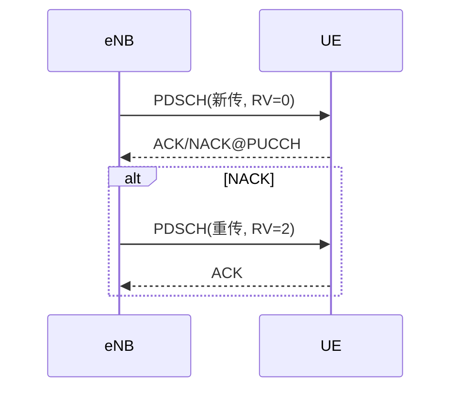
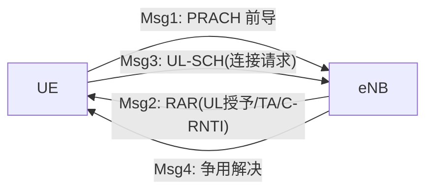
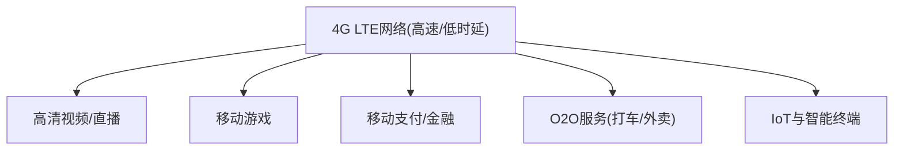
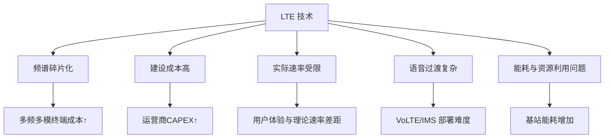
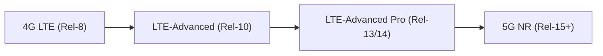

## RF 无线技术

### 蜂窝网-4G 移动通信系统

#### 4.1 发展背景与定义

进入 21 世纪第二个十年，3G 已经在全球广泛部署。然而，随着智能手机、移动互联网和多媒体应用的快速兴起，3G 在速率和时延方面逐渐暴露瓶颈：

-   **数据需求激增**：高清视频、移动游戏、社交媒体、云服务，对带宽需求远超 3G 承载能力。
    
-   **互联网化趋势**：用户不再满足于“能上网”，而是追求“高速、实时、流畅”的移动互联网体验。
    
-   **技术挑战**：3G 速率有限（HSPA+ 也仅 42 Mbps，下行实际体验远低于此），且网络架构复杂、时延较高（50–100 ms）。
    

在此背景下，3GPP 于 2004 年提出 **LTE（Long Term Evolution，长期演进）** 技术路线，作为 3G 的后续演进标准。2009 年，瑞典和挪威率先商用 LTE 网络，标志着 **4G 时代正式到来**。

📌 **ITU 对 4G 的定义（IMT-Advanced）**：

-   下行峰值速率：
    
    -   100 Mbps（高速移动场景，如列车）
        
    -   1 Gbps（低速/静止场景，如室内）
        
-   全 IP 网络架构（语音、数据、视频均基于 IP 承载）
    
-   更低的端到端时延（小于 10 ms）
    
-   更高的频谱利用率（3 倍于 3G）
    
-   灵活支持多频段、多制式、多天线
    

LTE 虽然在速率上未完全达到 IMT-Advanced 的标准，但凭借其架构简洁、性能突出，被全球广泛采纳，并逐步演进到 **LTE-Advanced（4.5G）**，才真正满足了 IMT-Advanced 的要求。

#### 4.2 技术特点

LTE 的核心技术特点可概括为以下几个方面：

1.  **高数据速率**
    
    -   LTE Release 8：下行峰值 100 Mbps，上行 50 Mbps。
        
    -   LTE-Advanced（Rel-10）：下行可达 1 Gbps，上行 500 Mbps。
        
2.  **低时延**
    
    -   无线接口单向时延 ~10 ms，远低于 3G 的 50–100 ms。
        
    -   使得 LTE 可以支撑实时互动应用，如 VoLTE、云游戏等。
        
3.  **全 IP 化**
    
    -   LTE 完全摒弃了 2G/3G 的电路交换核心网，采用 **EPC（演进分组核心网）**，实现语音、数据统一承载。
        
    -   语音通过 **VoLTE（Voice over LTE）** 或 CSFB（回落到 2G/3G）实现。
        
4.  **灵活的频谱利用**
    
    -   支持 1.4 MHz、3 MHz、5 MHz、10 MHz、15 MHz、20 MHz 等多种带宽。
        
    -   可灵活适应全球不同频谱资源。
        
5.  **先进的空口技术**
    
    -   **OFDMA（下行）**：将频谱分为多个子载波，提升抗干扰能力与频谱利用率。
        
    -   **SC-FDMA（上行）**：降低终端发射功率峰均比，延长手机电池续航。
        
6.  **多天线技术（MIMO）**
    
    -   LTE 引入 **MIMO（Multiple Input Multiple Output）**，如 2x2、4x4 MIMO，大幅提升速率和抗干扰性能。
        
7.  **扁平化网络架构**
    
    -   LTE 引入 **eNodeB（增强基站）**，将 3G 的 NodeB 和 RNC 功能合并，减少网络层级。
        
    -   提高传输效率，降低时延。
        

#### 4.3 常见的 4G 制式

虽然 LTE 成为全球主流，但在 4G 发展初期，ITU 也纳入了几种不同的候选技术。

1.  **LTE（Long Term Evolution）**
    
    -   **标准组织**：3GPP
        
    -   **频谱带宽**：1.4–20 MHz 灵活配置
        
    -   **多址方式**：OFDMA（下行）、SC-FDMA（上行）
        
    -   **演进方向**：LTE → LTE-Advanced → LTE-Advanced Pro
        
    -   **覆盖情况**：全球主流 4G 网络
        
2.  **WiMAX（Worldwide Interoperability for Microwave Access）**
    
    -   **标准组织**：IEEE 802.16e/16m
        
    -   **特点**：早期 4G 候选，强调宽带无线接入
        
    -   **缺陷**：生态不完善，被 LTE 全面超越
        
    -   **现状**：逐渐退出主流市场
        
3.  **LTE FDD 与 LTE TDD**
    
    -   **FDD（频分双工）**：上行与下行使用不同频段（如欧洲、北美主流）。
        
    -   **TDD（时分双工）**：上行和下行共用频段，通过时间分隔（中国移动主推）。
        
    -   两者互为补充，共同构成全球 LTE 生态。
        

📌 **结论**：  
在 4G 标准之争中，LTE 最终胜出，形成 **全球统一的技术平台**（FDD-LTE 与 TD-LTE 并行发展），这为 5G 的全球统一标准奠定了基础。

#### 4.4 使用频段与信道配置

LTE 之所以能迅速普及，离不开其在 **频谱适配性** 上的高度灵活性。不同于 2G、3G 常常受限于少数“黄金频段”，LTE 在设计时就考虑到全球运营商手中分散的频谱资源，因此定义了从 **700 MHz 到 3.5 GHz** 的众多频段。

1.  **主要 LTE 频段**
    
    -   **低频段（700–900 MHz）**
        
        -   优势：覆盖广、穿透力强，适合农村及室内覆盖。
            
        -   典型：Band 5（850 MHz）、Band 8（900 MHz）。
            
    -   **中频段（1.8–2.6 GHz）**
        
        -   优势：容量与覆盖兼顾，是城市 LTE 网络的主力。
            
        -   典型：Band 3（1800 MHz）、Band 7（2600 MHz）。
            
    -   **高频段（3.4–3.8 GHz）**
        
        -   优势：带宽大、速率高，但覆盖差，适合热点与小区层面部署。
            
        -   典型：Band 42/43（3.5 GHz）。
            
    
    📌 注：由于频段定义繁多，3GPP 在 Rel-13 时，LTE 频段号已超过 40 个。
    
2.  **双工方式**
    
    -   **FDD-LTE（频分双工）**
        
        -   上行与下行分占不同频段，中间有保护带。
            
        -   优点：链路对称，抗干扰能力强；缺点：需要成对频谱。
            
    -   **TDD-LTE（时分双工）**
        
        -   上下行共用频段，通过时间隙分割。
            
        -   优点：频谱利用率更高，灵活调整上下行比例；缺点：对同步要求高。
            
    -   **对比总结**：FDD 适合传统移动业务，TDD 更灵活，尤其适合数据业务不对称的场景。
        
3.  **信道配置与帧结构**
    
    -   **子载波间隔**：15 kHz（基本配置）；LTE-Advanced 引入 7.5 kHz、30 kHz 等扩展选项。
        
    -   **无线帧**：长度 10 ms，每帧包含 10 个子帧。
        
    -   **子帧**：1 ms，每子帧分为 2 个时隙，每时隙 0.5 ms。
        
    -   **OFDM 符号**：常规循环前缀（CP）下，每个时隙 7 个 OFDM 符号；扩展 CP 下为 6 个。
        
    -   **资源块（PRB）**：12 个子载波 × 0.5 ms（时隙），即 180 kHz × 0.5 ms。
        
    -   **带宽可配置性**：1.4、3、5、10、15、20 MHz，通过资源块个数不同体现。
        
    
    举例说明：
    
    -   20 MHz 带宽下，最多包含 100 个 PRB；
        
    -   1.4 MHz 带宽下，仅有 6 个 PRB。
        
4.  **参考信号与控制信道**
    
    -   **参考信号（RS）**：用于信道估计与测量，是测试 LTE 信号质量的关键。
        
    -   **控制信道**：如 PDCCH（下行控制信道）、PUCCH（上行控制信道），负责资源调度和链路管理。
        

📌 **测试提示**：在 RF 测试中，工程师通常通过观察 **RS 信号的 EVM、ACLR、频谱形态** 来判断终端的调制精度与发射性能。

### 4.5 理论速度

LTE 的速率表现是其最显著的优势之一，但“理论速率”往往高于实际体验，需要拆解原理：

1.  **LTE Release 8（初版）**
    
    -   下行：峰值 100 Mbps（20 MHz 带宽、2×2 MIMO、64QAM 条件下）。
        
    -   上行：峰值 50 Mbps（20 MHz 带宽、1×2 MIMO、16QAM 条件下）。
        
2.  **LTE-Advanced（Rel-10 及以后）**
    
    -   引入 **载波聚合（CA）** 与 **更高阶 MIMO**。
        
    -   下行：峰值可达 1 Gbps（100 MHz 带宽、8×8 MIMO、256QAM）。
        
    -   上行：可达 500 Mbps（100 MHz 带宽、4×4 MIMO、64QAM）。
        
3.  **影响速率的关键因素**
    
    -   **带宽大小**：1.4/3/5/10/15/20 MHz 不同配置。
        
    -   **MIMO 天线数**：2×2 → 4×4 → 8×8。
        
    -   **调制方式**：QPSK → 16QAM → 64QAM → 256QAM。
        
    -   **用户调度**：多用户共享资源块，速率随调度算法变化。
        

📌 注：实验室测试中常能接近理论速率，但在商用网络中，受干扰、用户数、回传链路等因素限制，通常只有 30%~60% 的理论值。

### 4.6 关键技术解析

#### 4.6.1 无线帧与资源单元（RE / RB / 子载波）

-   **数值体系（Rel-8 经典设置）**
    
    -   子载波间隔 Δf = **15 kHz**；FFT 尺度随带宽变化（20 MHz 典型 2048 点，**1200** 个有效子载波）。
        
    -   时隙 **0.5 ms**；子帧 **1 ms**（2 个时隙）；无线帧 **10 ms**（10 子帧）。
        
    -   **循环前缀**：
        
        -   正常 CP：每时隙 **7** 个 OFDM 符号（每子帧 14 符号）。
            
        -   扩展 CP：每时隙 **6** 个 OFDM 符号（每子帧 12 符号），抗时延扩展更强。
            
-   **资源粒度**
    
    -   **RE（Resource Element）**= 1 个子载波 × 1 个 OFDM 符号。
        
    -   **PRB（Physical Resource Block）**= **12** 子载波 × **1 个时隙**（0.5 ms）。
        
    -   下行调度的最小时间粒度是**1 子帧**（1 ms），频域按 PRB 成组分配。
        
-   **开销**：控制区、参考信号（CRS/DM-RS）、同步信号会占用 RE，实际可用于数据信道的 RE < 理论总 RE。
    

#### 4.6.2 下行：OFDMA 与物理信道/参考信号

-   **OFDMA**：把带宽分解为大量**正交子载波**，对抗频率选择性衰落，支持**按频域分配**给不同 UE 的“频率选择性调度”。
    
-   **主要物理信道/信号**（经典 Rel-8 表述）：
    
    -   **PSS/SSS**：小区搜索与同步（帧 0/5 的中心 62 个子载波附近）。
        
    -   **PBCH**：广播 MIB（小区基本配置，40 ms 周期）。
        
    -   **PDCCH**（及后续 **EPDCCH**）：下发**调度授权 DCI**。
        
    -   **PCFICH/PHICH**（早期版本）：分别指示控制区大小/承载 UL HARQ ACK。
        
    -   **PDSCH**：**数据面**，实际承载用户下行 IP 分组。
        
    -   **CRS（Cell-specific RS）/DM-RS**：信道估计与解调参考。后续更多依赖 UE-专属 **DM-RS**。
        
-   **控制区结构**：每子帧前 1~3 个 OFDM 符号作为控制区（由 PCFICH 通知）。控制区过大→数据 RE 变少；过小→DCI 负载不下，调度受限。

#### 4.6.3 上行：SC-FDMA（DFT-s-OFDM）与物理信道

-   **为何不是 OFDMA？** 终端发射功放受限，OFDMA **PAPR 高**。SC-FDMA 通过**DFT 预编码**形成“单载波特性”，显著降低 PAPR，提升电池续航与边缘上行覆盖。
    
-   **主要上行物理信道/信号**：
    
    -   **PUSCH**：承载用户上行数据与控制（UL-SCH）。
        
    -   **PUCCH**：承载 CQI/PMI/RI、下行 HARQ ACK/NACK 等控制。
        
    -   **PRACH**：**随机接入**前导，4 步消息建立 RRC 连接/切换接入。
        
    -   **SRS**：**探测-型上行参考**，给基站做频域测量与上行频域调度。
        

#### 4.6.4 调度与链路自适应（AMC + CQI/PMI/RI）

-   **CQI（0~15）**：UE 报告“可达 MCS 等级”，基站据此自适应选择**调制（QPSK/16QAM/64QAM/256QAM）**与编码速率。
    
-   **PMI/RI**：预编码矩阵指标/秩指示（MIMO 维度选择）。
    
-   **调度目标**：
    
    -   **最大 C/I**：优先好信道，吞吐高但公平性差。
        
    -   **轮询（RR）**：公平但吞吐低。
        
    -   **比例公平（PF）**：在平均速率与瞬时信道质量间折中，**商用默认**。
        
-   **BLER 目标**：物理层自适应一般以 **10% BLER** 为目标，交给 HARQ 做最后“兜底纠错”。
    

#### 4.6.5 MIMO：空间复用/分集/波束赋形与参考信号

-   **空间复用**：同频同时间传多流，理想下 2×2 可近似翻倍速率，4×4/8×8 进一步提高峰值。
    
-   **分集/组合**：提高抗衰落与可靠性（如 Alamouti、E-MRC 思想在实现上体现为预编码与接收合并）。
    
-   **波束赋形**：阵列方向图定向增益，**抑制干扰**、提升小区边缘 SINR。
    
-   **解调参考（DM-RS）/CSI-RS**：为特定 UE/天线端口提供解调/CSI 估计的“锚点”。
    
-   **模式选择**：单码字/多码字、闭环/开环预编码根据反馈开销、移动性与场景动态选取。
    

#### 4.6.6 HARQ：软合并重传（SAW，多进程）

-   **机制**：**增量冗余（IR）** + 软合并（结合前次 LLR）→ 大幅提升有效码距。
    
-   **进程**：**8 个 stop-and-wait** 并行管道，避免因等待 ACK 而“气泡”。
    
-   **时序**（FDD 典型）：
    
    -   **下行 HARQ**：异步 → eNB 可任意时刻发新传/重传；UE 在 **PUCCH** 上回 ACK/NACK。
        
    -   **上行 HARQ**：同步 → UE 在固定偏移发重传；eNB 在 **PHICH** 上回 ACK/NACK（早期）。
        
-   **RV 序列**：常见 **{0, 2, 3, 1}**；新传 RV=0，重传换 RV，接收端软合并。
    

#### 4.6.7 载波聚合（CA）与跨载波调度

-   **动机**：单载波上限 20 MHz → 难达 Gbps。
    
-   **方式**：
    
    -   **同频带-连续**、**同频带-非连续**、**异频带聚合**（最常见）。
        
-   **跨载波调度**：在“主小区”PCC 的 PDCCH 上下发 DCI，去调度“辅小区”SCC 的 PDSCH/PUSCH。
    
-   **UE Category**：限定 UE 可同时聚合的**CC 数量**与**MIMO 层数**。
    

### 4.6.8 FDD/TDD 帧结构与特殊子帧

-   **FDD**：上下行分频，子帧均衡，低时延、对称业务友好。
    
-   **TDD**：同频分时，**DL/UL 配置 0~6**；**特殊子帧**（DwPTS/GP/UpPTS）完成收发切换与同步。
    
-   **不对称业务**（视频下行重）：TDD 可把 DL 子帧占比配大；**但**上行控制/回传必须保证足够。
    

#### 4.6.9 干扰抑制：ICIC / eICIC / FeICIC 与 CoMP

-   **ICIC（频域）**：软频率复用、边缘 PRB 保护。
    
-   **eICIC（时域）**：宏站发 **ABS（近空白子帧）**，给皮/微站“让路”。
    
-   **FeICIC**：宏站**降功率子帧**，兼顾容量与干扰。
    
-   **CoMP（协作多点）**：
    
    -   **JT（联合发送）**：多站同相合并提升边缘 SINR。
        
    -   **DPS（动态点选择）**：按时隙切换最佳发射点。
        
    -   **CS/CB**：协调调度/波束。
        
-   **代价**：精确时间同步与高速回传（X2/理想光纤）开销大。
    

#### 4.6.10 上行功率控制与 TA（Timing Advance）

-   **目标**：既要**打得到**（覆盖），又要**不打过头**（少添干扰）。
    
-   **开环 + 闭环**：分层叠加，兼顾粗/细调。
    
-   **典型公式（PUSCH）**
    

$$P_{PUSCH} = min({ P_max, 10·log10(M) + P0_{PUSCH} + α·PL + Δ_TF + f(Δ_i) })$$

-   **M**：分配的上行 RB 数；**PL**：路径损耗；**α**：分数补偿（0~1）；
    
-   **Δ_TF**：随 MCS 的动态项；**f(Δ_i)**：闭环校正；**P_max**：UE 最大发射功率（如 23 dBm）。
    
-   **TA**：基站下发定时提前量，让所有 UE 的上行到达**齐头**对齐 FFT 窗口，避免**码间干扰**。
    

#### 4.6.11 随机接入（RACH）与切换（X2 / S1）

-   **四步 RACH（竞争型）**
    
    1.  **Msg1**：PRACH 前导（选 1/64 码），获得小区注意；
        
    2.  **Msg2**：RAR（含 UL 授权、TA、临时 C-RNTI）；
        
    3.  **Msg3**：在 PUSCH 上发 RRC 连接请求/上层数据；
        
    4.  **Msg4**：争用解决（确认 C-RNTI）。
        

-   **切换**
    
    -   **X2-based HO**：源 eNB ↔ 目标 eNB 直接交互，低时延、常用于同 EPC 内邻区。
        
    -   **S1-based HO**：经 MME/SGW 中转，跨域/回退时使用。
        
    -   关键流程：**测量触发 → HO 决策 → 资源预留 → RRC Reconfig → 目标小区随机接入 → 路径切换**。
        
    -   **优化点**：事件 A3/A5 门限、TTT、黑白名单、RACH 失败重试策略等。
        

#### 4.6.12 VoLTE / IMS 与 QoS（QCI）

-   **全 IP 语音**：SIP/IMS 建立呼叫；语音承载走 LTE 数据面（无电路域）。
    
-   **关键承载**：
    
    -   **QCI=1（GBR）**：AMR-WB 12.65 kbps/23.85 kbps 等；**低时延（~100 ms 端到端）**；
        
    -   **QCI=5**：IMS 信令；**QCI=9**：通用数据。
        
-   **语音保障**：
    
    -   **ROHC** 压缩头开销；**TTI Bundling** 提升边缘上行可达；
        
    -   **SRVCC**：向 2G/3G 语音回落（弱覆盖/异系统连续性）。
        
-   **EPC 角色**：MME（控制面）、SGW/PGW（用户面）、PCRF（策略/计费），共同确保承载的**GBR/ARP/优先级**。
    

#### 4.6.13 安全与完整性

-   **鉴权**：**EPS-AKA**（USIM 与 HSS/MMD 共享密钥）。
    
-   **加密/完整性**：
    
    -   加密 **EEA1/EEA2/EEA3**（SNOW 3G / AES / ZUC）；
        
    -   完整性 **EIA1/EIA2/EIA3**；
        
    -   **NAS/RRC** 分层保护，用户面可选。
        
-   **KPI 启示**：过早加密前置不会影响空口吞吐，但弱覆盖下不当的重传/解密失败会放大时延抖动。
    

#### 工程侧“速率估算”小算例（20 MHz，2×2 MIMO，64QAM）

-   20 MHz → 100 PRB/子帧；正常 CP 每 PRB/子帧约 **168 RE**。
    
-   假设参考/控制开销后可用 **~75% RE**；64QAM=6 bit/RE，编码效率 0.9；2 流并行。
    
-   估算：100×168×0.75×6×0.9×2 / 1 ms ≈ **136 Mb/s**（接近 R8 标称 100 Mb/s，考虑更多开销/调度损耗后与实测吻合）。
    

#### 小结（给优化与排障的抓手）

-   **容量三件套**：更大带宽（CA）× 更高 MIMO 层数 × 更高阶调制（256QAM）。
    
-   **体验三件套**：合理 **PF 调度** + **10% BLER 目标** + **HARQ 管道**。
    
-   **边缘三件套**：**波束赋形/MIMO** + **eICIC/CoMP** + **TTI Bundling/功控**。
    
-   **接入稳定**：RACH 成功率、TA 收敛、PUSCH/PUCCH 功控是否到位。
    
-   **语音质量**：QCI/GBR 落地、RTT 抖动控制、SRVCC/回落策略匹配实际覆盖。

#### 4.7 应用与社会影响

##### 4.7.1 高速移动宽带应用

-   **移动互联网普及的核心驱动力**  
    LTE 带宽与时延的大幅提升，使得移动网络从“话音为主”真正转向“数据为王”。
    
    -   移动视频：YouTube、爱奇艺、抖音等短视频/流媒体进入爆发期。
        
    -   移动办公：企业级 VPN、邮件、文档协作（Google Docs、Office 365）变为常态。
        
    -   移动支付：支付宝、微信支付等依赖稳定低时延网络，改变商业支付习惯。
        
-   **体验指标**：
    
    -   峰值速率可达 100 Mbps 以上（下行），用户面体验普遍达到数十 Mbps。
        
    -   **RTT ~30–50 ms**，远低于 3G 的 100+ ms，能支撑实时性更高的应用。
        

##### 4.7.2 VoLTE 与语音回归

-   **全 IP 化语音**：4G 不再有 CS 域语音，转而依赖 IMS 栈。
    
-   **优势**：
    
    -   通话建立时延 < 1 s（对比 3G CSFB 的 3–4 s）。
        
    -   通话中可并行高速数据业务。
        
    -   支持高清语音（AMR-WB），改善用户体验。
        
-   **社会影响**：
    
    -   电信运营商彻底从电路交换思维转向“承载 + QoS 控制”。
        
    -   推动 OTT 语音（如微信语音、Skype）与运营商 VoLTE 并行，形成竞争与融合。
        

##### 4.7.3 移动视频与娱乐产业变革

-   **短视频与直播经济**：  
    LTE 下的高带宽与低时延，使得 **直播互动**、**短视频分发**成为主流业务形态。
    
    -   抖音/快手等平台依赖 4G 大规模崛起。
        
    -   游戏直播（虎牙、Twitch）依赖 LTE 支撑移动端观众。
        
-   **网络游戏**：
    
    -   传统 3G 时延过大（>100 ms）导致 FPS、MOBA 游戏体验不佳；
        
    -   LTE 的 30~50 ms RTT 则使 **王者荣耀、PUBG Mobile** 等手游成为“全民级现象”。
        
##### 4.7.4 IoT 与 M2M 的前奏

-   虽然 LTE 不是最初为 IoT 设计，但其高带宽与广覆盖为 IoT 奠定基础：
    
    -   **LTE Cat-1**：适用于中低速率 IoT（车载、共享单车、支付终端）。
        
    -   **LTE-M / NB-IoT**：后续增强，低功耗广域（LPWA）解决海量 IoT 接入问题。
        
-   **产业应用**：
    
    -   智能电表、远程监控、车联网初代（T-Box）。
        
    -   工业物联网试点开始在 4G 网络下部署。
        

##### 4.7.5 社会数字化转型

-   **个人层面**：
    
    -   用户使用习惯彻底转向 **移动优先**。
        
    -   “手机 = 网络入口”，替代 PC 成为主要上网工具。
        
-   **企业层面**：
    
    -   O2O 模式兴起（美团、滴滴等依赖实时定位和调度）。
        
    -   云服务向移动端延伸，企业 IT 架构发生变革。
        
-   **政府与公共服务**：
    
    -   智慧城市应用（交通监控、应急调度）。
        
    -   公共服务（移动政务、移动医疗、远程教育）。
        

##### 4.7.6 产业链与经济影响

-   **终端产业**：
    
    -   智能手机市场爆发（iPhone 5/6、华为、三星 Galaxy 系列等），加速了 4G 的普及。
        
    -   芯片厂商（高通 Snapdragon、海思 Kirin、MTK）借 LTE 世代成长壮大。
        
-   **运营商**：
    
    -   收入结构转型：语音与短信收入下降，数据流量收入占比急速上升。
        
    -   网络投资加大：LTE 建网成为 2010–2015 年全球运营商的最大资本开支。
        
-   **互联网公司**：
    
    -   BAT（百度、阿里、腾讯）以及 Google、Facebook 等，借助 LTE 移动流量扩张业务版图。
        

##### 4.7.7 社会行为的改变

-   **即时通信取代短信**：微信/WhatsApp/Facebook Messenger 崛起。
    
-   **移动支付普及**：扫码支付、NFC 支付带来“无现金社会”趋势。
    
-   **碎片化时间利用**：用户随时随地消耗短内容（短视频、微博、快讯）。
    
-   **社会关系重塑**：朋友圈、移动社交成为人际关系维护的核心。
    

##### 4.7.8 国际对比与数字鸿沟

-   **发达国家**：LTE 覆盖早、速率高，带动产业升级。
    
-   **发展中国家**：
    
    -   LTE 替代固定宽带，成为城乡地区的主要互联网入口。
        
    -   数字鸿沟缩小，但因频谱资源、基站投资不足，覆盖/速率仍有差距。
        
-   **典型对比**：韩国/日本 LTE 覆盖率超过 90%，速率超 50 Mbps；部分非洲国家仅覆盖大城市。
    

##### 4.7.9 图示 —— LTE 应用生态

##### 4.7.10 小结

LTE 的社会影响远远超出了通信领域，它推动了**移动互联网的全面爆发**，重塑了个人生活方式、企业商业模式与政府服务模式。可以说，**4G = 移动互联网的基石**，为 5G 的大连接、大带宽、低时延需求提前“预演”了用户习惯与产业逻辑。

#### 4.8 局限与问题

1.  **频谱碎片化**
    
    -   LTE 定义频段众多，各国分配不统一，终端需支持多频多模，增加成本与设计复杂度。
        
2.  **建设成本高**
    
    -   大规模部署宏基站、小基站与核心网改造需要巨额投资，运营商资本开支压力大。
        
3.  **实际速率受限**
    
    -   虽然理论可达百兆，但在实际网络中，受用户数、干扰、回传带宽限制，用户体验常低于预期。
        
4.  **语音过渡复杂**
    
    -   LTE 全 IP 化导致语音必须依赖 **VoLTE/IMS**，在早期部署中存在互操作性与覆盖盲区问题。
        
5.  **能耗与资源利用**
    
    -   大量基站长期运行带来能耗问题，且频谱利用率虽提升，但仍难以满足未来海量数据需求。

#### 4.9 小结

LTE 作为 4G 时代的核心技术，实现了从 **以语音为主 → 以数据为核心** 的彻底转变。  
它通过 **OFDMA、MIMO、载波聚合、全 IP 架构** 等关键技术，使移动通信进入了真正的 **宽带时代**。  
LTE 的普及不仅改变了用户的通信与娱乐方式，还推动了移动互联网、共享经济、移动支付、物联网的兴起。

然而，LTE 也并非完美：频谱碎片化、建设成本高、速率与覆盖受限、能耗压力等问题，逐渐显现出它的瓶颈。  
这也为后续的 **LTE-Advanced、LTE-Advanced Pro** 以及 **5G** 技术的提出奠定了方向。

因此，4G LTE 可以被视为 **移动宽带的里程碑**，同时也是通往 5G 时代的 **关键过渡阶段**。

<!--stackedit_data:
eyJoaXN0b3J5IjpbLTEzMzAzNjc4NTNdfQ==
-->