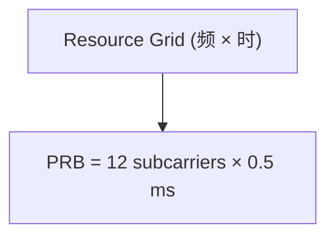

##  RF无线技术

### 蜂窝网-4G — LTE 技术详解

#### 4.0 前言

3G 时代的 HSPA 已经实现了基本的移动宽带体验，但在高清视频、实时互动应用、海量数据下载的推动下，用户需求急剧增长。运营商与标准化组织迫切需要一种**更高带宽、更低时延、更灵活的接入技术**，从而催生了 4G 的 LTE（Long Term Evolution）体系。LTE 不仅仅是 3G 的演进，而是一次跨代的“移动互联网”飞跃——以 **OFDMA/SC-FDMA 空口 + 全 IP 核心 EPC** 为核心，支撑了智能手机、流媒体、移动办公等应用的爆发。

#### 4.1 发展背景与定义

-   **发展背景**
    
    -   2G 主要面向语音业务；
        
    -   3G 在数据速率上已有显著提升，但架构复杂、时延高、频谱效率有限；
        
    -   面对 2010 年后移动互联网的普及，高清视频、移动社交、云服务对带宽与时延的需求超过了 3G 的极限。
        
-   **定义**  
    LTE 是 3GPP 在 Release 8 开始提出的长期演进系统，它的核心目标是：
    
    1.  提升频谱效率（至少 3 倍于 HSPA）；
        
    2.  降低空口与核心时延（小于 10 ms）；
        
    3.  支持灵活的带宽配置（1.4 MHz 至 20 MHz）；
        
    4.  构建全 IP 的核心网架构（Evolved Packet Core, EPC）。
        


#### 4.2 技术特点概览

1.  **空口设计**
    
    -   下行采用 **OFDMA**，上行采用 **SC-FDMA**，兼顾灵活调度与终端低功耗需求。
        
    -   统一的**资源网格**（Resource Grid）与**资源块**（PRB）概念，便于调度与度量。
        
2.  **调度与适配**
    
    -   支持 AMC（自适应调制编码），QPSK→16QAM→64QAM→256QAM。
        
    -   快速 HARQ 机制提升链路可靠性。
        
3.  **多天线技术**
    
    -   支持 2×2、4×4 乃至更高阶 MIMO，提升容量与覆盖。
        
4.  **核心网**
    
    -   扁平化 EPC 设计，减少节点，降低时延。
        
5.  **扩展能力**
    
    -   LTE-Advanced 引入载波聚合（CA）、更高阶 MIMO、协调多点（CoMP）。
        

#### 4.3 常见制式

-   **LTE（Release 8/9）**：基础 LTE，速率可达 150 Mbps（DL）。
    
-   **LTE-Advanced（Release 10/11）**：引入 CA、4×4 MIMO 等，速率达 1 Gbps。
    
-   **LTE-A Pro（Release 13+）**：支持 256QAM、更广泛的 CA，逐步过渡到 5G。
    


#### 4.4 频段与信道配置

-   **子载波间隔**：15 kHz（基准值）。
    
-   **帧结构**：10 ms 帧 → 10 子帧（1 ms）→ 2 时隙（0.5 ms）。
    
-   **OFDM 符号数**：Normal CP 下每时隙 7 个符号，每子帧 14 个符号。
    
-   **资源块（PRB）**：12 个子载波 × 0.5 ms 时隙（180 kHz）。
    
-   **带宽配置**：1.4 / 3 / 5 / 10 / 15 / 20 MHz。
    
-   **LTE-A**：多个 20 MHz 聚合，实现更宽带宽。
    


#### 4.5 理论速率

-   **LTE 基本配置（20 MHz, 2×2 MIMO, 64QAM）**：DL ≈ 150 Mbps，UL ≈ 50 Mbps。
    
-   **LTE-A（载波聚合 + 4×4 MIMO + 256QAM）**：可达 1 Gbps。
    

注：用户实际速率受信道条件、调度策略、网络拥塞限制。


#### 4.6 关键技术详解

##### 4.6.1 OFDM 与 SC-FDMA

-   **OFDM（下行）**：将频谱分为大量正交子载波，抗多径能力强；但 PAPR 高。
    
-   **SC-FDMA（上行）**：在 OFDM 基础上做 DFT 预编码，保持“单载波特性”，降低 PAPR，利于手机射频功放设计。
    

> 注：测试时常用 **ACLR（邻道泄漏比）** 与 **PAPR 测量** 来评估 OFDM/SC-FDMA 信号特性。


##### 4.6.2 资源块与调度

-   **资源块（PRB）**：调度的基本单元。
    
-   **调度策略**：基站根据 CQI、RI、PMI 分配资源，平衡用户速率与网络效率。
    


##### 4.6.3 AMC 与 HARQ

-   **AMC**：根据信噪比动态调整调制与编码，最大化吞吐。
    
-   **HARQ**：在链路层提供快速错误恢复，结合 Turbo 编码与软合并，大幅提升链路效率。
    

> 注：**EVM（误差向量幅度）** 测试可直接反映 AMC 下调制精度。HARQ 的时序可通过协议分析仪观测。


##### 4.6.4 信道编码

-   **数据信道**：Turbo 码。
    
-   **控制信道**：尾咬合卷积码。
    


##### 4.6.5 MIMO 技术

-   **空间分集**：提高覆盖与稳定性。
    
-   **空间复用**：提升峰值吞吐。
    
-   **波束赋形**：定向发射，提升小区边缘性能。
    

> 注：MIMO 性能测试常结合 **吞吐测试 + 信道仿真仪**，考察不同相关性条件下的速率。


##### 4.6.6 载波聚合与小区协作

-   **载波聚合（CA）**：把多个分散频段聚合。
    
-   **小区协作（CoMP）**：多基站协同，提高边缘用户性能。
    

##### 4.6.7 时延与 QoS

-   **空口时延**：约 10 ms。
    
-   **EPC 端到端时延**：优化后可在几十毫秒范围。
    
-   **QoS 机制**：支持不同业务类别（如 VoLTE、视频流）。
    


#### 4.7 应用与社会影响

-   **移动互联网普及**：智能手机、视频、社交媒体。
    
-   **OTT 服务兴起**：微信、YouTube 等成为核心流量。
    
-   **网络部署模式转变**：宏小区 + 微小区 + 异构网络。
    


#### 4.8 局限性

-   **上行覆盖受限**：手机发射功率低，室内覆盖困难。
    
-   **频谱碎片化**：需要 CA 技术弥补。
    
-   **复杂性高**：MIMO/CoMP 优化困难，设备成本高。
    
-   **低时延极限**：无法满足未来工业控制、车联网需求。
    


#### 4.9 示意图（基础 mermaid）

**（1）资源网格与 PRB**



**（2）OFDM / SC-FDMA 对比**

```mermaid
graph LR
  OFDM["下行 OFDM\n高灵活性, 高PAPR"] --- SCFDMA[""]
```
<!--stackedit_data:
eyJoaXN0b3J5IjpbMTU1NDA4OTc2M119
-->