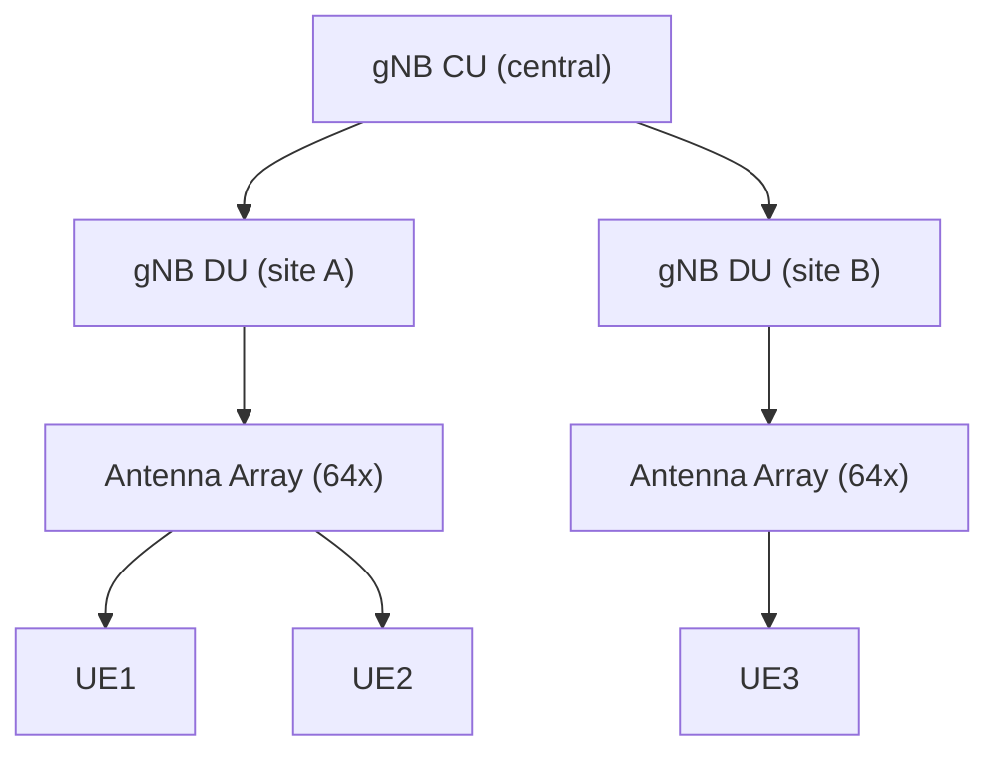
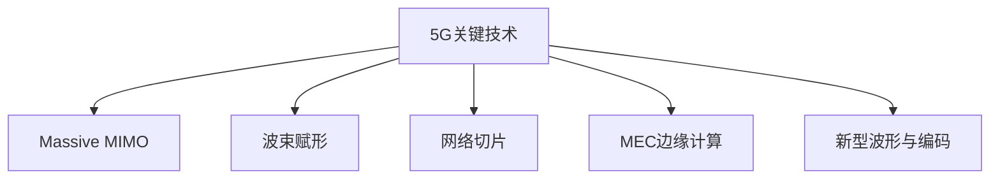
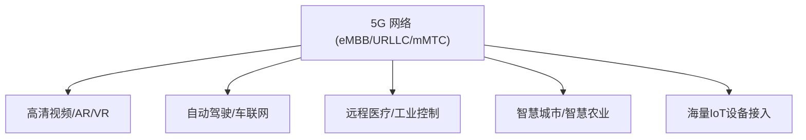
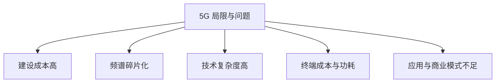
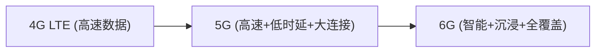
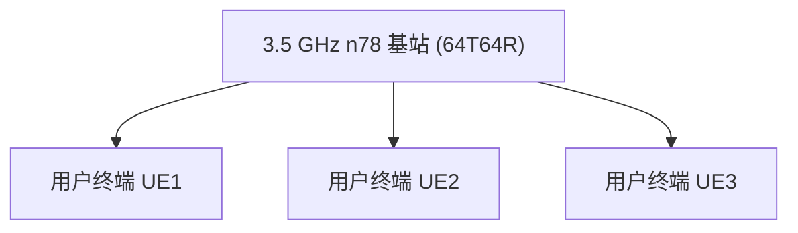
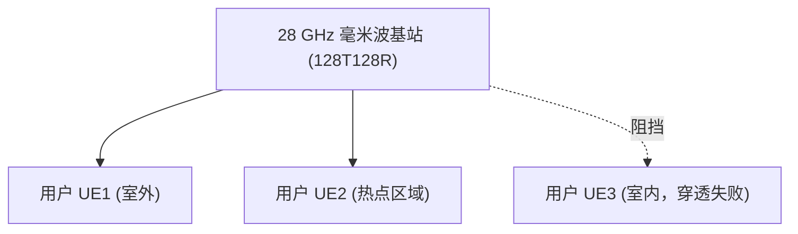
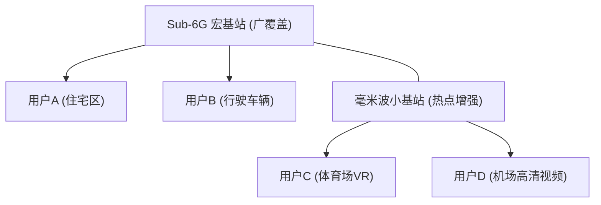

## RF 无线技术

### 蜂窝网-5G 移动通信系统

#### 5.1 发展背景与定义

进入 2010 年代后，移动互联网已全面普及，4G LTE 成为全球主流网络。  
然而，随着 **高清视频、AR/VR、云游戏、车联网、工业物联网** 等新兴应用的发展，用户和产业对移动通信提出了更高要求：

-   更高的 **速率**：希望在无线环境下获得接近光纤的体验；
    
-   更低的 **时延**：满足自动驾驶、远程手术等实时性需求；
    
-   更大的 **连接数**：支撑万亿级 IoT 设备的接入；
    
-   更高的 **可靠性与能效**：保障关键业务和绿色网络建设。
    

在这样的背景下，国际电信联盟（ITU）提出 **IMT-2020 标准**，定义了 5G 的三大应用场景：

1.  **eMBB（增强型移动宽带）** —— 提供超高速率和大带宽。
    
2.  **URLLC（超高可靠低时延通信）** —— 支持工业控制、车联网、远程医疗等。
    
3.  **mMTC（大规模机器类通信）** —— 实现海量物联网终端接入。
    

**定义**：  
5G 是继 4G LTE-Advanced 之后的新一代移动通信系统，采用全新的 **NR（New Radio）无线接入技术**，结合 **云化核心网、网络切片、边缘计算** 等架构创新，目标是实现 **“万物互联”** 与 **“智能社会”** 的信息基础设施。

#### 5.2 技术特点

与 4G 相比，5G 在以下几个方面实现了质的飞跃：

1.  **超高速率**
    
    -   峰值速率：下行可达 20 Gbps，上行可达 10 Gbps。
        
    -   用户体验速率：普遍在 100 Mbps 以上。
        
2.  **超低时延**
    
    -   空口时延：最低可至 1 ms。
        
    -   端到端时延：典型场景 510 ms，大幅低于 4G 的 3050 ms。
        
3.  **海量连接**
    
    -   支持 100 万设备 / km² 的连接密度，远超 4G。
        
    -   满足智慧城市、智能工厂、智能交通的接入需求。
        
4.  **高可靠性与高能效**
    
    -   可靠性可达 99.999%，满足关键任务场景。
        
    -   引入 **Massive MIMO、波束赋形、动态节能**，能效提升 100 倍以上。
        
5.  **架构创新**
    
    -   **独立组网（SA）核心网**：云化、虚拟化、服务化。
        
    -   **网络切片**：根据业务需求定制 QoS 与资源。
        
    -   **边缘计算（MEC）**：降低业务时延，增强本地化处理能力。
        

#### 5.3 常见制式与频段

##### 5.3.1 制式分类

5G 无线接入统一采用 **NR（New Radio）** 标准，不再像 3G/4G 那样存在 GSM/WCDMA/CDMA/LTE 的分裂情况。  
主要有两类部署模式：

1.  **NSA（非独立组网）**：在 4G LTE 基础上叠加 5G NR，快速商用，降低初期建设成本。
    
2.  **SA（独立组网）**：独立的 5G NR + 新核心网，支持网络切片、低时延和大连接，是最终形态。
    

##### 5.3.2 频段划分

ITU 将 5G 频段分为两大类：

-   **Sub-6 GHz（FR1）**：频率 < 6 GHz，典型如 700 MHz、2.6 GHz、3.5 GHz、4.9 GHz。特点是覆盖好、部署成本低，适合广域覆盖。
    
-   **毫米波（FR2）**：24 GHz~100 GHz，典型如 28 GHz、39 GHz。特点是带宽大、速率高，但穿透能力差，适合热点区域和室内高密度应用。
    

##### 5.3.3 全球频谱分配现状

-   中国：以 2.6 GHz、3.5 GHz、4.9 GHz 为主。
    
-   美国：28 GHz、39 GHz 毫米波 + Sub-6。
    
-   欧洲：3.5 GHz 主导，同时研究 26 GHz。
    
-   日本/韩国：3.5 GHz + 28 GHz 双频段商用。

#### 5.4 理论速度

5G 的速率目标是由 ITU **IMT-2020** 标准明确规定的，远超 4G LTE：

1.  **峰值速率**
    
    -   下行：20 Gbps
        
    -   上行：10 Gbps
        
    -   这一速率主要依赖毫米波大带宽和大规模 MIMO 技术，在实验室环境可实现。
        
2.  **用户体验速率**
    
    -   单个用户在典型场景下的平均速率可达 100 Mbps 以上，是 4G 的 10 倍。
        
3.  **小区边缘速率**
    
    -   在覆盖边缘，用户仍可获得数十 Mbps 的速率体验，大幅改善 4G 的“边缘掉速”问题。
        
4.  **频谱效率**
    
    -   提升 3 倍以上，借助 Massive MIMO、波束赋形、动态调度实现。
        
5.  **实际商用情况**
    
    -   在 Sub-6 GHz 频段：通常下行 300 Mbps~1 Gbps。
        
    -   在毫米波频段：在理想环境下可突破 2~5 Gbps。
        

#### ## 5.5 关键技术解析（详解）

##### 概览

5G 的关键技术可以按功能分为：

-   空口与物理层：**数值化（Numerology）/帧结构、波形与编码、Massive MIMO、波束赋形、毫米波/射频**；
    
-   可靠性与低时延：**URLLC 机制（短 TTI、grant-free、重复/分片、优先级）**；
    
-   大连接与低功耗：**mMTC（接入/省电/批量管理）**；
    
-   组网与服务：**网络切片、MEC、云化 5GC、CU/DU 架构与 fronthaul**；
    
-   辅助技术：**同步/定位/安全/AI 驱动优化**。
    
下面逐项详解。

##### 5.5.1 数值化（Numerology）与灵活帧结构

**核心**：NR 引入可伸缩的子载波间隔
$$ \Delta f = 15\text{ kHz} \times 2^\mu $$
$$（\mu = 0,1,2,3,4），$$
对应不同的场景与频段。

| μ | Δf (kHz) | 时隙长度 (ms) | 说明 |
| -: | -------: | --------: | ------------------ |
| 0 | 15 | 1.0 | 适用于 Sub-6 GHz，覆盖优先 |
| 1 | 30 | 0.5 | 中频场景，兼顾时延/多径 |
| 2 | 60 | 0.25 | 毫米波/高速场景 |
| 3 | 120 | 0.125 | 超低时延或高频带宽 |
| 4 | 240 | 0.0625 | 研究/实验用，极短 TTI |

-   **Slot / mini-slot**：slot 通常为 14 个符号，NR 支持 mini-slot（2/4/7 个符号）用于 URLLC，减少调度等待。
    
-   **自包含子帧**：可包含下行控制、数据与上行 ACK，使端到端时延最小化。
    

**工程要点**：选择 μ 时需在时延、频率选择性和多普勒容忍性之间折中：高 Δf 更耐多普勒但对频偏/相位噪声更敏感。

##### 5.5.2 波形与信道编码：CP-OFDM / DFT-s-OFDM，LDPC/Polar

-   **波形**：下行与可选上行多采用 **CP-OFDM**；上行也可采用 **DFT-s-OFDM**（低 PAPR）。NR 保持与 LTE 类似的基本优势但更灵活。
    
-   **信道编码**：
    
    -   **数据平面（PDSCH/PUSCH）**：采用 **LDPC（Low-Density Parity-Check）**，在大块数据下译码效率高。
        
    -   **控制平面（PDCCH 等）**：采用 **Polar code**（短报文性能优）。
        

**工程影响**：

-   LDPC 对于高吞吐复杂度高但有并行化优势；Polar 在短块下误码性能优先。测试时需分别考查 BLER 随 SNR 的曲线与译码延时。
    

##### 5.5.3 Massive MIMO（大规模天线）

**原理**：基站配备几十到上百根天线，通过空间维度实现大规模空间复用与波束增益。  
**核心公式（MIMO 容量简化）**：

$$C = \log_2 \det\left(\mathbf{I} + \frac{\rho}{N_t} \mathbf{H}\mathbf{H}^\mathrm{H}\right)\ \text{(bits/s/Hz)}$$

其中 $\mathbf{H}$ 为信道矩阵，$N_t​$ 发射天线数，$\rho$ 为 SNR。

-   **增益类型**：
    
    -   **阵列增益**（array gain）：平均信号功率随天线数 NNN 增加约 $10\log_{10}N$ dB（理想情况下）。
        
    -   **空间复用增益**：在独立信道下近似线性增加吞吐。
        

**实现方式**：物理上有三类架构——**全数字**（每天线一 RF 链）、**全模拟/相控阵**、**混合波束赋形（Hybrid）**（少量 RF 链 + 模拟相位网络）。Hybrid 在 mmWave 非常实用以降低成本/功耗。

**挑战**：CSI 获取（特别 FDD 下），pilot contamination、多路径相关性、硬件校准、热噪与相位噪声。TDD reciprocity 常用于减少上行反馈开销，但需严格校准。

##### 5.5.4 波束赋形与波束管理

**波束赋形（Beamforming）**：通过加权各天线的相位/幅度形成窄波束，主要有**数字/模拟/混合**实现。波束增益极大缓解路径损耗并降低干扰。

**波束管理流程（四步）**：

1.  **波束扫描/扫掠（Beam sweeping）**：基站与 UE 扫描一组预定义波束。
    
2.  **测量（Beam measurement）**：UE 测量 SSB / CSI-RS 上的波束强度。
    
3.  **上报（Beam reporting）**：UE 上报最佳波束索引与测量值。
    
4.  **维护/恢复（Beam failure recovery）**：发现波束失效时触发快速重选或重新扫掠。
    

**工程要点**：毫米波场景下初始接入延迟与覆盖盲区问题常由波束管理策略与多 TRP（多发点）冗余解决。

##### 5.5.5 毫米波（mmWave）与高频挑战

-   **优势**：大量连续带宽（100s MHz） → 突破 Gbps。
    
-   **困难**：穿透/散射差、遮挡敏感、雨衰、相位噪声与 RF 非理想（PA 线性、低噪声放大器）、短覆盖半径。
    
-   **工程解法**：高密度部署、反射面（RIS）、multi-connectivity、波束追踪与物理遮挡感知。
    

##### 5.5.6 URLLC：低时延与高可靠机制

**目标**：端到端时延 1 ms、可靠性 10^-510^-6（每包成功概率）。  
**关键手段**：

-   **短 TTI / mini-slot**：支持 2/4/7 符号的快速调度。
    
-   **Grant-free access & configured grants**（上行）：减少调度延迟（免去 RRC/PDCCH 等等待）。
    
-   **Packet duplication / multi-connectivity**：在不同路径/基站同时发送副本，增强可靠性。
    
-   **Preemption**：URLLC 流可以抢占 eMBB 资源以保证优先级。
    
-   **HARQ 优化**：减少 RTT，使用更短反馈时隙、重复发射策略。
    

**设计折中**：短 TTI 提高控制开销并降低频谱效率；需在系统层面平衡 eMBB/URLLC 资源。

##### 5.5.7 mMTC（海量物联）技术

**关键需求**：数百万设备/km²、低成本、极低功耗。  
**典型技术**：

-   **轻量接入流程**：扩展 RACH（批量接入、group paging、shared resources）。
    
-   **省电机制**：eDRX、PSM（Power Saving Mode）。
    
-   **非正交接入试验（NOMA）/Grant-free**：在高密场景下提高接入容量（尚为研发/试验方向）。
    

工程关注：控制信令的缩减、群体级的接入协调与 QoS 分流。

##### 5.5.8 多址与接入（OFDMA 主流，Grant-free 辅助）

NR 仍以 OFDMA（下行）和 FDMA/SC-FDMA（上行）为主，不同点在于支持更灵活的時频资源划分与 grant-free 模式（尤其对 URLLC/mMTC）。NOMA（非正交多址）在研究中，但未在主流规范中大规模部署。

##### 5.5.9 网络切片、QoS 与 5GC（服务化核心）

-   **网络切片**：根据业务需求在同一物理平台上创建逻辑虚拟网络（每片拥有独立资源、策略与 SLA）。
    
-   **QoS 架构**：5GC 使用 QoS Flow / 5QI 来区分承载，SMF/PCF/AMF 等网络功能协作实现策略控制。
    
-   **SBA（服务化架构）**：5GC 为云原生 NF，以微服务方式实现扩展、弹性与自动化。
    

##### 5.5.10 MEC（多接入边缘计算）与分布式处理

-   **目标**：把计算/缓存下沉至接近用户的位置（edge），减少 RTT 并支持本地化服务（V2X、AR）。
    
-   **部署模型**：边缘节点可部署在 RAN 边缘或运营商 PoP，与 UPF 紧耦合以缩短路径。
    
-   **工程点**：服务迁移、状态同步与移动性管理是关键挑战。

##### 5.5.11 CU/DU 架构、O-RAN 与 Fronthaul 要求

-   **分割**：RAN 功能可分为 **CU（Centralized Unit）** 与 **DU（Distributed Unit）**，支持不同分割点（如 F1/X2），便于云化部署与功能集中。
    
-   **Fronthaul**：eCPRI 等协议对时延与带宽要求高，尤其在 Massive MIMO 下更苛刻。
    
-   **O-RAN**：引入开放接口与 RIC（RAN Intelligent Controller），方便第三方算法、AI 管理与自优化（xApps/rApps）。
    

##### 5.5.12 定位与同步

5G 提供更精确的定位能力（PRS、multi-RTT、AoA/AoD），支持厘米级增强（结合 GNSS/INS）。同步方面，尤其在相控阵/CoMP 中，基站需达到亚微秒级同步，要求时钟分发与回传链路高质量。

##### 5.5.13 安全与隐私（5G 特有改进）

-   **用户标识保护**：引入 SUCI（隐私化的 SUPI）来避免明文 IMSI 曝露。
    
-   **鉴权**：5G-AKA / EAP-AKA 扩展，结合 HPLMN/SEAF 等新架构。
    
-   **切片安全**：隔离与策略控制、租户认证与服务级安全组必须设计到位。
    

##### 5.5.14 AI/ML 在 5G 的落地应用

-   **无线资源调度预测**（流量预测→预分配）；
    
-   **波束/链路预测**（基于历史环境与传感器数据）；
    
-   **异常检测与自动故障修复**（SON）；
    
-   **切片资源弹性管理**（基于 KPI 的动态扩缩容）。
    

工程使用上需注意模型泛化、延迟与隐私合规。

##### 工程注意点与测试要点（摘要）

-   **SSB/CSI-RS 测试**：验证波束覆盖、SSB 强度与周期。
    
-   **CSI 报文与反馈延时**：确认 TDD/TX-RX 校准与 reciprocity 性能。
    
-   **Massive MIMO 校准**：相位/幅度校正、相位噪声与互调测试。
    
-   **mmWave 链路**：EVM、相位噪声、天线方向图、遮挡恢复时间。
    
-   **URLLC**：端到端时延测量（包含 MEC）、重传概率、packet duplication 成功率。
    
-   **切片隔离测试**：不同 slice 下的带宽/时延/优先级冲突测试。
    
-   **CU/DU 分割与 fronthaul 时延**：测量 fronthaul 可用带宽与RTT，验证 eCPRI 延时目标。
    

##### 简单示意图：Massive MIMO 与 CU/DU 架构（基础 mermaid）

##### 小结（对教材/课堂的提示）

-   5G 的技术堆栈更复杂、选择更灵活：教学时把 **物理层原理（MIMO/波束/数值化）** 与 **系统层策略（切片/MEC/云化）** 分层讲清，最后辅以典型业务（URLLC/mMTC/eMBB）的设计案例。
    
-   工程实现重点在 **CSI 管理、校准、波束管理和端到端时延测量**；这些是实际网络性能好坏的决定因子。

#### 5.6 应用与社会影响

5G 不仅仅是移动宽带速率的提升，更是新一轮 **数字经济基础设施** 的核心驱动力。它将深度融入各行各业，推动产业升级和社会数字化转型。

##### 5.6.1 eMBB —— 增强型移动宽带

-   **应用场景**：4K/8K 高清视频、沉浸式 AR/VR、云游戏、云桌面。
    
-   **社会影响**：
    
    -   推动 **文化娱乐数字化**，促进媒体、影视、教育内容产业发展；
        
    -   降低终端计算要求，促进“轻终端、云处理”模式普及。
        

##### 5.6.2 URLLC —— 超可靠低时延通信

-   **应用场景**：自动驾驶、车联网（V2X）、远程手术、工业自动化。
    
-   **社会影响**：
    
    -   **交通安全**：通过毫秒级通信，支持车与车、车与路协同，大幅减少交通事故；
        
    -   **医疗革命**：外科医生可在千里之外操控机械臂完成手术；
        
    -   **工业互联网**：实现高精度协同制造和柔性生产。
        

##### 5.6.3 mMTC —— 大规模机器类通信

-   **应用场景**：智慧城市（传感器网络）、智慧农业、能源管理、海量物联网设备。
    
-   **社会影响**：
    
    -   **智慧城市**：实现实时交通监控、环境监测、公共安全管理；
        
    -   **绿色能源**：提升电网与能源系统的智能化水平；
        
    -   **农业升级**：通过土壤、水质、气候传感器，推动精准农业。
        

##### 5.6.4 综合影响

-   **经济层面**：5G 被视为推动 GDP 增长的重要引擎，据 GSMA 预测，2030 年全球 5G 将贡献超过 **万亿美元级别的经济价值**。
    
-   **社会层面**：促进 **信息平等与数字包容**，缩小城乡差距，提升公共服务质量。
    
-   **产业层面**：带来 **ICT 与垂直行业的深度融合**，是数字经济时代的核心基础。

#### 5.7 局限与问题

虽然 5G 在速率、时延和连接数等方面取得了巨大突破，但其在商用与应用落地过程中仍然面临一系列挑战与局限。

##### 5.7.1 建设与运维成本高

-   **基站密度**：5G 高频段（尤其是毫米波）传播损耗大，覆盖半径小，导致需要建设更多基站以实现连续覆盖。
    
-   **成本压力**：不仅包括基站硬件，还涉及光纤回传、网络电力消耗和长期维护费用。
    
-   **对比 4G**：5G 的基站数量可能是 4G 的 3~10 倍，成本压力极大。
    

##### 5.7.2 频谱碎片化与资源紧张

-   **Sub-6 GHz 频段** 稀缺，全球各国分配不一致，影响 5G 全球漫游与统一标准。
    
-   **毫米波频段** 虽带宽充裕，但穿透力差，部署困难，实际应用仍有限。
    

##### 5.7.3 技术复杂度高

-   **Massive MIMO** 带来的信道估计与算法开销大；
    
-   **波束赋形** 需要实时跟踪用户位置，高速移动场景下效果受限；
    
-   **网络切片与 MEC** 涉及虚拟化、资源编排和安全隔离，管理复杂。
    
##### 5.7.4 终端与功耗问题

-   **终端成本**：5G 芯片、射频前端和多天线模组价格高，导致用户初期换机成本高；
    
-   **功耗挑战**：高带宽、高速率带来功耗激增，影响手机续航。
    
    
##### 5.7.5 应用生态与商业模式尚不成熟

-   **缺乏杀手级应用**：目前 5G 主要用于“更快的上网”，未充分发挥低时延和大连接的潜力；
    
-   **产业协同不足**：垂直行业的 5G 应用（工业互联网、智慧医疗等）仍处在探索和试点阶段。

#### 5.8 小结

5G 作为 **新一代移动通信系统**，在速率、时延、连接数等方面实现了跨越式提升：

-   通过 **Massive MIMO、波束赋形、网络切片、边缘计算、新型编码** 等关键技术，5G 为不同场景提供差异化保障；
    
-   在应用层面，5G 支撑了 **高清视频、沉浸式娱乐、智慧城市、自动驾驶、远程医疗、工业互联网** 等广泛场景；
    
-   在社会层面，5G 正逐渐成为 **数字经济、智能制造和智慧社会** 的重要基础设施。
    

然而，5G 也面临 **建设成本高、频谱碎片化、技术复杂度高、商业模式未成熟** 等问题。  
因此，虽然 5G 为移动通信的发展开辟了新天地，但它并非终点，而是通向未来 6G 的重要里程碑。

#### 5.9 从 5G 到 6G 的过渡

5G 的快速普及和产业融合，为 6G 的研究奠定了坚实基础。  
学术界和产业界普遍认为，6G 将在 2030 年左右实现商用，其核心目标是 **全面智能化的万物互联**。

##### 5.9.1 技术演进路径

-   **从更快到更智能**：5G 解决了速率和时延问题，6G 将进一步关注 **AI 原生网络、智能资源调度**；
    
-   **频谱扩展**：从毫米波拓展到 **太赫兹（THz）频段**，实现 Tbps 级传输；
    
-   **空间融合**：6G 将把 **卫星通信、空天地一体化网络** 融合进来，突破 5G 覆盖局限。
    

##### 5.9.2 预期能力指标

-   峰值速率：1 Tbps 以上；
    
-   时延：小于 0.1 ms；
    
-   连接密度：每平方公里千万级设备；
    
-   AI 驱动的智能网络管理：实现自优化、自修复、自学习。
    

##### 5.9.3 潜在应用场景

-   **全息通信**：实现实时 3D 沉浸式交流；
    
-   **脑机接口**：实现人与设备的直接信息交互；
    
-   **空天地海一体化互联**：为无人机、卫星、船舶提供统一接入；
    
-   **数字孪生社会**：在虚拟世界实时映射物理世界。
    

📊 **5G → 6G 演进示意图**

#### 📦 专栏：5G Sub-6 GHz（FR1）详解

##### 定义与频段划分

-   **Sub-6G（FR1）** 指 **频率低于 6 GHz 的 5G 频段**，范围在 **450 MHz – 6 GHz**。
    
-   **常见频段**（中国）：n41（2.6 GHz）、n78（3.5 GHz，全球最常用）、n79（4.9 GHz，中国特色）。
    
-   **特点**：覆盖好、穿透力强、产业成熟，是 5G 商用的主力。
    

##### 技术特点

-   **覆盖优势**：穿透强，适合室内/广域部署。
    
-   **带宽限制**：一般 20–100 MHz，部分场景最多 200 MHz。
    
-   **MIMO 阵列规模有限**：3.5 GHz 下 64T64R 是主流，天线体积较大。
    
-   **成本低/成熟度高**：基于 LTE 演进，设备成本相对较低。
    

##### 理论速率与性能

-   **100 MHz 带宽 + 4×4 MIMO + 256QAM** → 峰值 **1–2 Gbps**。
    
-   **200 MHz 载波聚合** → 可达 **3–4 Gbps**。
    
-   **时延**：配置 URLLC 可达 1–2 ms。
    

##### 工程应用与挑战

-   **主要应用**：高清视频、云游戏、智慧城市、部分车联网/远程控制。
    
-   **挑战**：
    
    -   频谱紧张，与 LTE/卫星等共享。
        
    -   Massive MIMO 功耗高（>1 kW RRU），需解决散热。
        
    -   天线尺寸/重量大，站址部署困难。
        

##### Sub-6G vs. 毫米波
| 维度 | Sub-6G (FR1) | mmWave (FR2) |
| ---- | ---------------------- | ------------ |
| 频率范围 | 0.45–6 GHz | 24–52 GHz |
| 带宽 | 20–100 MHz（少数 200 MHz） | 400–800 MHz |
| 覆盖半径 | 500 m – 5 km | 50–200 m |
| 穿透性 | 强（可入室内） | 弱（遮挡敏感） |
| 阵列规模 | 64–128 阵列 | 数百–上千阵列 |
| 峰值速率 | 1–4 Gbps | 10–20 Gbps |
| 应用场景 | 广域覆盖、主体商用 | 热点增强、超高速接入 |
------

##### 关键技术

1.  **Massive MIMO**：3.5 GHz 下 64T64R，带来 3–5 倍容量增益。
    
2.  **载波聚合（CA）与双连接（EN-DC）**：常见组合 n41+n78、LTE+NR。
    
3.  **动态频谱共享（DSS）**：LTE/NR 共用频谱，平滑过渡。
    
4.  **灵活 TDD**：动态调整上下行，适应不同业务模型。
    

##### 示意图（基础 mermaid）

##### 小结

-   Sub-6G 是 5G 的 **覆盖骨干**，地位类似 LTE 在 4G。
    
-   速率虽不及毫米波，但覆盖好、成本低，是全球部署主力 (>90% 基站)。
    
-   工程关注点：**MIMO 功耗与散热**、**频谱共享与管理**。
    
-   未来趋势：**Sub-6G + 毫米波协同**，实现“广覆盖 + 热点高容量”。

#### 5G 毫米波（FR2）详解

##### 定义与频段划分

-   **毫米波（FR2）** 指 **24.25–52.6 GHz 频段**，因波长在毫米级而得名。
    
-   常用频段：28 GHz（n257/n261）、39 GHz（n260），部分国家在 26 GHz 部署。
    
-   是 5G **高频高速通道** 的核心，使 5G 真正具备 “光纤级无线速率”。

##### 技术特点

-   **超大带宽**：单载波可提供 400–800 MHz，远大于 Sub-6G 的 20–100 MHz。
    
-   **传输距离短**：覆盖半径仅 50–200 m，且对雨水、树叶、人体遮挡敏感。
    
-   **高度定向**：依靠波束赋形（Beamforming）保证链路质量。
    
-   **阵列规模大**：因波长短（28 GHz → λ≈10.7 mm），基站和终端均能集成数百到上千单元天线阵列。
    

##### 理论速率与性能

-   **峰值速率**：在 800 MHz 带宽、4×4 MIMO、256QAM 下，可达 **10–20 Gbps**。
    
-   **时延**：因 TTI 可缩短至 0.125 ms，适合 URLLC 场景。
    
-   **链路预算**：自由空间损耗大，常需中继站/回传链路配合。
    
##### 工程应用与挑战

-   **应用场景**：
    
    -   热点区域（体育场、机场、展馆）容量提升；
        
    -   固定无线接入（FWA），提供家庭/企业宽带替代方案；
        
    -   AR/VR、超高清视频直播等大带宽业务。
        
-   **挑战**：
    
    -   信号易受阻挡，穿墙几乎不可能；
        
    -   覆盖成本高，需要超密集组网（small cell）；
        
    -   终端功耗和散热压力大。

##### 毫米波 vs. Sub-6G

| 维度 | 毫米波 (FR2) | Sub-6G (FR1) |
| ---- | ------------ | ------------ |
| 频率范围 | 24–52 GHz | 0.45–6 GHz |
| 带宽 | 400–800 MHz | 20–100 MHz |
| 覆盖半径 | 50–200 m | 500 m – 5 km |
| 穿透性 | 弱（阻挡敏感） | 强（适合室内） |
| 天线规模 | 上千阵列 | 数十到百阵列 |
| 峰值速率 | 10–20 Gbps | 1–4 Gbps |
| 应用场景 | 热点、FWA、沉浸式应用 | 广域覆盖、主力商用 |

------

##### 关键技术

1.  **波束赋形（Beamforming）**
    
    -   通过相控阵天线，将能量集中到用户方向，抵消路径损耗。
        
    -   支持动态跟踪移动用户。
        
2.  **Massive MIMO（大规模阵列）**
    
    -   毫米波可在有限空间内集成上千天线单元，提升空间复用效率。
        
3.  **超密集小区（Ultra Dense Network, UDN）**
    
    -   毫米波需要小区半径 100 m 以内，必须采用密集站点部署。
        
4.  **混合波束赋形（Hybrid Beamforming）**
    
    -   结合模拟与数字预编码，降低硬件复杂度与功耗。
        

##### 示意图（基础 mermaid）

##### 小结

-   毫米波赋予 5G **真正的超高速率能力**，但覆盖受限、成本高。
    
-   工程上，毫米波不是独立主力，而是 **Sub-6G 的补充**：
    
    -   Sub-6G 提供连续覆盖；
        
    -   毫米波增强热点容量，支持新兴大带宽应用。
        
-   未来趋势：通过 **双连接（DC）** 和 **载波聚合（CA）**，实现 Sub-6G + 毫米波协同。
    
    
#### Sub-6G 与 毫米波的协同

##### 背景

5G 并不是“Sub-6G 或 毫米波二选一”，而是 **二者协同**：

-   Sub-6G 提供 **广覆盖**，保证基础网络连续性；
    
-   毫米波补充 **热点容量**，满足极高带宽和低时延场景。

这就形成了 **分层覆盖（Layered Coverage）** 的网络架构。

##### 协同方式

1.  **双连接（Dual Connectivity, DC）**
    
    -   终端同时连接 Sub-6G 基站和毫米波基站，保证可靠性。
        
    -   数据可分流：大带宽业务走毫米波，控制信令走 Sub-6G。
        
2.  **载波聚合（Carrier Aggregation, CA）**
    
    -   将 Sub-6G 的稳定带宽和毫米波的超大带宽结合，实现速率叠加。
        
3.  **异构组网（HetNet）**
    
    -   Sub-6G 作为宏基站提供“伞形覆盖”；
        
    -   毫米波小基站在热点区域（广场、体育馆、机场）进行容量补充。
        

##### 协同应用场景

-   **城区广覆盖**：Sub-6G 承担主覆盖，毫米波用于繁华商圈/高铁站的容量补充。
    
-   **家庭宽带替代**：毫米波 + FWA 提供光纤级速率，Sub-6G 保障接入稳定性。
    
-   **AR/VR 与全息通信**：毫米波提供高速率，Sub-6G 保证连续移动。
    
-   **车联网**：Sub-6G 提供广域车联网覆盖，毫米波在智能交通枢纽/道路交叉口提升容量。
 

##### 示意图（基础 mermaid）

##### 小结

-   Sub-6G 与 毫米波不是竞争，而是 **互补关系**。
    
-   工程部署中通常采用：**Sub-6G 保底覆盖 + 毫米波热点增强**。
    
-   这种协同模式能兼顾 **连续覆盖、用户体验和业务创新**，是 5G 网络长期演进的核心策略。
<!--stackedit_data:
eyJoaXN0b3J5IjpbMTIxNzUwMTU2Ml19
-->