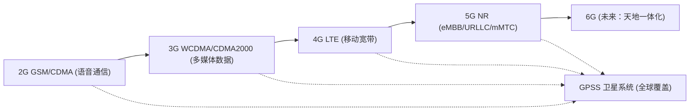
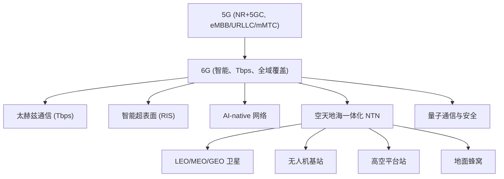

## RF无线技术

###  RF无线技术总结

#### 7.1 发展脉络概览

-   **2G**：以语音通信为核心，数字蜂窝通信的起点。
    
-   **3G**：引入数据业务，开启多媒体通信时代。
    
-   **4G (LTE)**：全面以数据为中心，高速宽带接入推动移动互联网兴起。
    
-   **5G (NR + 5GC)**：实现三大场景（eMBB、URLLC、mMTC），进入万物互联时代。
    
-   **GPSS（卫星通信与导航）**：突破地面网络局限，实现全球无缝覆盖，与地面蜂窝系统形成互补。
    

#### 7.2 系统性对比表

| 维度 | 2G (GSM/CDMA) | 3G (WCDMA/CDMA2000/TD-SCDMA) | 4G (LTE) | 5G (NR + 5GC) | GPSS (卫星通信) |
| -------- | ------------- | ---------------------------- | --------------- | ------------------- | ----------------------- |
| **商用时间** | 1990s | 2000s | 2010s | 2020s | 1990s–至今 |
| **主要目标** | 数字语音 | 语音 + 多媒体数据 | 移动宽带 | eMBB + URLLC + mMTC | 全球覆盖、导航、补充通信 |
| **频段** | 900/1800 MHz | 2 GHz | 700–2600 MHz | Sub-6 GHz + 毫米波 | L/S/Ku/Ka/V 波段 |
| **理论速率** | < 0.1 Mbps | 2–14 Mbps | 100 Mbps–1 Gbps | 10 Gbps 级 | kbps–Gbps（取决于轨道与波段） |
| **关键技术** | TDMA/CDMA、功控 | 宽带CDMA、软切换 | OFDMA、MIMO、全IP | 大规模MIMO、网络切片、边缘计算 | 多轨道协同、星间链路、多波束天线 |
| **时延** | \~500 ms | \~200 ms | \~50 ms | < 1 ms | GEO：250 ms；LEO：20–40 ms |
| **典型业务** | 语音、短信 | 视频电话、移动上网 | 移动视频、移动支付 | AR/VR、车联网、工业互联网 | 应急通信、导航定位、星基物联网 |
| **社会影响** | 语音大众化 | 移动互联网萌芽 | 智能手机普及 | 万物互联时代 | 全球互联，天地一体化 |

----------

#### 7.3 技术演进逻辑

1.  **容量提升**：2G → 3G → 4G → 5G，每一代都通过更高的频谱效率、更宽带宽、更先进的调制方式来提升容量。
    
2.  **业务驱动**：从 **语音** 到 **多媒体** 到 **宽带数据** 到 **低时延/大连接**。
    
3.  **架构演进**：从传统交换 → 分组核心 → 全 IP → 服务化架构（SBA）。
    
4.  **覆盖模式**：从地面蜂窝独立覆盖 → 卫星补充（GPSS） → 地天地一体化。
    
5.  **应用延伸**：从人到人（2G/3G） → 人到网（4G） → 万物互联（5G/卫星）。
    

#### 7.4 示意图

#### 7.5 小结

-   **2G → 5G** 展现了蜂窝通信的线性演进逻辑：更快速率、更低时延、更广业务。
    
-   **GPSS** 则提供了非线性补充：突破地理限制，实现全球化连接。
    
-   未来 **6G 及之后**，蜂窝与卫星将深度融合，构建 **无缝、智能、普适的天地一体化网络**。

#### 专栏：未来趋势展望 —— 走向 6G 与天地一体化网络

##### 1. 演进方向

-   **6G 愿景**：不仅仅是比 5G 更快，而是构建“普适、无缝、智能”的通信网络。
    
-   **目标能力**：
    
    -   峰值速率：可达 **1 Tbps**；
        
    -   空口时延：小于 **0.1 ms**；
        
    -   覆盖能力：**地面+空中+海上+太空** 全域；
        
    -   AI-native：网络将具备自优化、自管理、自修复的能力。
        

##### 2. 关键技术前瞻

-   **太赫兹通信（0.1–1 THz）**：提供 Tbps 级速率，适合超高速短程链路。
    
-   **智能超表面 (RIS, Reconfigurable Intelligent Surface)**：通过“可编程反射”调控电磁波，实现能量集中和链路增强。
    
-   **AI-native 网络**：人工智能不再是应用层工具，而是嵌入到协议栈和资源调度中。
    
-   **空天地海一体化 (NTN)**：融合卫星、无人机、高空平台与地面网络，真正实现“全球无死角”。
    
-   **量子通信/量子密钥分发**：提供未来网络的最高级别安全。
    

##### 3. 蜂窝与卫星的深度融合

-   **5G-NTN** 已经是 3GPP Release 17 的一部分，允许普通手机直接接入卫星网络。
    
-   **6G 时代**：预计 LEO 星座与地面基站将实现完全互通，用户无需区分是通过“基站”还是“卫星”接入。
    
-   **应用场景**：
    
    -   无人机与低轨卫星协同 → 低空经济；
        
    -   远洋航行/极地探险 → 全球高速宽带；
        
    -   工业物联网 → 无死角监控与控制。
        

##### 4. 示意图（基础 mermaid）

##### 5. 总结

-   **2G–5G**：蜂窝技术演进，推动人类通信走向数字化与智能化。
    
-   **GPSS**：弥补蜂窝的覆盖短板，实现全球互联。
    
-   **6G 及未来**：蜂窝与卫星深度融合，AI、太赫兹、RIS、量子技术共同塑造一个 **全覆盖、全智能、全安全** 的新型通信网络。
<!--stackedit_data:
eyJoaXN0b3J5IjpbLTE3NzEzOTA0MjVdfQ==
-->
