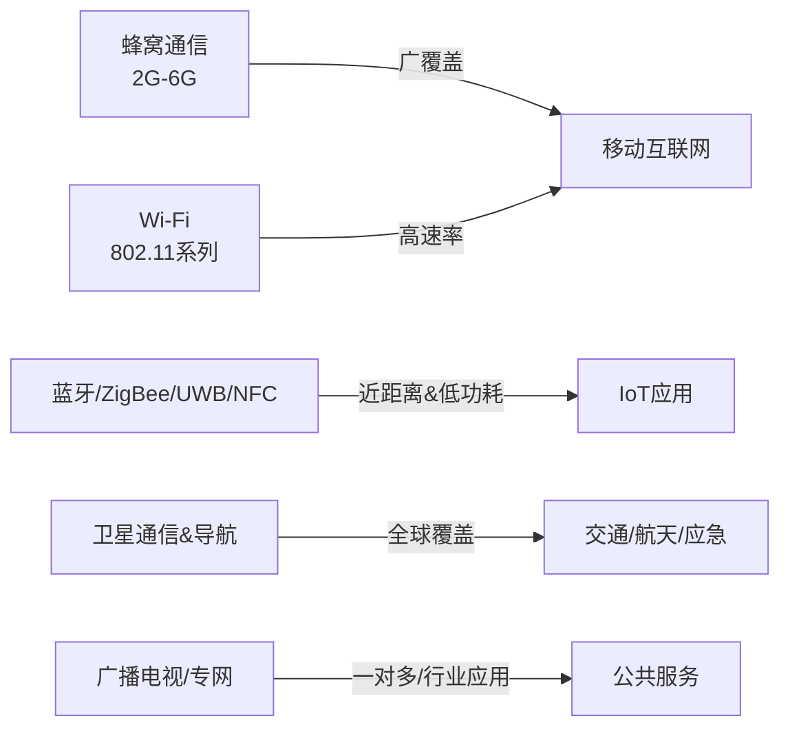

## RF无线技术

无线通信作为现代信息社会的核心支撑，几乎渗透到人类生活和工业生产的各个环节。从最早的广播、电视，到今天的蜂窝通信、Wi-Fi、蓝牙、卫星通信与物联网，均依赖于射频（Radio Frequency, RF）技术。为了更好地理解RF测试硬件及其在系统中的作用，本章将从无线通信技术的基本概念出发，梳理常见RF相关无线技术，涵盖其定义、工作原理、功能特点、核心指标、典型应用和发展趋势。

### 3.1 无线技术的基本概念

无线通信是指在不依赖有线介质的情况下，通过电磁波在空中传输信息的技术。射频技术是无线通信的核心部分，频率范围通常从几十kHz延伸到数百GHz，涵盖AM/FM广播、电视、卫星通信、蜂窝网络、无线局域网、短距离无线传输、毫米波与太赫兹应用等。

无线通信的基本构成包括：

1.  **发射端**：完成基带调制、频率变换、功率放大、天线辐射。
    
2.  **信道**：空中电磁波传播通道，包括路径损耗、多径衰落、干扰与噪声。
    
3.  **接收端**：完成天线接收、低噪声放大、混频解调、基带处理。
    

核心特征是**开放性**（任何设备可接收）、**时变性**（受环境变化影响）、**共享性**（频谱资源有限）。

### 3.2 主流RF无线技术分类

无线通信按照**覆盖范围、速率、功耗、频段**可大致分为以下几类：

1.  **蜂窝移动通信**
    
    -   包括2G（GSM/CDMA）、3G（WCDMA/TD-SCDMA/CDMA2000）、4G（LTE）、5G NR以及正在研究的6G。
        
    -   特点：广覆盖、支持高速移动、容量大、标准化程度高。
        
2.  **无线局域网（WLAN, Wi-Fi）**
    
    -   基于IEEE 802.11标准，频段覆盖2.4 GHz、5 GHz、6 GHz（Wi-Fi 6E）、未来扩展到60 GHz（WiGig）。
        
    -   特点：中短距离高速率，应用于家庭、办公室、公共热点。
        
3.  **短距离无线技术**
    
    -   典型代表：蓝牙（Bluetooth）、ZigBee、UWB（Ultra Wide Band）、NFC。
        
    -   特点：低功耗、低成本、适合IoT与消费电子。
        
4.  **卫星与导航系统**
    
    -   包括GPS、北斗、GLONASS、Galileo等导航系统，以及LEO卫星互联网（Starlink等）。
        
    -   特点：大范围覆盖、无地面基站依赖，但延时与成本相对较高。
        
5.  **广播电视与专用通信**
    
    -   AM/FM、地面数字电视（DVB-T、DTMB）、专网通信（TETRA、PDT、专用微波链路）。
        
    -   特点：一对多广播、专网安全性强。
        
6.  **新兴技术**
    
    -   毫米波通信（24–100 GHz）、太赫兹通信（0.1–10 THz）、可见光通信（VLC）、Wi-SUN、NB-IoT、LoRa。
        
    -   特点：满足未来高带宽、低时延、大连接的需求。
       

### 3.3 各类无线技术核心原理与特点

### 3.3.1 蜂窝通信（2G → 6G演进）

-   **2G GSM/CDMA**：以语音业务为主，采用窄带频分/码分复用。
    
-   **3G WCDMA/TD-SCDMA/CDMA2000**：支持多媒体业务，速率提升至几百kbps–2 Mbps。
    
-   **4G LTE**：基于OFDM调制，支持MIMO，速率可达百Mbps–Gbps级。
    
-   **5G NR**：采用大规模MIMO、毫米波、网络切片，支持eMBB、URLLC、mMTC三大场景。
    
-   **6G（展望）**：目标为Tbps速率、亚毫秒时延、空天地一体化网络。
    

**核心指标**：频谱利用率、峰值速率、时延、用户容量、移动性支持。

#### 3.3.2 Wi-Fi 技术

-   **Wi-Fi 4（802.11n）**：引入MIMO，多流传输。
    
-   **Wi-Fi 5（802.11ac）**：支持MU-MIMO、80/160 MHz带宽。
    
-   **Wi-Fi 6（802.11ax）**：OFDMA、上行MU-MIMO，更高并发性能。
    
-   **Wi-Fi 7（802.11be）**：目标最高30 Gbps，支持320 MHz带宽与多链路聚合。
    

**应用场景**：家庭宽带接入、智能家居、企业网络、热点覆盖。

#### 3.3.3 蓝牙与短距离通信

-   **蓝牙经典（BR/EDR）**：主要用于音频、外设连接。
    
-   **蓝牙低功耗（BLE）**：面向物联网传感器、智能穿戴。
    
-   **ZigBee**：低速率、低功耗，适合工业控制和智能家居。
    
-   **UWB**：纳秒级精确定位、低功耗短距通信。
    
-   **NFC**：厘米级通信，用于支付、门禁。
    

#### 3.3.4 卫星通信与导航

-   **GNSS（GPS/北斗/GLONASS/Galileo）**：定位精度米级到厘米级。
    
-   **LEO卫星互联网**：低轨星座实现全球宽带，延迟比传统GEO大幅降低。
    

**指标**：链路预算、延迟、覆盖范围、星座规模。

#### 3.3.5 广播电视与专网

-   **FM广播**：调频抗干扰性好。
    
-   **数字电视**：支持高清多频道。
    
-   **专网通信（TETRA/DMR/PDT）**：可靠性高，适合警用、铁路、应急救援。
    

### 3.4 无线技术核心性能指标

在评估RF无线技术时，常用以下指标：

-   **频段/带宽**：决定速率与覆盖能力。
    
-   **调制方式**：QAM、OFDM、CDMA等影响频谱效率与抗干扰性能。
    
-   **峰值速率与实际吞吐量**。
    
-   **覆盖半径**：从几厘米（NFC）到几千公里（卫星）。
    
-   **功耗**：IoT注重低功耗，蜂窝通信更注重容量。
    
-   **时延**：对自动驾驶、工业互联网至关重要。
    
-   **容量/并发数**：影响大规模连接能力。
    

----------

### 3.5 各类无线技术对比

（采用文字分散描述，不用表格）

-   **蜂窝通信**：最适合大范围、移动性强的场景，代价是建设成本高。
    
-   **Wi-Fi**：高速率、部署灵活，但覆盖半径有限。
    
-   **蓝牙/ZigBee/UWB/NFC**：适合近距离连接、低功耗物联网。
    
-   **卫星通信**：全球覆盖，但延迟与成本问题仍在优化。
    
-   **广播电视/专网**：一对多与特定行业保障。
    
-   **新兴毫米波/太赫兹**：未来方向，但受限于传播损耗。
    

### 3.6 应用与发展趋势

-   **消费领域**：智能手机、智能家居、可穿戴设备。
    
-   **工业领域**：工业物联网、智能制造、智慧物流。
    
-   **交通领域**：车联网、自动驾驶（5G C-V2X、卫星导航）。
    
-   **公共服务**：应急通信、远程医疗、教育、公共安全。
    
-   **未来趋势**：
    
    1.  向更高频段拓展（毫米波、太赫兹）。
        
    2.  向更高容量与低时延演进（6G）。
        
    3.  空天地一体化（卫星+地面）。
        
    4.  与AI、大数据结合，实现智能频谱管理。
        

## 本章小结

本章从RF相关无线技术的基本概念出发，介绍了蜂窝通信、Wi-Fi、蓝牙与短距离通信、卫星与导航、广播与专网通信等主要类型，阐述了各自的定义、特点、应用场景与核心性能指标。通过对比与趋势分析，读者可以理解不同无线技术在速率、覆盖、功耗、应用上的差异，为后续深入学习RF测试硬件的使用与原理奠定基础。

<!--stackedit_data:
eyJoaXN0b3J5IjpbMTg1NTkwMTg2NF19
-->